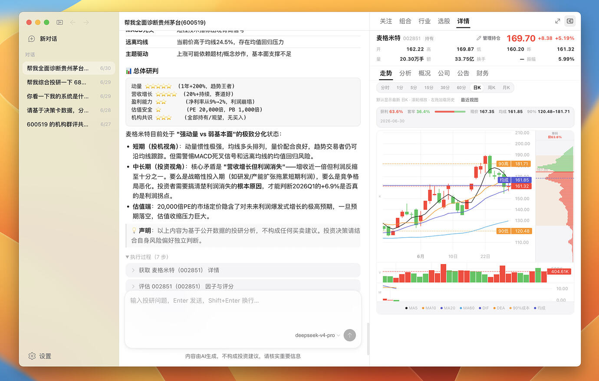

<p align="center">
  
</p>

# Opptrix — 全球多市场投研助手

[](https://nodejs.org/)
[](https://www.typescriptlang.org/)
[](LICENSE)

---

## ⚠️ 重要风险提示与用户须知

**请在使用前仔细阅读。使用本软件即表示你已理解并同意以下条款。**

| 说明 | 内容 |
|------|------|
| **产品性质** | Opptrix 是 **数据查询与投研信息整理工具**，用于聚合公开/授权数据源、辅助阅读与检索。**不是** 证券投顾软件、**不是** 券商交易终端、**不提供** 代客理财、**不支持** 自动下单或实盘交易。 |
| **非投资建议** | 软件内展示的行情、财务、新闻、因子、策略信号、机构观点摘要及一切 **AI 生成内容**，均仅供学习、研究与信息整理，**不构成** 任何形式的投资建议、要约、邀约或承诺。 |
| **AI 内容风险** | 大模型可能产生错误、遗漏或「幻觉」；请 **以工具返回的结构化数据为准**，勿单独依据自然语言结论做决策。 |
| **数据局限性** | 行情可能延迟、缺失或错误；多数据源回退 **不保证** 实时性与准确性；第三方接口受各自服务条款与限流约束。 |
| **策略与回测** | 因子筛选、回测、信号验证基于历史数据，**过往表现不代表未来收益**。 |
| **责任归属** | 你基于本软件所作的任何投资或交易决定及由此产生的一切后果，**由你自行承担**；开发者与贡献者不对因使用本软件导致的任何直接或间接损失负责。 |
| **合规** | 请遵守所在国家/地区的证券、数据与隐私相关法规；接入 Tushare、LLM 等服务须自行配置凭证并遵守其协议。 |

> 界面截图、示例对话与演示数据 **不代表** 真实荐股或实盘推荐，请勿作为实际投资依据。

---

**Opptrix** 是一款开源的 **全球多市场投研数据助手**：覆盖 **A 股、美股、港股、日股、韩股与加密货币** 等市场的行情查询、筛选与 Agent 分析。用自然语言提问，由大模型调用 **40+ 投研工具** 拉取结构化数据并整理为中文可读报告。支持 **浏览器 Web** 与 **Electron 桌面端**，共用同一套 React 界面与 Fastify API。

---

## 💬 技术交流群

使用问题、功能建议、贡献讨论，欢迎扫码加入 **Opptrix 技术交流群**（微信）：

<p align="center">
  
</p>

<p align="center"><sub>群聊：Opptrix 技术交流群 · 扫码加入后可在群内交流使用与开发问题</sub></p>

---

> 🤖 **协作者 / Vibe Coding**：请先阅读 **[docs/AGENT-GUIDE.md](docs/AGENT-GUIDE.md)** — 单文件说明项目用途、目录地图、架构约束与设计规范。

<p align="center">
  
</p>

<p align="center"><sub>主界面：多会话聊天、Agent 工具链路、右侧关注/个股面板；桌面与 Web 共用同一套 UI</sub></p>

---

## 项目定位

| 维度 | 说明 |
|------|------|
| **是什么** | 本地/自托管的 **全球多市场数据查询与投研整理** 工具：跨市场标的搜索、聊天问答、新闻订阅、行情动态、关注列表与本地因子库（A 股深度最强） |
| **不是什么** | 持牌投顾、券商交易软件、理财销售或荐股/喊单系统 |
| **支持市场** | **CN** A 股/ETF/指数 · **US** 美股 · **HK** 港股 · **JP** 日股 · **KR** 韩股 · **CRYPTO** 现货等（能力因市场而异，见 [MULTI-MARKET-ARCHITECTURE.md](docs/MULTI-MARKET-ARCHITECTURE.md)） |
| **适合谁** | 希望 **自行查询与整理** 全球或多市场信息的投资者、研究者；需自备 LLM API Key 使用对话能力 |
| **适合学习** | TypeScript monorepo、LLM Function Calling、多 Provider 多市场数据层、Fluent UI 产品设计 |

---

## 功能概览

| 能力 | 说明 |
|------|------|
| **Chat Agent** | 流式对话，自动调用投研工具，展示执行过程 |
| **多会话** | 历史对话持久化（SQLite），侧栏新建/切换/归档 |
| **全球多市场** | A 股 / 美股 / 港股 / 日股 / 韩股 / 加密货币：标的搜索、行情、K 线、截面筛选与 Agent 跨市场分析 |
| **MCP 投研工具** | 个股/ETF 诊断、分市场 universe 筛选、机构评级（A 股）、策略/回测、市况与动态等（见 `packages/agent/src/tools.ts`） |
| **右侧投研面板** | 跨市场关注列表、发现策略、A 股行业与决策卡、A 股组合账本 |
| **新闻中心** | RSS 订阅、文章阅读；可选本地/远程翻译 |
| **行情动态** | 全球与 A 股大盘/板块/龙虎榜等动态视图 |
| **本地因子库** | A 股 SQLite 同步、全市场筛选、决策雷达（其他市场以在线数据为主） |
| **桌面端** | Electron 打包、系统托盘、自动更新、`opptrix://` 深链 |
| **设置** | LLM 提供商、分市场数据源 Provider、市场数据同步、新闻订阅、翻译/多模态等 |

---

## 使用方式（最终用户）

### 方式一：桌面安装包（推荐）

从 [GitHub Releases](https://github.com/Travisun/Opptrix/releases) 下载对应平台安装包（标签 `desktop-v*`）：

| 平台 | 下载 |
|------|------|
| **Apple Silicon Mac** | `Opptrix-{version}-MacOS-arm64-M-CPU.dmg` |
| **Intel Mac** | `Opptrix-{version}-MacOS-x64-Intel-CPU.dmg` |
| **Windows** | `Opptrix-{version}-Windows.exe` |
| **Linux** | `Opptrix-{version}-Linux.AppImage` |

安装后首次启动：

1. 打开 **设置 → 模型与 API**，配置 LLM 提供商与 API Key（对话功能需要）。
2. （可选）**设置 → 数据源**，配置 Tushare 等行情数据源。
3. （可选）**设置 → 新闻订阅** 导入 RSS 源。
4. 在 **聊天** 中用自然语言提问；在侧栏切换 **新闻**、**行情动态** 等视图。

桌面端启动约 10 秒后会 **后台检查更新**；有新版本时会提示下载，需你点击 **重启更新** 才会安装（不会静默强制升级）。详见 [docs/DESKTOP-RELEASE.md](docs/DESKTOP-RELEASE.md)。

未签名/dev 包在 macOS 上若提示「已损坏」，可在终端执行 `xattr -cr /Applications/Opptrix.app` 或 **右键 → 打开** 一次。

### 方式二：浏览器（自托管 Web）

适合在本机或服务器部署后通过浏览器访问：

```bash
git clone https://github.com/Travisun/Opptrix.git
cd Opptrix
npm install
cp example/startup/env.example .env   # 填入 LLM_API_KEY
npm run build
npm run serve    # → http://127.0.0.1:5173
```

在 **设置** 中同样配置 LLM 与数据源。生产环境请自行做好 HTTPS、访问控制与密钥管理。

### 方式三：开发模式

见下方 [快速开始（开发者）](#快速开始开发者) 与 [docs/DEVELOPMENT.md](docs/DEVELOPMENT.md)。

---

## 架构一览

```
┌──────────────────────────────────────────────────────────────────┐
│  client-ui (React + Fluent UI + Vite)                             │
│  聊天 · 新闻 · 行情动态 · 右侧面板 · 设置 · Electron 桌面 chrome   │
└────────────────────────────┬─────────────────────────────────────┘
                             │ /api/*  (dev: Vite proxy → :8711)
┌────────────────────────────▼─────────────────────────────────────┐
│  apps/server (Fastify)                                            │
│  REST · Chat SSE · 配置 · 会话 · 静态 SPA                          │
└────────────────────────────┬─────────────────────────────────────┘
                             │
     ┌───────────────────────┼───────────────────────┐
     ▼                       ▼                       ▼
 packages/agent      research-hub / search-hub   user-store
 LLM + MCP tools     dispatch / instrument_*     SQLite 用户数据
     │                       │                       │
     └───────────────────────┼───────────────────────┘
                             ▼
              a-stock-layer (MarketDataEngine)
              queryInstrumentData · Provider Registry · 多市场
                             │
        ┌────────────────────┼────────────────────┐
        ▼                    ▼                    ▼
  market-data-store    stock-eval · institutions   news-feed
  本地 SQLite 因子库    t-strategy · skills         文章 enrichment
```

```
Opptrix/
├── apps/
│   ├── server/                 # Fastify API（:8711）
│   └── desktop/                # Electron 壳 + sidecar + 打包
├── client-ui/                  # React SPA（:5173）
└── packages/
    ├── shared/                 # InstrumentRef、市场注册表、类型
    ├── a-stock-layer/          # 在线数据 Engine、Provider、TDX
    ├── market-data-core/       # 数据层核心抽象
    ├── market-data-store/      # 本地 SQLite 存储与同步
    ├── market-data-providers-{cn,us,crypto}/
    ├── provider-sdk/           # Provider 开发 SDK
    ├── stock-eval/             # 因子 · 评分卡 · 回测
    ├── institutions/           # 机构综合评级
    ├── t-strategy/             # 策略信号与验证
    ├── skills/                 # 市场报告 · 产业透视
    ├── research-hub/           # Hub feature 调度
    ├── search-hub/             # 标的搜索
    ├── news-feed/              # RSS 新闻
    ├── article-enrichment/     # 文章抓取与增强
    ├── local-inference/        # 本地翻译/推理（桌面）
    ├── user-store/             # 用户配置与会话持久化
    └── agent/                  # LLM + MCP 工具
```

**延伸阅读**

| 文档 | 内容 |
|------|------|
| [docs/ARCHITECTURE.md](docs/ARCHITECTURE.md) | 分层、请求流、持久化 |
| [docs/DATA-LAYER.md](docs/DATA-LAYER.md) | Provider、InstrumentRef、本地库 |
| [docs/MULTI-MARKET-ARCHITECTURE.md](docs/MULTI-MARKET-ARCHITECTURE.md) | 多市场能力与边界 |
| [docs/PROVIDER-STANDARD-API.md](docs/PROVIDER-STANDARD-API.md) | `queryInstrumentData` 标准 API |
| [docs/DESKTOP.md](docs/DESKTOP.md) | 桌面开发与 sidecar |
| [docs/README.md](docs/README.md) | **文档总索引** |

---

## 数据源说明

数据经 **MarketDataEngine**（`@opptrix/a-stock-layer`）按 **InstrumentRef（市场 + 标的类型 + 代码）+ Capability** 在多个 Provider 间 **按市场优先级回退**（A 股：东财、Tushare、TDX 等；美股/港股/日股/韩股：Yahoo 等；加密货币：专用 Provider，见各 `manifest`）。

| 类型 | 来源 | 备注 |
|------|------|------|
| 实时/历史行情 | 分市场多 Provider | 免费接口可能延迟或限流；各市场覆盖度不同 |
| 基本面 / 档案 | 东财、Tushare、Yahoo 等 | 字段与深度因市场、数据源而异 |
| 机构观点 | institutions + 在线数据 | 以 **A 股** 为主；规则化评分，非研报全文 |
| 本地因子库 | `market-data-store` 同步入库 | **A 股** 全市场筛选与雷达；其他市场以在线查询为主 |
| 新闻 | RSS + 可选抓取 | 可按 CN / US / MACRO 等分组订阅 |

**请勿** 将本软件作为生产交易决策的 **唯一** 依据。

---

## 快速开始（开发者）

### 环境要求

- **Node.js** ≥ 24（Active LTS）  
- **npm**（workspaces，仅在仓库根目录 `npm install`）  
- 可选：macOS / Windows / Linux（桌面打包见 [DESKTOP.md](docs/DESKTOP.md)）

### 安装与编译

```bash
git clone https://github.com/Travisun/Opptrix.git
cd Opptrix
npm install
cp example/startup/env.example .env   # 填入 LLM_API_KEY
npm run build            # 编译 packages + client-ui
```

更多示例（数据源、新闻、关注列表）见 **[example/](example/)**。

### 开发模式

```bash
# Web：API + Vite 热更新
npm run dev
# → 浏览器 http://127.0.0.1:5173（API 在 :8711，由 Vite 代理 /api）

# 桌面：Electron + API + Vite HMR
npm run dev:desktop
```

### 生产预览

```bash
npm run build
npm run serve            # API :8711 + Vite preview :5173
```

### 测试

```bash
npm run test             # build:packages + 冒烟/集成测试
npm run test:ci          # 仅跑测试（CI 在 build 之后）
```

### 数据目录

| 路径 | 内容 |
|------|------|
| `~/.opptrix/` | 默认用户数据根（可用 `OPPTRIX_DATA_DIR` 覆盖） |
| `~/.opptrix/opptrix.db` | 配置、会话、关注列表等（SQLite） |
| `~/.opptrix/portfolio.json` | 模拟组合账本（A 股） |
| `.env` | 环境变量（优先于部分配置项） |

---

## 配置

| 位置 | 用途 |
|------|------|
| [example/](example/) | 启动环境、LLM、数据源、新闻、关注列表示例 |
| `.env` / `.env.example` | `LLM_API_KEY`、`STOCK_RESEARCH_PORT` 等 |
| 应用内 **设置** | LLM、数据源 Provider、市场数据同步、新闻、翻译 |
| `~/.opptrix/tushare-config.json` | Tushare Token（也可在设置页配置） |

---

## API 入口

| 端点 | 说明 |
|------|------|
| `GET /api/health` | 健康检查、版本与工具数量 |
| `POST /api/chat` | Agent 对话（支持流式） |
| `POST /api/research` | `{ "feature": "...", "params": {} }` Hub 调度 |
| `POST /api/instrument/*` | InstrumentRef 标准能力（见 API 文档） |

完整列表：[docs/API.md](docs/API.md)

---

## 文档索引

| 文档 | 读者 | 内容 |
|------|------|------|
| **[docs/README.md](docs/README.md)** | 所有人 | **文档总目录与阅读顺序** |
| **[docs/AGENT-GUIDE.md](docs/AGENT-GUIDE.md)** | AI Agent | 协作手册、目录、规范 |
| [docs/DEVELOPMENT.md](docs/DEVELOPMENT.md) | 开发者 | 日常命令、调试、FAQ |
| [docs/ARCHITECTURE.md](docs/ARCHITECTURE.md) | 开发者 | 分层、Hub、持久化 |
| [docs/DATA-LAYER.md](docs/DATA-LAYER.md) | 开发者 | Provider、Instrument、同步 |
| [docs/MULTI-MARKET-ARCHITECTURE.md](docs/MULTI-MARKET-ARCHITECTURE.md) | 开发者 | 多市场矩阵与扩展 |
| [docs/PROVIDER-STANDARD-API.md](docs/PROVIDER-STANDARD-API.md) | 开发者 | 标准数据 API |
| [docs/API.md](docs/API.md) | 集成方 | REST 与 Hub features |
| [docs/DESKTOP.md](docs/DESKTOP.md) | 桌面 | Electron 开发与 sidecar |
| [docs/DESKTOP-RELEASE.md](docs/DESKTOP-RELEASE.md) | 发布 | 版本号、三端产物、CI |
| [docs/UI-DESIGN-SYSTEM.md](docs/UI-DESIGN-SYSTEM.md) | 前端 | 设计 token 与组件 |
| [packages/README.md](packages/README.md) | 开发者 | 各 workspace 包职责 |
| [docs/CONTRIBUTING.md](docs/CONTRIBUTING.md) | 贡献者 | PR 与 review 约定 |

---

## 参与贡献

1. Fork 仓库，从 `main` 创建分支（`feat/`、`fix/`、`docs/` …）  
2. 让 AI 助手先读 [AGENT-GUIDE.md](docs/AGENT-GUIDE.md)  
3. `npm run build && npm run test`  
4. 提交 PR，说明动机与测试方式  

细则：[docs/CONTRIBUTING.md](docs/CONTRIBUTING.md)

---

## 技术栈

Node.js · TypeScript · Fastify · React · Fluent UI v9 · Vite · Electron · SQLite (better-sqlite3) · OpenAI 兼容 LLM API

---

## 许可证

本仓库采用 **[Apache License 2.0](LICENSE)** 发布（Copyright © 2026 Opptrix contributors）。  
在遵守许可证条款的前提下，可自由使用、修改与分发本软件（含商业用途）；再分发时请保留版权声明与许可证全文。

---

## 相关链接

- GitHub：[Travisun/Opptrix](https://github.com/Travisun/Opptrix)  
- Releases：[桌面安装包下载](https://github.com/Travisun/Opptrix/releases)  
- Issues：[报告问题或提议功能](https://github.com/Travisun/Opptrix/issues)

<a href="https://linux.do"></a>
