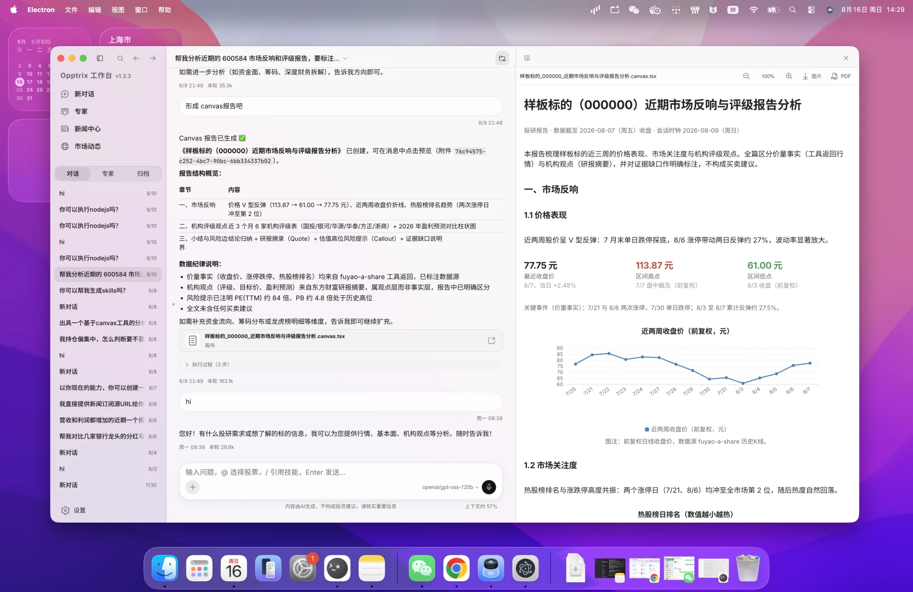

<p align="center">
  
</p>

# Opptrix — 全球多市场投研工作台

<table align="center">
  <tr>
    <td align="center"><a href="https://github.com/Travisun/Opptrix"></a></td>
    <td align="center"><a href="https://gitee.com/Travisun/Opptrix"></a></td>
    <td align="center"><a href="https://github.com/Travisun/Opptrix/releases"></a></td>
    <td align="center"><a href="https://linux.do"></a></td>
    <td align="center"><a href="https://nodejs.org/"></a></td>
    <td align="center"><a href="https://www.typescriptlang.org/"></a></td>
    <td align="center"><a href="LICENSE"></a></td>
  </tr>
</table>

<p align="center">
  <strong>加入 <a href="https://opptrix.net/">Opptrix 量化投研交流社区</a></strong> — 与同路人一起讨论策略、分享研究、跟上产品节奏；注册邀请码：<code>A8SA8</code>
</p>

<p align="center">
  
</p>

<p align="center"><sub>主界面：多会话聊天、Agent 工具与工作流技能、右侧关注/个股面板；桌面与 Web 共用同一套 UI</sub></p>

<p align="center">
  <a href="https://pan.quark.cn/s/68ed347a6992#/list/share"></a>
  &nbsp;&nbsp;&nbsp;
  <a href="https://opptrix.org/"></a>
</p>

## 💬 技术交流与作者动态

使用问题、功能建议、贡献讨论，欢迎扫码加入 **微信技术交流群**；也可扫码在 **抖音** 关注项目作者，获取产品与开发动态：

<table align="center">
  <tr>
    <td align="center" width="33%">
      <br />
      <sub>微信 · Opptrix 技术交流群</sub>
      <!-- 维护备注：群二维码过期后替换官网 docs/public/images/wechat-group-qr.jpg，并更新 ?v= 缓存戳 -->
    </td>
    <td align="center" width="33%">
      <br />
      <sub>抖音 · 关注项目作者动态</sub>
    </td>
    <td align="center" width="33%">
      <br />
      <sub>微信扫码·成为Opptrix 赞助者</sub>
    </td>
  </tr>
</table>

---

## ❤️ 欢迎赞助我们

Opptrix 坚持免费、开源。赞助不是购买，而是对理念的认可——你的支持会帮助我们把 Opptrix 发展得更加强大。

<p align="center">
  <a href="https://opptrix.org/sponsor"><strong>前往赞助页 → https://opptrix.org/sponsor</strong></a>
</p>

### 个人赞助者

感谢每一位支持者（与 [官网赞助墙](https://opptrix.org/sponsor) 同步）：

<table align="center">
  <tr>
    <td align="center" width="120">
      <br />
      <sub>WorldWithinDreams</sub>
    </td>
    <td align="center" width="120">
      <a href="https://github.com/LiberSeek">
        <br />
        <sub>Raven</sub>
      </a>
    </td>
    <td align="center" width="120">
      <br />
      <sub>Remielle</sub>
    </td>
    <td align="center" width="120">
      <br />
      <sub>N</sub>
    </td>
    <td align="center" width="120">
      <a href="https://www.douyin.com/user/MS4wLjABAAAAmj0mJEXCyfheDFZyFVpeEKKaX_zWMlN3Ir6YcScCSAU">
        <br />
        <sub>叶小莹</sub>
      </a>
    </td>
    <td align="center" width="120">
      <br />
      <sub>月落参横</sub>
    </td>
  </tr>
</table>

<p align="center"><sub>企业赞助席位虚位以待 — 详情见 <a href="https://opptrix.org/sponsor">赞助页</a></sub></p>

---

## ⚠️ 重要风险提示与用户须知

**请在使用前仔细阅读。使用本软件即表示你已理解并同意以下条款。**

| 说明 | 内容 |
|------|------|
| **产品性质** | Opptrix 是 **数据查询与投研信息整理工具**，用于聚合公开/授权数据源、辅助阅读与检索。**不是** 证券投顾软件、**不是** 券商交易终端、**不提供** 代客理财、**不支持** 自动下单或实盘交易。 |
| **非投资建议** | 软件内展示的行情、财务、新闻、因子、策略信号、机构观点摘要及一切 **AI 生成内容**，均仅供学习、研究与信息整理，**不构成** 任何形式的投资建议、要约、邀约或承诺。 |
| **AI 内容风险** | 大模型可能产生错误、遗漏或「幻觉」；请 **以工具返回的结构化数据为准**，勿单独依据自然语言结论做决策。 |
| **数据局限性** | 行情可能延迟、缺失或错误；多数据源回退 **不保证** 实时性与准确性；第三方接口受各自服务条款与限流约束。 |
| **策略与回测** | 因子筛选、回测、信号验证基于历史数据，**过往表现不代表未来收益**。 |
| **责任归属** | 你基于本软件所作的任何投资或交易决定及由此产生的一切后果，**由你自行承担**；开发者与贡献者不对因使用本软件导致的任何直接或间接损失负责。 |
| **合规** | 请遵守所在国家/地区的证券、数据与隐私相关法规；接入 Tushare、LLM 等服务须自行配置凭证并遵守其协议。 |

> 界面截图、示例对话与演示数据 **不代表** 真实荐股或实盘推荐，请勿作为实际投资依据。

---

**Opptrix** 是一款开源的 **全球多市场投研工作台**：覆盖 **A 股、美股、港股、日股、韩股与加密货币** 等市场。用自然语言提问，由大模型按意图挂载 **150+ 投研工具**，并可激活 **170+ 内置工作流技能**（量化因子 / 择时 / 价值投资流程等），把结构化数据整理成中文报告或可预览投研页。支持 **浏览器 Web** 与 **Electron 桌面端**，共用同一套 React 界面与 Fastify API；设置中可选开启 **自进化**，让同一模型在投研主路径上更稳、更完整。

---

> 🤖 **协作者 / Vibe Coding**：请先阅读 **[docs/AGENT-GUIDE.md](docs/AGENT-GUIDE.md)** — 单文件说明项目用途、目录地图、架构约束与设计规范。工作流技能详见 **[docs/AGENT-SKILLS.md](docs/AGENT-SKILLS.md)**。

---

## 项目定位

| 维度 | 说明 |
|------|------|
| **是什么** | 本地/自托管的 **全球多市场数据查询与投研整理** 工作台：跨市场标的搜索、聊天问答、工作流技能、新闻订阅、行情动态、关注列表、发现策略、计划任务与多市场本地数据包（A 股深度最强） |
| **不是什么** | 持牌投顾、券商交易软件、理财销售或荐股/喊单系统；也不提供自动下单与实盘交易 |
| **支持市场** | **CN** A 股/ETF/指数 · **US** 美股 · **HK** 港股 · **JP** 日股 · **KR** 韩股 · **CRYPTO** 现货等（能力因市场而异，见 [MULTI-MARKET-ARCHITECTURE.md](docs/MULTI-MARKET-ARCHITECTURE.md)） |
| **适合谁** | 希望 **自行查询与整理** 全球或多市场信息的投资者、研究者；需自备 LLM API Key 使用对话能力 |
| **适合学习** | TypeScript monorepo、LLM Function Calling、Agent Skills、多市场数据标准层、Fluent UI 产品设计 |

---

## 工作流技能（Agent Skills）

界面称 **工作流技能**：可发现、可激活的投研步骤说明 + 附件（参考资料 / 可运行脚本）。与「专家人设」「工具包」正交——对话里可以同时有角色偏好、按意图挂载的工具，以及最多若干已激活技能。

| 能力面 | 作用 |
|--------|------|
| **激活与执行** | 对话中按需激活技能 → 按步骤取数、写入工作区、运行脚本 → 默认可生成 **可预览投研页** |
| **本地扩展** | 内置技能在仓库；你也可导入/编辑个人技能（落在本机数据目录） |
| **数据纪律** | 技能脚本走 Opptrix 本地取数与工作区，不依赖外部券商脚本环境；数据不足时如实标注，避免虚假「完整回测」 |

### 内置技能家族（约 170+）

| 家族 | 大致规模 | 做什么 |
|------|----------|--------|
| **核心投研** | 数十个 | 个股深潜、多角色研讨、报告审计、网页/画布交付等日常投研流程 |
| **Lean 量化** | 约 27（`lean-*`） | 组合构建、风险、执行与研究等工作流参照 Lean 方法论 |
| **量化方法库** | 约 60+ | 因子、择时、行业轮动、情绪与微观结构等可运行方法（由开源量化研究材料映射为自洽技能） |
| **价值投资** | 约 20+ | 财务严谨检查、报告审计、论点跟踪与组合复盘；总入口 **`ai-berkshire`（AI Berkshire 分析）**（场景路由 → 取数 → 子技能 → 交付） |

开发者映射与契约：[docs/AGENT-SKILLS.md](docs/AGENT-SKILLS.md)、[docs/quants-playbook-skill-map.md](docs/quants-playbook-skill-map.md)、[docs/ai-berkshire-skill-map.md](docs/ai-berkshire-skill-map.md)。

---

## 功能概览

| 能力 | 说明 |
|------|------|
| **Chat Agent** | 流式对话，自动调用投研工具，展示执行过程；按意图 **智能挂载工具包**，避免一次塞满全部工具 |
| **工作流技能** | 170+ 内置技能：量化 / 价值投资 / Lean / 核心投研；可导入个人技能 |
| **自进化** | 设置中可选开启：在不换模型的前提下，按使用反馈合入更稳妥的「分析习惯」；可关停、按模型查看、恢复默认 |
| **多会话** | 历史对话持久化（SQLite），侧栏新建/切换/归档 |
| **全球多市场** | A 股 / 美股 / 港股 / 日股 / 韩股 / 加密货币：标的搜索、行情、K 线、截面筛选与跨市场分析 |
| **投研工具矩阵** | 150+ 注册工具：个股诊断、基本面事实表、策略信号、资金流向、筹码分布、机构评级与产业链透视等 |
| **网页交付** | 投研结果可生成可预览网页，便于分享与复盘 |
| **子 Agent** | 复杂任务可派生子任务并行或接力，父会话汇总 |
| **发现策略** | 多市场内置策略（ETF / 美股 / 加密 / 日 / 韩 / 港等），支持自建策略与回测验证 |
| **计划任务** | 定时 / 周期 / Cron 调度，支持智能体提示词与受控脚本（应用内 + 桌面 OS tick） |
| **Agent 工作区** | 文件读写、Shell、HTTP、网页浏览、Python、密钥保险箱；会话隔离沙盒 |
| **专家体系** | 内置与本地自建专家；技能专长注入对话，配合投研纪律（与工作流技能互补） |
| **右侧投研面板** | 跨市场关注列表、发现策略、行业透视、组合账本、决策卡 |
| **新闻中心** | RSS 订阅、RSSHub 路由、文章阅读、本地/远程翻译 |
| **行情动态** | 全球与 A 股大盘/板块/龙虎榜/涨跌停/市场情绪等动态视图 |
| **本地数据** | 多市场基础数据包同步（`.opmd`）、A 股全市场能力、多市场本地列表筛选 |
| **桌面端** | Electron 打包、系统托盘、计划任务 OS tick、自动更新、`opptrix://` 深链 |
| **设置** | 模型与 API、分市场数据源、市场数据同步、新闻、翻译/多模态、自进化、MCP 服务器管理 |

---

## 使用方式（最终用户）

### 方式一：桌面安装包（推荐）

从 [GitHub Releases](https://github.com/Travisun/Opptrix/releases) 下载对应平台安装包（标签 `desktop-v*`）：

| 平台 | 下载 |
|------|------|
| **Apple Silicon Mac** | `Opptrix-{version}-MacOS-arm64-M-CPU.dmg` |
| **Intel Mac** | `Opptrix-{version}-MacOS-x64-Intel-CPU.dmg` |
| **Windows** | `Opptrix-{version}-Windows.exe` |
| **Linux** | `Opptrix-{version}-Linux.AppImage` |

安装后首次启动：

1. 打开 **设置 → 模型与 API**，配置 LLM 提供商与 API Key（对话功能需要）。
2. （可选）**设置 → 数据源**，配置 Tushare 等行情数据源。
3. （可选）**设置 → 新闻订阅** 导入 RSS 源。
4. （可选）**设置 → 自进化**：按需开启，让常用模型逐步更贴合你的投研用法。
5. 在 **聊天** 中用自然语言提问，或激活工作流技能；在侧栏切换 **新闻**、**行情动态** 等视图。

桌面端启动约 10 秒后会 **后台检查更新**；有新版本时会提示下载，需你点击 **重启更新** 才会安装（不会静默强制升级）。详见 [docs/DESKTOP-RELEASE.md](docs/DESKTOP-RELEASE.md)。

未签名/dev 包在 macOS 上若提示「已损坏」，可在终端执行 `xattr -cr /Applications/Opptrix.app` 或 **右键 → 打开** 一次。

### 方式二：浏览器（自托管 Web）

适合在本机或服务器部署后通过浏览器访问：

```bash
git clone https://github.com/Travisun/Opptrix.git
cd Opptrix
npm install
cp example/startup/env.example .env   # 填入 LLM_API_KEY
npm run build
npm run serve    # → http://127.0.0.1:5173
```

在 **设置** 中同样配置 LLM 与数据源。生产环境请自行做好 HTTPS、访问控制与密钥管理。

### 方式三：开发模式

见下方 [快速开始（开发者）](#快速开始开发者) 与 [docs/DEVELOPMENT.md](docs/DEVELOPMENT.md)。

---

## 架构一览

跨市场行情与档案统一经 **标的 + 能力** 标准查询，多数据源按市场自动回退；Agent 侧为 **工具包路由 + 工作流技能 + 工作区脚本**，Hub 负责投研 feature 调度。

```
┌──────────────────────────────────────────────────────────────────┐
│  client-ui (React + Fluent UI + Vite)                             │
│  聊天 · 技能 · 新闻 · 行情动态 · 右侧面板 · 设置 · Electron chrome │
└────────────────────────────┬─────────────────────────────────────┘
                             │ /api/*  (dev: Vite proxy → :8711)
┌────────────────────────────▼─────────────────────────────────────┐
│  apps/server (Fastify)                                            │
│  REST · Chat SSE · 配置 · 会话 · 静态 SPA                          │
└────────────────────────────┬─────────────────────────────────────┘
                             │
     ┌───────────────────────┼───────────────────────┐
     ▼                       ▼                       ▼
 packages/agent      research-hub / search-hub   user-store
 LLM + 150+ 工具      dispatch / instrument_*     SQLite 用户数据
 Tool Pack 路由              │                       │
 agent-skills 激活           │                       │
 agent-workspace             │                       │
     └───────────────────────┼───────────────────────┘
                             ▼
              a-stock-layer (MarketDataEngine)
              queryInstrumentData · Provider Registry · 多市场
                             │
        ┌────────────────────┼────────────────────┐
        ▼                    ▼                    ▼
  market-data/          stock-eval · institutions   news-feed
  多市场数据包同步        t-strategy                  article-enrichment
```

```
Opptrix/
├── apps/
│   ├── server/                 # Fastify API（:8711）
│   └── desktop/                # Electron 壳 + sidecar + 打包
├── client-ui/                  # React SPA（:5173）
└── packages/
    ├── shared/                 # InstrumentRef、市场注册表、类型
    ├── a-stock-layer/          # 在线数据 Engine、Provider、TDX
    ├── market-data-core/       # 数据层核心抽象
    ├── market-data/            # 多市场本地数据包（.opmd）与同步
    ├── market-data-providers-{cn,us,crypto}/
    ├── provider-sdk/           # Provider 开发 SDK
    ├── stock-eval/             # 因子 · 评分卡 · 回测
    ├── institutions/           # 机构综合评级
    ├── t-strategy/             # 策略信号与验证
    ├── agent-skills/           # 工作流技能（builtin 170+）
    ├── research-hub/           # Hub feature 调度
    ├── search-hub/             # 标的搜索
    ├── news-feed/              # RSS 新闻
    ├── article-enrichment/     # 文章抓取与增强
    ├── canvas-kit/ · doc-library/
    ├── local-inference/        # 本地翻译/推理（桌面）
    ├── schedule/               # 计划任务（应用内 + OS tick）
    ├── agent-workspace/        # 文件 / Shell / Python / 密钥保险箱
    ├── agent-browser/          # 网页浏览后端
    ├── user-store/             # 用户配置与会话持久化
    └── agent/                  # LLM · 工具 · Tool Pack · 子 Agent
```

**延伸阅读**

| 文档 | 内容 |
|------|------|
| [docs/ARCHITECTURE.md](docs/ARCHITECTURE.md) | 分层、请求流、持久化 |
| [docs/DATA-LAYER.md](docs/DATA-LAYER.md) | Provider、InstrumentRef、本地库 |
| [docs/MULTI-MARKET-ARCHITECTURE.md](docs/MULTI-MARKET-ARCHITECTURE.md) | 多市场能力与边界 |
| [docs/PROVIDER-STANDARD-API.md](docs/PROVIDER-STANDARD-API.md) | `queryInstrumentData` 标准 API |
| [docs/AGENT-SKILLS.md](docs/AGENT-SKILLS.md) | 工作流技能规范与目录 |
| [docs/SELF-HARNESS-PRODUCT.md](docs/SELF-HARNESS-PRODUCT.md) | 自进化产品设计（开发者） |
| [docs/DESKTOP.md](docs/DESKTOP.md) | 桌面开发与 sidecar |
| [docs/README.md](docs/README.md) | **文档总索引** |

---

## 数据源说明

数据经 **MarketDataEngine** 按 **InstrumentRef（市场 + 标的类型 + 代码）+ Capability** 在多个 Provider 间 **按市场优先级回退**（A 股：东财、Tushare、TDX 等；美股/港股/日股/韩股：Yahoo 等；加密货币：专用 Provider）。

| 类型 | 来源 | 备注 |
|------|------|------|
| 实时/历史行情 | 分市场多 Provider | 免费接口可能延迟或限流；各市场覆盖度不同 |
| 基本面 / 档案 | 东财、Tushare、Yahoo 等 | 字段与深度因市场、数据源而异 |
| 机构观点 | institutions + 在线数据 | 以 **A 股** 为主；规则化评分，非研报全文 |
| 本地基础数据包 | `market-data` 同步（`.opmd`） | **A 股** 全市场 + 多市场本地列表；支持截面筛选与离线浏览 |
| 新闻 | RSS + 可选抓取 | 可按 CN / US / MACRO 等分组；支持 RSSHub 与本地/远程翻译 |

**请勿** 将本软件作为生产交易决策的 **唯一** 依据。

---

## 快速开始（开发者）

### 环境要求

- **Node.js** ≥ 24（Active LTS）  
- **npm**（workspaces，仅在仓库根目录 `npm install`）  
- 可选：macOS / Windows / Linux（桌面打包见 [DESKTOP.md](docs/DESKTOP.md)）

### 安装与编译

```bash
git clone https://github.com/Travisun/Opptrix.git
cd Opptrix
npm install
cp example/startup/env.example .env   # 填入 LLM_API_KEY
npm run build            # 编译 packages + client-ui
```

更多示例（数据源、新闻、关注列表）见 **[example/](example/)**。

### 开发模式

```bash
# Web：API + Vite 热更新
npm run dev
# → 浏览器 http://127.0.0.1:5173（API 在 :8711，由 Vite 代理 /api）

# 桌面：Electron + API + Vite HMR
npm run dev:desktop
```

### 生产预览

```bash
npm run build
npm run serve            # API :8711 + Vite preview :5173
```

### 测试

```bash
npm run test             # build:packages + 冒烟/集成测试
npm run test:ci          # 仅跑测试（CI 在 build 之后）
```

### 数据目录

| 路径 | 内容 |
|------|------|
| `~/.opptrix/` | 默认用户数据根（可用 `OPPTRIX_DATA_DIR` 覆盖） |
| `~/.opptrix/opptrix.db` | 配置、会话、关注列表等（SQLite） |
| `~/.opptrix/agent-skills/` | 用户导入的工作流技能 |
| `~/.opptrix/portfolio.json` | 模拟组合账本（A 股） |
| `.env` | 环境变量（优先于部分配置项） |

---

## 配置

| 位置 | 用途 |
|------|------|
| [example/](example/) | 启动环境、LLM、数据源、新闻、关注列表示例 |
| `.env` / `.env.example` | `LLM_API_KEY`、`STOCK_RESEARCH_PORT` 等 |
| 应用内 **设置** | LLM、数据源、市场数据同步、新闻、翻译、自进化 |
| `~/.opptrix/tushare-config.json` | Tushare Token（也可在设置页配置） |

---

## API 入口

| 端点 | 说明 |
|------|------|
| `GET /api/health` | 健康检查、版本与工具数量 |
| `POST /api/chat` | Agent 对话（支持流式） |
| `POST /api/research` | `{ "feature": "...", "params": {} }` Hub 调度 |
| `POST /api/instrument/*` | InstrumentRef 标准能力（见 API 文档） |

完整列表：[docs/API.md](docs/API.md)

---

## 文档索引

| 文档 | 读者 | 内容 |
|------|------|------|
| **[docs/README.md](docs/README.md)** | 所有人 | **文档总目录与阅读顺序** |
| **[docs/AGENT-GUIDE.md](docs/AGENT-GUIDE.md)** | AI Agent | 协作手册、目录、规范 |
| **[docs/AGENT-SKILLS.md](docs/AGENT-SKILLS.md)** | 开发者 | 工作流技能规范 |
| [docs/SELF-HARNESS-PRODUCT.md](docs/SELF-HARNESS-PRODUCT.md) | 开发者 | 自进化产品设计 |
| [docs/EXPERT-GUIDE.md](docs/EXPERT-GUIDE.md) | 用户/开发者 | 专家体系与投研纪律 |
| [docs/DEVELOPMENT.md](docs/DEVELOPMENT.md) | 开发者 | 日常命令、调试、FAQ |
| [docs/ARCHITECTURE.md](docs/ARCHITECTURE.md) | 开发者 | 分层、Hub、持久化 |
| [docs/DATA-LAYER.md](docs/DATA-LAYER.md) | 开发者 | Provider、Instrument、同步 |
| [docs/MULTI-MARKET-ARCHITECTURE.md](docs/MULTI-MARKET-ARCHITECTURE.md) | 开发者 | 多市场矩阵与扩展 |
| [docs/PROVIDER-STANDARD-API.md](docs/PROVIDER-STANDARD-API.md) | 开发者 | 标准数据 API |
| [docs/API.md](docs/API.md) | 集成方 | REST 与 Hub features |
| [docs/DESKTOP.md](docs/DESKTOP.md) | 桌面 | Electron 开发与 sidecar |
| [docs/DESKTOP-RELEASE.md](docs/DESKTOP-RELEASE.md) | 发布 | 版本号、三端产物、CI |
| [docs/UI-DESIGN-SYSTEM.md](docs/UI-DESIGN-SYSTEM.md) | 前端 | 设计 token 与组件 |
| [packages/README.md](packages/README.md) | 开发者 | 各 workspace 包职责 |
| [docs/CONTRIBUTING.md](docs/CONTRIBUTING.md) | 贡献者 | PR 与 review 约定 |

---

## 参与贡献

1. Fork 仓库，从 `main` 创建分支（`feat/`、`fix/`、`docs/` …）  
2. 让 AI 助手先读 [AGENT-GUIDE.md](docs/AGENT-GUIDE.md)  
3. `npm run build && npm run test`  
4. 提交 PR，说明动机与测试方式  

细则：[docs/CONTRIBUTING.md](docs/CONTRIBUTING.md)

---

## 技术栈

Node.js · TypeScript · Fastify · React · Fluent UI v9 · Vite · Electron · SQLite (better-sqlite3) · OpenAI 兼容 LLM API · Agent Skills

---

## 许可证

本仓库采用 **[Apache License 2.0](LICENSE)** 发布（Copyright © 2026 Opptrix contributors）。  
在遵守许可证条款的前提下，可自由使用、修改与分发本软件（含商业用途）；再分发时请保留版权声明与许可证全文。

---

## 参考项目

Opptrix 的 Agent 工作流、投研协作与量化/价值投资技能设计，受益于下列开源项目（排名不分先后）：

| 项目 | 与 Opptrix 的关系 |
|------|-------------------|
| [deepseek-ai/deepseek-harness](https://github.com/deepseek-ai/deepseek-harness) | 自进化 / harness 思路的外部参照之一 |
| [anthropics/claude-code](https://github.com/anthropics/claude-code) | Agent 工作区、工具编排与工程化 Agent 体验的参照 |
| [tauricresearch/tradingagents](https://github.com/tauricresearch/tradingagents) | 多角色投研协作与 Agent 分工的参照 |
| [hugo2046/QuantsPlaybook](https://github.com/hugo2046/QuantsPlaybook) | 量化因子 / 择时等方法映射为内置工作流技能的来源之一 |
| [xbtlin/ai-berkshire](https://github.com/xbtlin/ai-berkshire) | 价值投资流程（含 `ai-berkshire` 技能）的灵感来源 |
| [QuantConnect/Lean](https://github.com/QuantConnect/Lean) | Lean 风格量化方法论在 `lean-*` 技能中的参照 |
| [anomalyco/opencode](https://github.com/anomalyco/opencode) | 开放式编码型 Agent / 工具工作流的参照 |

---

## 相关链接

- GitHub：[Travisun/Opptrix](https://github.com/Travisun/Opptrix)  
- Releases：[桌面安装包下载](https://github.com/Travisun/Opptrix/releases)  
- Issues：[报告问题或提议功能](https://github.com/Travisun/Opptrix/issues)

<a href="https://linux.do?ref=seal-click" target="_blank" rel="noopener noreferrer" title="Born in LINUX DO">
  
</a>
