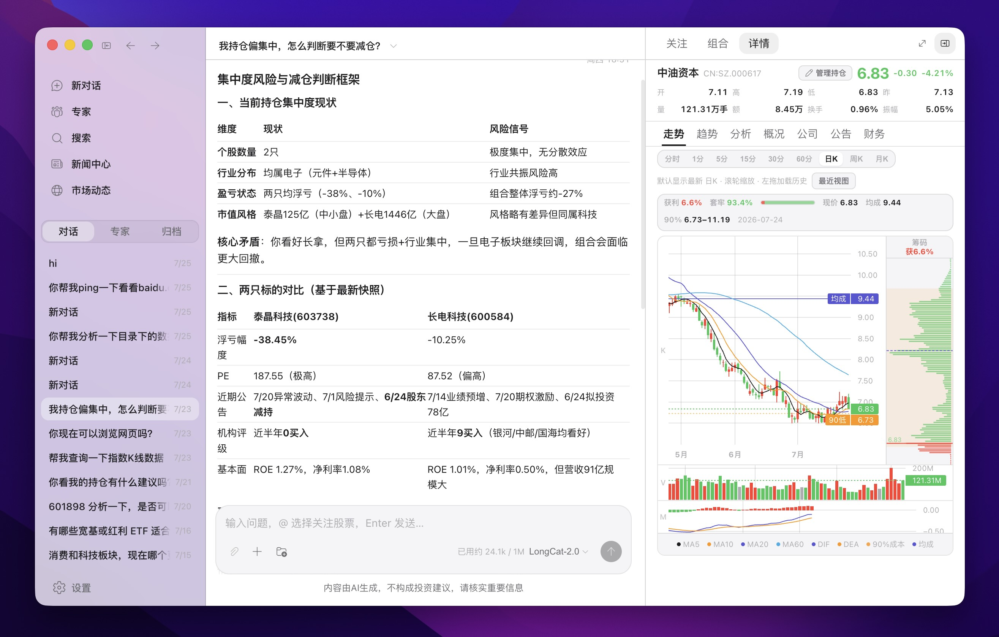

# Opptrix Agent 协作指南

> **面向对象**：使用 Cursor、Codex、Claude Code 等 AI 编程助手参与本仓库开发的协作者。  
> **用法**：在 Agent 会话开头附加一句：「请先阅读 `docs/AGENT-GUIDE.md`，再按其中规范修改代码。」  
> 人类贡献者请同时阅读 [CONTRIBUTING.md](./CONTRIBUTING.md) 与 [README.md](../README.md)。

---

## 1. 项目是什么

**Opptrix** 是一款 **全球多市场投研数据查询与信息整理工具**（非券商、非投顾、非交易终端）：

- 用户通过自然语言提问，LLM 调用 **127 个 MCP 投研工具** 拉取 **A 股、美股、港股、日股、韩股、加密货币** 等市场的行情、评估、新闻与结构化数据，再生成中文分析。
- 提供 **Web** 与 **Desktop**（Electron + 本地 API sidecar），**共用同一套 React UI 与 Fastify API**。
- 核心能力：跨市场标的搜索、个股/ETF 诊断、行业透视、新闻订阅、行情动态、机构评级（A 股）、策略回测、关注列表与组合账本、发现策略、计划任务、Agent 工作区与专家体系等（多市场本地数据包同步：A 股全市场 + 美股/加密货币/港股/日股/韩股本地列表）。

**面向用户的完整说明与醒目风险提示**见根目录 [README.md](../README.md) 顶部「重要风险提示与用户须知」。

<p align="center">
  
</p>

<p align="center"><sub>三栏布局：左侧会话、中间 Agent 分析与工具过程、右侧个股行情与 K 线</sub></p>

### 1.1 项目边界（必须遵守）

| 允许 | 禁止 |
|------|------|
| 投研信息整理、因子计算、策略回测、学习研究 | 冒充持牌投顾、承诺收益、代客下单 |
| 调用公开/授权数据源 | 绕过付费接口、爬取违反 ToS 的数据 |
| 在 UI 中面向投资者写易懂文案 | 在界面裸露技术词（MCP、hydrate、F10）而不解释 |
| 小步增量 PR | 未经讨论的大范围重构、擅自改导航/布局模式 |
| 数据层走 `queryInstrumentData` 标准 API | Hub/UI 直连 Provider |
| **向后兼容与迁移**（硬性，禁止断代） | 无迁移改 DB/schema/API/更新源导致旧客户端不可用或丢数据 |

**免责声明**：本软件输出仅供参考与学习，**不构成投资建议**；协作者不得在文案或逻辑中暗示「保证盈利」。详见 [README.md](../README.md) 风险提示。

### 1.2 向后兼容与迁移（硬性）

任何 **SQLite schema**、**本地/用户数据格式**、**Hub/API 契约**、**自动更新源/安装包**、**Provider/数据层路由** 变更，必须先设计 **旧版兼容 + 幂等迁移**，**禁止断代**（旧客户端无法打开、丢数据、或永久无法更新）。

| 必须 | 禁止 |
|------|------|
| 启动时自动检测旧格式并幂等迁移（`meta` / `SCHEMA_VERSION`） | 无迁移 `DROP`/重命名导致旧数据不可读 |
| 过渡期双读旧格式；更新 URL 变更须保证旧包至少能升一次 | 让用户删 `opptrix.db` 或重装作为唯一方案 |
| 迁移失败可诊断、尽量保留原数据 | 旧安装包永久无法自动更新且无说明 |

**参考实现**：`packages/user-store`（`migrateFromLegacyFiles`）、`packages/market-data-store`（`SCHEMA_VERSION`）、`packages/news-feed`（`ensureMigrated`）、桌面更新见 [DESKTOP-RELEASE.md](./DESKTOP-RELEASE.md)。

完整规则：`.cursor/rules/backward-compatibility.mdc`。

---

## 2. 技术栈与运行形态

| 层级 | 技术 |
|------|------|
| 语言 | TypeScript（Node.js ≥ 24） |
| 后端 | Fastify（`apps/server`） |
| 前端 | React 18 + Fluent UI v9 + Vite（`client-ui`） |
| 桌面 | Electron（`apps/desktop`），生产环境捆绑 Node sidecar |
| 包管理 | npm workspaces（**仅在仓库根目录** `npm install`） |
| Agent | OpenAI 兼容 Function Calling + 进程内 MCP Broker（`packages/agent`） |
| 本地库 | SQLite + better-sqlite3（`packages/market-data`） |

### 2.1 端口与代理

| 端口 | 用途 |
|------|------|
| `5173` | 用户访问的 Web UI（开发：Vite HMR；生产：preview） |
| `8711` | API 后台（`STOCK_RESEARCH_PORT`），开发时由 Vite 代理 `/api` |

桌面版同样加载 `http://127.0.0.1:8711`（生产）或开发时 `5173`（HMR）。

---

## 3. 仓库目录地图

```
Opptrix/
├── apps/
│   ├── server/              # Fastify API、静态 SPA、配置与会话持久化
│   └── desktop/             # Electron main/preload、打包脚本
├── client-ui/               # React 单页应用（主入口 ChatApp）
│   └── src/
│       ├── chat/            # 聊天、Composer、Markdown、侧栏会话
│       ├── market/          # 右侧投研面板：关注/发现/行业/个股/组合
│       ├── desktop/         # 窗口 chrome、浮层侧栏、Electron 布局
│       ├── pages/           # 设置页等
│       ├── components/opptrix/ # OpptrixButton、OpptrixField 等封装
│       ├── theme/           # tokens、mixins、Fluent 主题
│       ├── api/             # 前端 API 客户端
│       └── platform/        # isElectron 等运行时检测
├── packages/
│   ├── shared/
│   ├── a-stock-layer/       # MarketDataEngine、Provider、TDX
│   ├── market-data-core/ · market-data/
│   ├── market-data-providers-{cn,us,crypto,jp,kr,hk}/
│   ├── provider-sdk/
│   ├── stock-eval/ · institutions/ · t-strategy/ · skills/
│   ├── research-hub/ · search-hub/
│   ├── news-feed/ · article-enrichment/
│   ├── local-inference/
│   ├── schedule/            # 计划任务服务（应用内 timer + 桌面 OS tick）
│   ├── user-store/          # SQLite 用户数据
│   ├── agent/               # LLM + 127 MCP 工具 + Tool Pack 路由
│   ├── agent-workspace/     # Agent 工作区：文件/Shell/Python/密钥保险箱
│   └── agent-browser/       # Playwright 网页浏览工具后端
├── docs/                    # 架构、API、UI；入口 docs/README.md
├── tests/                   # smoke + integration tests (*.test.mjs)
├── .cursor/rules/           # Cursor 工程规则（UI 与改动原则）
├── package.json             # 根脚本：dev / build / test / dev:desktop
```

---

## 4. 架构要点

### 4.1 单一调度入口

所有投研能力经 **`ResearchHub.dispatch(feature, params)`** 路由：

- HTTP：`POST /api/research` → hub
- Agent：MCP 工具 handler 内部调用 hub 或 `MarketDataService`

新增业务能力时，**优先**在 hub 增加 `case`，再暴露 REST / 注册 MCP tool，避免三套重复实现。

### 4.2 Agent 与 MCP

```
用户消息 → AgentEngine → ToolPackResolver（播种 packs）
                ↓
         activeNames = core+meta+播种+会话激活
                ↓
         AggregatingToolBroker（外部 MCP 优先级链 → 本地 McpToolBroker）→ LLM tools
                ↓
         activate_tool_pack → 同会话累积 → 同轮刷新 Broker
                ↓
         ToolRegistry / External MCP Client → ResearchHub / MarketDataService
```

- 工具定义：`packages/agent/src/tools.ts`（MCP 投研工具）+ `document-tools.ts`（会话研报库：`list_session_documents` / `search_document` / `read_document` / `search_library`，属 `core`；支持 PDF / 文本 / Word / PPT / 图片 OCR 文本；**跨会话/全库**混合检索主路径 `search_library`（FTS ⊕ 向量，`scope=library`）→ `read_document` 多跳精读——意图 `library_search`：跨研报/全库问句首选 `search_library`，勿与本会话 `search_document` 混淆）+ `canvas-tools.ts`（画布/脑图制品，属 `artifacts` pack）+ `mcp/workspace-tools.ts`（工作区）+ `mcp/browser-tools.ts`（网页）+ 内置 `ask_user` / 工具包元工具 / 外部 MCP 运维工具
- 工具元数据（何时使用、调用规范、`packId`）：`packages/agent/src/tool-meta.ts`
- **工具包路由（Tool Pack Router）**：
  - 包定义：`packages/shared/src/tool-packs.ts`（`TOOL_PACK_DEFS` / `TOOL_PACK_MEMBERSHIP`）
  - 意图播种：`packages/agent/src/mcp/tool-pack-resolver.ts`（关键词/上下文 → ≤2 业务 pack）
  - 会话激活：`list_tool_packs` / `activate_tool_pack`；同 session 累积 active packs
  - **工作流技能（Agent Skills）**：`@opptrix/agent-skills`（meta pack）；与专家「技能专长」persona、Tool Pack **正交**。规范见 [AGENT-SKILLS.md](./AGENT-SKILLS.md)
    - **Meta 工具**：`list_agent_skills` / `activate_agent_skill` / `get_agent_skill` / `get_agent_skill_file`；写操作 `create_agent_skill` / `import_agent_skill` / `delete_agent_skill`（须 `ask_user` + `confirmed=true`）
    - **激活**：同会话最多 3 个；正文 `` `@skill:name` `` 引用会**依赖自动激活**（循环检测 + 超限记入 `depNotes`）
    - **内置**：`equity-deep-dive`、`morning-market-brief`（v2 JSON）、`closing-market-brief`、`industry-chain`（`references/chain-knowledge.json`）、`earnings-quick-read`、`create-skill`（新建技能引导）
    - **意图**：早报 / 收盘 / 产业链 → 激活对应工作流技能，再用 `market` / `fundamentals` 等 pack 取数；**新建/定制技能** → 先 `activate_agent_skill(create-skill)` 再 `create_agent_skill`；**勿**再调用已删除的 `get_morning_brief` / `get_closing_report` / `industry_mining` / `industry_mermaid`
  - 引擎每轮按 `core`+`meta`+播种+已激活 子集创建 `AggregatingToolBroker`（内含本地 `McpToolBroker` + 外部 MCP 注册表）；激活后同轮刷新 tools
  - **外部 MCP（优先级故障转移）**：
    - 配置：`packages/shared/src/mcp-servers.ts`；持久化 user-store `mcp_servers`；设置页 **MCP 服务器** / REST `/api/mcp-servers*`
    - 运行时：`packages/agent/src/mcp/external/`（`ExternalMcpRegistry` / Health / AggregatingToolBroker）
    - 传输：stdio + Streamable HTTP；LLM 仍见稳定本地工具名；有 `capabilityBindings` 时按 `sortOrder` 试外部再本地兜底
    - **Client 与 failover 判定**（`packages/agent/src/mcp/external/connection.ts`、`packages/shared/src/mcp-servers.ts`）：
      - SDK Client 注入 permissive `jsonSchemaValidator`，不强制校验远程 `outputSchema`，避免上游 schema 漂移导致 `callTool` 直接失败
      - `parseToolResult` 优先取 `structuredContent`；若载荷为鉴权/业务错误形态（如 `{ data: null, message }`、`{ error: ... }`）则抛错，由绑定链换源或降级本地
      - `isMcpServerFailoverError`：`-32602`（structured content 不匹配）、`-32600`（声明 outputSchema 但未返回 structured content）、`Missing X-api-key` / 401 / 429 / 5xx / 网络超时等 → 可 failover；`invalid argument` 等业务参数错误不换源
      - 降级本地时 `_mcp.degraded=true`；若 `extractMcpConfigHint` 识别出缺 Key/鉴权问题，附带 `_mcp.configHint` 供 LLM 提示用户检查设置
    - 外部独有工具：`serverId__toolName` 命名空间注入 catalog
    - **远程优先排序（三级优先，不可倒置）**：`AggregatingToolBroker.openAiTools()` 远程工具排前 + 同名本地不重复暴露；`orderToolsByPreference(..., { remoteFirst: true })` 进一步保证远程（命名空间）工具整体先于本地，preferred 排序仅在各自分组内生效。本地工具是最低优先级兜底。system 注入 `buildDataSourcingPolicy`：远程 MCP=最高优先、`_mcp.source=local` 视为降级须提示可信度受限
    - meta 运维：`list_mcp_servers` / `enable_mcp_server` / `pause_mcp_server` / `reorder_mcp_servers`；`install_mcp_server` / `uninstall_mcp_server` **须 ask_user 后 `confirmed=true`**；禁止经 Agent 改已有 server 的 command/url/env
    - 单测：`tests/external-mcp-failover.test.mjs`
  - **分层精排**：`resolveToolRoutePlan` 将用户意图映射为首选工具顺序与研究档位（L1 事实快答 / L2 结构化解读 / L3 深度备忘录），注入「本轮工具选型卡」与证据纪律/输出骨架，并把首选工具排到 tools schema 前列
  - **投研完备性闭环（`buildResearchCompletenessLoop`，仅 L2/L3 注入）**：出报告前强制「缺口自检 → 针对性补齐（换源重试 / activate_tool_pack / 远程重试降级项）→ 重新纳入分析 → 收敛输出」；同一缺口最多补 1 轮，取不到则如实标注缺口。L1 事实快答不注入，避免过度拉数
  - 默认角色为**投研研究员**：事实与推断分层、标注时效、工具失败不编造、L3 声明数据缺口；配合 MCP 取证后按档位写结论
  - **消息正文插图（无需 pack，日常默认）**：L2/L3 有对比/趋势/占比/强弱矩阵等定量数据时，助手回复 Markdown 可用 ` ```chart ` / ` ```opptrix-chart ` 围栏（内容为 JSON，非 TSX）直接渲染 `@opptrix/canvas` 的 `Chart`（与画布同源），无需授权、无需 `artifacts`。「画个图」用围栏，勿误当成完整报告；**禁止**用 `shell_run` + Python（matplotlib/seaborn/plotly 等）出图再当聊天插图（用户明确要求导出图像文件到工作区时除外）。见 `buildResearchEpistemicPlaybook`。
  - **画布与脑图（`artifacts` pack）**：实现 `packages/agent/src/canvas-tools.ts`；非 always-on，意图播种（可视化报告/画布/脑图/思维导图）或 `activate_tool_pack({ pack_ids: ["artifacts"] })`
    - **工具**：`create_canvas` / `update_canvas` / `read_canvas` / `create_mindmap` / `update_mindmap` / `read_mindmap`
    - **何时用**：完整可视化报告仅当用户明确点名报告/画布/可视化报告/机构调研报告版式，或 Agent 自感应本轮值得交付完整多章节图文报告时：加载 `artifacts` 并以 `create_canvas` 为主交付；**禁止**先 `ask_user` 询问是否出报告。日常定量表达优先正文 `chart` 围栏。用户要脑图/思维导图/结构化主题树 → `create_mindmap`；更新先 `read_*` 再 `update_*`。插图 ≠ 报告：「画个图」用围栏，不必 `create_canvas`
    - **画布源码约束**：`source` 为 TSX 字符串。**UI**：使用 `@opptrix/canvas` curated 组件（`Surface` / `Stack` / `H1`–`H3` / `Text` / `Stat` / `Table` / `Chart` / `Callout` / `Quote` 等）；颜色用 `useCanvasTheme` 或组件默认；禁止渐变、大阴影、装饰 emoji。**语义配色**：文字层级用 `Text` tone（primary/secondary/tertiary）；涨跌默认红涨绿跌（`danger`/`success`）；tips/风险用 `Callout`（tone + 可选 variant）；原文/口径摘录用 `Quote`（`cite` 写来源），勿用 Callout 冒充引用；行内 `Pill` / `Code` / `Link`。**版面**：默认流体宽度 `Surface`；**默认机构调研报告版式**（H1→导语→H2 分章 + 正文与图表穿插；定量对比/变化/构成/强弱矩阵优先 `Chart`（`bar`/`line`/`pie`/`heatmap`）+ 主题配色，heatmap 用 `{ label, row, col, value }`；`Table`/`Stat` 作明细与 KPI；**Chart 勿拉满全宽**（默认居中；bar/line ~320、pie ~230、heatmap ~380；勿写 `width:'100%'`；图注用 `Chart caption` 与图居中对齐；Chart 已含轴/网格/数值标注，勿手写假坐标）；章节靠标题与 Stack 间距，**避免 Divider**（勿用手写 hr/边框冒充），仅用户明确要求时例外；须含介绍/说明文字；勿用 Card 墙做面板分割；仅用户明确要面板/仪表盘时例外）。**仅允许** `import … from 'react'` 与 `import { … } from '@opptrix/canvas'`（公开导出）；禁止其它依赖（含 echarts）。返回 `attachment`（`kind=canvas`）供消息内点击预览。playbook：`buildArtifactsPlaybook()`
    - **脑图**：`rootId` + `nodes[{id,parentId,label,note?}]`；返回 `kind=mindmap` 附件
    - **意图精排**：`create_canvas` → 首选 `create_canvas`；`create_mindmap` → 首选 `create_mindmap`；勿用 `workspace_write` 代替制品工具
    - **REST**：列表/下载见会话附件 API；预览写回见 `PUT /api/sessions/:id/attachments/:attachmentId`（仅 canvas/mindmap）
  - **基本面事实表（`fundamentals` pack）**：`get_instrument_profile` / `get_instrument_financials` / `get_instrument_income_statement` / `get_instrument_balance_sheet` / `get_instrument_cash_flow` / `get_instrument_financial_indicators` / `get_instrument_shareholders` / `get_instrument_institution_holdings` / `get_instrument_dividend`
  - **市场（`market` pack）**：`get_market_dynamics`（全景）；`get_macro_series`（中国/国外/行业/油价宏观序列，可翻页）；专项 `get_dragon_tiger` / `get_limit_updown` / `get_market_sentiment`；同花顺独有 `get_cn_market_special`；`get_trade_calendar` / `get_market_session`；`get_instrument_money_flow`
  - **资讯与订阅（`news` pack）**：
    - **只读浏览**：`get_news_center_status` → `list_news_groups` / `list_news_sources` → `list_news_articles` → `get_news_article`；标的公告 `get_instrument_notices` → `get_notice_content`
    - **RSS 路由目录（内置 curated schema v3，三级漏斗）**：`list_rsshub_categories` → `list_rsshub_domains` → `get_rsshub_domain_routes`（返回路由+频道**拉平**后的可订阅叶子，`ask_user(allow_multiple=true)` 直接多选；禁止再先选路由再选频道；叶子过多用 `q` 缩小）→ 拼短名单基址 + `add_news_source`；`search_rsshub_routes` 仅用户已点名媒体时捷径；不依赖 GitHub docs / 全量 radar
    - **订阅 CRUD**：`validate_news_source`（添加前探测，不写入）→ `add_news_source`（`url` 必填，可选 `title`/`group_id`）；`create_news_group` / `update_news_group` / `move_news_source` 可直接执行
    - **确认纪律（与 MCP 安装同类）**：`delete_news_source`、`import_news_sources`、`delete_news_group` **须先 `ask_user`，再以相同参数 + `confirmed=true` 重试**；未 confirmed 只返回摘要、不落库。删订阅不可恢复；删分组仅把组内订阅改为未分组，不删订阅本身。导入入参：`schema_version=1` + `subscriptions`，或仅 `subscriptions` 数组（已存在 url 跳过）
    - Hub feature 映射：`news_center_status` / `news_groups_list` / `news_sources_list` / `news_articles_list` / `news_article_detail` / `news_source_add|delete|validate` / `news_sources_import` / `news_group_create|update|delete` / `news_source_move_group`（见 [API.md](./API.md) Hub Features）
  - **网页浏览（`browser` pack）**：`browser_navigate` / `browser_snapshot` / `browser_click` / `browser_type` / `browser_screenshot` / `browser_close`（Playwright 完整 Chromium，headless，无需单独 headless-shell；开发环境 `npm install` 会自动安装 Chromium，可用 `OPPTRIX_SKIP_PLAYWRIGHT_BROWSER=1` 跳过；桌面安装包已内置）
  - **计划任务（`automation` pack）**：实现 `packages/agent/src/mcp/schedule-tools.ts`，底层 `@opptrix/schedule` / user-store；REST 见 [API.md · 计划任务](./API.md#计划任务--schedule)；桌面 OS tick 见 [DESKTOP.md · 计划任务与后台常驻](./DESKTOP.md#计划任务与后台常驻)
    - **工具**：`list_scheduled_jobs` / `get_scheduled_job` / `create_scheduled_job` / `update_scheduled_job` / `enable_scheduled_job` / `disable_scheduled_job` / `delete_scheduled_job` / `run_scheduled_job_now` / `list_scheduled_job_runs`
    - **激活**：非 always-on；关键词播种（`tool-pack-resolver.ts`：`计划任务|定时任务|定时分析|自动执行` 等）或 `activate_tool_pack({ pack_ids: ["automation"] })`
    - **何时用**：用户要**定时重复**跑智能体分析、提醒或受控脚本；一次性命令仍用 `shell_run`，勿用计划任务代替
    - **意图精排**（`tool-route-plan.ts`）：`schedule_create` → 首选 `create_scheduled_job`；`schedule_manage` → `list_scheduled_jobs` / CRUD；`schedule_run_now` → `run_scheduled_job_now`；混淆对：计划任务优先于 `shell_run`
    - **`create_scheduled_job` / `update_scheduled_job` 参数**：
      - `title`（必填）、`kind`：`agent_prompt` | `shell_script`
      - `schedule_kind`：`once` | `interval` | `cron`；`schedule`：`run_at` / `every_sec` / `expression`
      - `payload`：`agent_prompt` → `{ prompt, session_id? }`；`shell_script` → `{ argv, cwd? }`
      - `enabled`（可选，默认 true）
    - **安全与纪律**：
      - `kind=shell_script` **须**用户在设置中开启 `allow_shell_scripts`（`PATCH /api/schedule/settings`）；未开启时 create/update 返回错误，Agent 应引导用户先开开关，**禁止**用 `shell_run` 绕过定时登记
      - `delete_scheduled_job` **须** `ask_user` 后以 `confirmed=true` 重试；未确认只返回 `needs_confirmation`
      - `run_scheduled_job_now` 写入执行记录（`trigger: 'agent'`）；同一任务勿连续多次触发
      - `list_scheduled_job_runs`：`job_id` 必填，`limit` 默认 20、最大 50
    - **与调度关系**：Sidecar 进程内 timer（20s）在应用运行时常驻扫描；桌面 **OS tick**（60s 用户级）在关窗/后台时兜底——Agent 只读写任务定义，不负责触发 OS 注册（由桌面 `reconcileOsSchedule` 完成）
  - **工作区与文件（`workspace` pack）**：实现 `@opptrix/agent-workspace` + `packages/agent/src/mcp/workspace-tools.ts`
    - **工具**：`workspace_list` / `workspace_read` / `workspace_write` / `workspace_mkdir` / `workspace_delete` / `download_file` / `http_fetch` / `request_folder_access` / `list_workspace_grants` / `resolve_workspace_path_uri` / `shell_platform_status` / `shell_run` / `shell_install` / `python_env_status` / `ensure_python` / `list_local_data_apis` / `get_local_data_catalog` / `prepare_fuyao_dump` / `request_session_lan_access` / `request_secret` / `list_vault_secrets` / `grant_session_secret` / `revoke_session_secret` / `delete_vault_secret`
    - **消息内文件引用**：聊天 Markdown 展示工作区图片/音视频/文件时，使用协议 `opptrix-ws://{root_id}/{相对路径}`（例：`opptrix-ws://shared/charts/a.png`）。可先调 `resolve_workspace_path_uri({ root_id, path })` 得到规范 `uri` 与 `exists` / `kind_hint`（合法且已授权即返回 uri，不返回本机绝对路径）。UI 将 URI 解析为 `GET /api/sessions/:id/workspace/file` 流。**禁止**消息中写 `file://` 或绝对路径。
    - **激活**：非 always-on；意图播种（本地读写/下载/开放 API/授权文件夹/运行代码/编程类处理）或 `activate_tool_pack({ pack_ids: ["workspace"] })`；须在聊天会话中调用（依赖 session bridge）。**能力不足兜底**：内置/已匹配工具无法完成或无匹配 pack 时 → activate `workspace`，用 `shell_run` / `ensure_python` / `workspace_*` 沙盒编程实现（可先标准工具取数再沙盒计算）；标准 API 能做的禁止先上沙盒；首选已加载时勿仪式化重复 activate
    - **可访问目录（唯一清单）**：Agent 问「能访问哪些目录」时**只**用 `list_workspace_grants`（属 `workspace` pack，须已播种或 `activate_tool_pack`；返回 `summary` + 脱敏后的 `grants[]`：`root_id` / `label` / `mode` / `path_hint`）。默认项**不**返回 `~/.opptrix` 绝对路径；落在用户数据根下的额外 grant 亦脱敏为 basename +「应用内部路径」提示。用户侧界面与 Agent 摘要均称「**本对话工作区**」，**不**把 `~/.opptrix` 根目录或跨会话全局目录标为默认可写区。
    - **`get_project_info`（已脱敏，非授权清单）**：经 `buildAgentSafeProjectInfo` 剥离 `paths` / `project_root` / `agent_package`，仅保留版本/运行时等元数据 + `user_data_configured`；**勿**当作目录清单，亦**勿**向用户复述内部数据根路径。
    - **根目录布局**：容器根 `{userData}/agent-workspace/`（quota / 清理统计）；每会话默认 `root_id=default` → `agent-workspace/sessions/<sessionId>/`（读写，**会话隔离**）；**公共复用区** `root_id=shared` → `agent-workspace/shared/`（`packages/` / `data/dumps|exports|cache` / `docs/` + README；会话自动 grant rw；**`clearSession` 不删 shared**）；旧版全局根下散落文件幂等迁入 `_legacy/`。额外目录由用户在界面「授权文件夹」或 REST grant 写入本会话（`ro`/`rw`）
    - **本地数据目录**：`list_local_data_apis` → `get_local_data_catalog({ api_id })`。分类：`instrument_standard` / `agent_tools` / `hub_features`（如 Hub `search_local_instruments`，`access: hub_feature`）/ `shared_packages` / `fuyao_dump` / `workspace_fs`。system 仅挂索引句 + 编程协议短段。
    - **编程协议**：查目录 → 扫 `shared/packages` → `shell_install` → 自写回写 README；离线大数据用 `prepare_fuyao_dump`（服务端持 Key 落盘 `shared/data/dumps` 或短时效 URL）；**禁止** Key 进沙盒；**禁止**引导 `market sync` / `dailyDump`。
    - **会话局域网（P1）**：`SessionLanAccessStore`（内存）；有效 LAN = 全局 `allow_lan_access` **\|\|** 本对话授权。`ask_user` 选 `allow_lan_session` 或 `request_session_lan_access`；`clearSession` 清除。`http_fetch` / egress 读有效 LAN。
    - **密钥保险箱**：用户级 AES-GCM（`agent_vault` + `vault.key`）；会话 allowlist。`request_secret` → `user_prompt.kind=secret`（密码框）；服务端写 vault + grant 后再 resolve；工具结果无明文。`shell_run.secret_refs` → SRT sentinel + stdout 脱敏。意图 `secret_vault` 首选 `request_secret`。
    - **安全边界摘要**：
      - 路径闸门：相对路径，禁止 `..` 穿越；Global Deny 优先于 grant（如 `agent-privileges`、用户库 `opptrix.db*`、`providers/`、`sessions/`、`tushare-config.json`、`watchlist.json`、`portfolio.json`、`market-data/` 等）；用户数据根本身不可作为 grant 目标暴露给 Agent
      - 写/删/覆盖：`rw` 授权；覆盖与删除需用户确认（可本对话 sticky）；默认工作区总配额约 20GB
      - `http_fetch` / `download_file`：仅 `http`/`https`；DNS 解析后禁止 localhost / 私网 / 链路本地 / 云元数据地址（SSRF）；**会话/全局已允许局域网时**可访问私网 host（具体域名仍可能需出站确认）；响应进上下文默认截断约 1.5MB；请求体 ≤32MB
      - `request_folder_access` 仅提示用户去界面授权，不直接弹系统选目录；授权 API 见 [API.md · Workspace grants](./API.md#workspace-grants会话文件夹授权)
      - **命令隔离（shell_*）**：实现 `packages/agent-workspace/src/shell/`（`ShellRunner` + `@anthropic-ai/sandbox-runtime` OS 级沙箱）。`shell_run` 以结构化 `argv` 传参（`shell: false`），白名单二进制：`python` / `python3` / `node` / `npm` / `npx` / `pip` / `pip3` / `ping` / `traceroute` / `tracert`；禁止 sudo、管道删根等高危模式。白名单校验在 **argv 重写前**（用户传 `node`，非 `Opptrix`/`Electron` 可执行名）。`python`/`pip`/`node`/`npm`/`npx` 在 spawn 前经 `resolveShellArgv` 重写：Python → active 解释器；桌面端 **Node 注入（方案 A）** → `process.execPath` + `ELECTRON_RUN_AS_NODE=1`；npm/npx → 系统二进制或 `[node, npm-cli.js, …]`（探测顺序：PATH → `OPPTRIX_RUNTIME_STAGE` → `require('npm/bin/npm-cli.js')`）。`get_system_info` 返回 `node_ready` / `node_source` / `sandbox_node_version`、`npm_ready` / `npm_source`、`python_ready` / `python_source` / `sandbox_python_version`、`electron_run_as_node`（不含内部绝对路径）。`allowRead` 追加 Node 运行时目录（execPath 父目录、macOS Frameworks/Resources、`OPPTRIX_RUNTIME_STAGE`、npm CLI 所在 node_modules）。`PIP_INDEX_URL` 取自设置页首个 pip 镜像。调用 `shell_run` 前须 `get_system_info`（或本轮已有 platform）再按平台组 argv（darwin/linux：`ping -c` + `traceroute`；win32：`ping -n` + `tracert`）；禁止 `powershell`/`cmd`/`bash -c` 整串绕过。测网站延迟优先 `http_fetch`；用户明确要求 ICMP 时用 `shell_run` + `ping`。系统提示**不再**写「禁止 Shell」；本轮已加载 `shell_run` 时必须用它完成本地命令；**能力不足**时 activate `workspace` 兜底（见 playbook）。cwd 须在 session grant 内（可读即可）；文件系统以 grants 为第一层闸门，SRT `allowRead`/`allowWrite`/`denyRead`（含用户数据根、homedir、`.ssh` 与 Global Deny，`runtimes/` 在 Deny 但托管 Python 目录在 allowRead）为第二层强制隔离。默认超时 120s；stdout/stderr 截断。意图精排：`local_data_catalog` → `list_local_data_apis`；`fuyao_dump` → `prepare_fuyao_dump`；`session_lan` → `request_session_lan_access`；`python_env` → 首选 `python_env_status`；`workspace_shell` → 首选 `shell_run`；`workspace_network_latency` → 优先 `http_fetch`；`workspace_shell_install` → 首选 `shell_install`
      - **命令运行确认（shell sticky）**：首次 `shell_run` / `shell_install` 在真正 spawn 前弹出确认（展示 argv 摘要）；选项 `allow_once` / `allow_session` / `cancel`。`allow_session` 写入 `ShellRunStickyStore`（**内存**，会话删除时清除）。`shell_platform_status` 无需确认。聊天进度（`chat-progress`）对 shell 工具有中文标签与 exit_code / stdout 截断摘要
      - **包安装与联网 sticky**：`shell_install(manager=pip|npm)` 或 `shell_run` 且 `network_intent=install` / 检测到 `pip|npm install|ci|update` 时在命令确认之后触发联网安装确认（若本会话已 sticky 则跳过）。选项：`once` / `sticky` / `cancel`，存 `NetworkInstallStickyStore`（**内存**）。允许联网时沙箱 `allowedDomains` 为 PyPI / npm / yarn / GitHub 相关域（见 `network-policy.ts`）。包只能装进授权工作区：pip 默认 `--target .opptrix-packages`；npm 禁止 `-g`/`--global`/`--user`/`--system`
      - **出站授权（SessionNetworkEgressStore + sandboxAskCallback）**：默认 `allowedDomains=[]`（禁 TCP 出站）。**永久免确认白名单**：`OPPTRIX_SHELL_ALLOWED_DOMAINS` **∪** 设置页白名单（`GET/PUT /api/settings/sandbox`，存 `preference/sandbox_settings`；支持 `*.example.com`）。`allow_lan_access=true` **或本对话 SessionLanAccessStore 已授权**时允许白名单含私网/localhost；否则 PUT 校验与运行时 `getGrantableMergedAllowedDomains*` 均过滤私网/localhost。`ping` / `traceroute` / `tracert` 与命令运行**合并一次**确认（argv 摘要 + 目标主机）；选项 `allow_host_once` / `allow_host_session` / `cancel`。本会话已 grant 的 host 或命中永久白名单免确认。运行中 SRT 拦截出站 connect 时，`sandboxAskCallback`（`createSandboxAskCallback` → `SandboxManager.initialize`）弹出 `confirmation.kind === "network_egress"`（同上选项）；无 confirm handler 时拒绝。`python`/`node`/`npx` 无明确 host 时不弹全网确认；禁网运行，出站被拒时返回 `needs_network_egress`（含建议 host）由 Agent/用户确认该域名后重试。grant 经 SSRF 校验（`assertEgressHostGrantable`，受有效 LAN 约束）。SRT 不支持 `allowedDomains=*`
      - **设置页白名单（用户可见）**：**设置 → 沙盒环境** — 「访问白名单」（每行一条，命中后不再询问）与「允许局域网访问」开关；变更经 REST 持久化，sidecar 通过 `getSandboxSettings()` 读取
      - **DNS 策略**：SRT 下系统 `getaddrinfo` / 宿主代理解析不受 fence；沙盒内自打 UDP/53 的 `dig`/`nslookup`/`host` 会被 fence（且不在 `ALLOWED_BINARIES`）。授权对象是连接目标，不是 DNS；解析到私网后 connect 仍拒
      - **平台依赖（`shell_platform_status`）**：返回 `platform` / `supported` / `sandbox_available` / `ready` / `message`，以及可选 `missing_dependencies` / `setup_hint` / `needs_windows_install` / `needs_linux_install` / `can_auto_install` / `needs_elevation` / `userns_restricted`。`ready=false` 时 `shell_run` / `shell_install` 直接失败并返回 `message`。**macOS**：一般无需额外操作；**Linux deb**：依赖随 apt 安装；**Linux AppImage**：尽量使用内置 `sandbox-bins`（deb 仍最稳）；**Ubuntu 24.04+ userns 限制**：首次 `shell_*` 可自动触发一次 **pkexec** 系统授权（`can_auto_install` / `needs_elevation`），无需手敲终端命令；取消授权后可稍后重试；无 polkit/无管理员权限的企业机仍可能失败。**Windows**：首次 `shell_*` 可自动触发一次 UAC，无需用户手敲 `npx windows-install`；取消授权后可稍后重试。不支持的 OS → `supported=false`

#### 工作区编程、本地数据目录与扶摇 Dump

以下能力均属 **`workspace` pack**（须播种或 `activate_tool_pack`）；实现：`packages/agent/src/local-data-catalog.ts`、`packages/agent/src/mcp/workspace-tools.ts`、`packages/market-data/src/sync/dump-import.ts`（`prepareFuyaoDumpForAgent`）、`packages/agent-workspace/src/shared-workspace.ts`。

**渐进加载（本地数据目录）**

| 步骤 | 工具 | 说明 |
|------|------|------|
| 1 | `list_local_data_apis({ category? })` | 轻量索引：`api_id` / `category` / `title` / `summary` / `access`；可按分类过滤 |
| 2 | `get_local_data_catalog({ api_id, include_examples? })` | 按 `api_id` 取调用方式、参数、`how_to_call`、示例（默认含示例） |

- system 提示仅挂**索引句** + 编程协议短段（`buildLocalDataCatalogIndexHint` / `buildLocalProgrammingPlaybook`），**勿臆造**未通过 catalog 加载的 API 细节。
- 分类：`instrument_standard`（标准 capability / `queryInstrumentData`）/ `agent_tools` / `hub_features`（如 `hub.search_local_instruments`，`access: hub_feature`）/ `shared_packages` / `fuyao_dump` / `workspace_fs`。
- 常用 `api_id`：`cap.realtime`、`fuyao.dump`、`shared.packages`、`workspace.shared`、`workspace.default`、`hub.search_local_instruments`。

**公共资产（`root_id=shared`；用户界面称「公共资产」，路径概念仍为 shared）**

| 路径 | 用途 |
|------|------|
| `packages/<name>/` | 可复用脚本/包（须含 README） |
| `data/dumps/` | 扶摇 Parquet 等离线大数据（经 `prepare_fuyao_dump`） |
| `data/exports/` | 导出 CSV/JSON 等结果 |
| `data/cache/` | 可删中间缓存 |
| `docs/` | 公共约定；含 `package-readme-template.md` |

- 容器：`{userData}/agent-workspace/shared/`；首次访问幂等初始化目录树与根 `README.md`（文案见 `shared-workspace.ts`）。
- 会话自动 grant `rw`；**`clearSession` 不删 shared**（仅删 `sessions/<sessionId>/`）。

**编程协议（摘要）**

1. `list_local_data_apis` → `get_local_data_catalog({ api_id })` 了解能力
2. `workspace_list({ root_id: "shared", path: "packages" })` → 读 `packages/<name>/README.md`，能复用则复用
3. 缺依赖 → `shell_install`（npm/pip），勿盲造轮子
4. 最后自写；可复用产物写入 `shared/packages/<name>/` + README（目的/入口/入参出参/依赖/示例/勿存密钥）
5. 离线大数据 → `prepare_fuyao_dump`；在线行情优先标准 Agent 工具，勿平行造数据源；第三方密钥经 `request_secret` + `shell_run.secret_refs`（禁止明文进沙盒）
6. 需局域网 → `request_session_lan_access` 或 `ask_user`（选项见下）

**`prepare_fuyao_dump` — 用法与安全**

- **用途**：服务端持扶摇 Key 鉴权下载 Parquet，**不把 Key 返回给 Agent/沙盒**；Agent 侧取 dump 的**唯一主路径**（见下方废弃说明）。
- **参数**：
  - `dump_kind`（必填）：`full` | `incremental` | `adjustment_factors`
  - `mode`（可选，默认 `local_path`）：`local_path`（落盘 `shared/data/dumps`）| `presigned_url`（返回短时效预签名 URL）
  - `force_refresh`（可选）：忽略缓存强制重下
- **成功返回**：
  - `local_path` 模式：`ok: true`、`root_id: "shared"`、`relative_path`（如 `data/dumps/<file>`）、`bytes`、`from_cache`、`sandbox_hint`
  - `full` / `incremental` + `local_path` 成功时**额外**：服务端自动写入 `shared/data/cache/offline-k-meta.json`，返回 `meta_written: true`、`meta_path: "data/cache/offline-k-meta.json"`（写失败不改 dump 成功态，仅 `meta_warning`）
  - `adjustment_factors` / `presigned_url`：**不**写 offline-k-meta
  - `presigned_url` 模式：`url`、`url_expires_hint`、`sandbox_hint`
- **沙盒侧**：用 `workspace_read` / `workspace_list` / `shell_run`（`root_id=shared` + `relative_path`）或下载 `url`；**禁止**向 shell 环境注入 `API_KEY` / `TOKEN` / 扶摇凭证。
- **失败**：返回 `ok: false` + `error` + `sandbox_hint`；勿改用 sync/dailyDump 兜底。

**已废弃：Agent 侧 `market sync` / `dailyDump` 作为主取 dump 路径**

- App 主库 **不再** 导入扶摇静态日 K；`prepare_fuyao_dump` 只落盘 shared / 缓存，不写 `market.db`。
- `packages/market-data` 的 `sync()` 仍供 **UI 与后台**维护名录/行业等，**不是** Agent 获取扶摇 Parquet 的入口。
- Agent / 文档 / 系统提示：**禁止**引导用户或自行在沙盒跑 `market sync`、`dailyDump`、或把 Key 注入环境变量来拉 dump；统一 `prepare_fuyao_dump`。

**会话局域网与全局设置**

| 层级 | 存储 | 作用 |
|------|------|------|
| 全局 | 用户 SQLite `preference/sandbox_settings.allow_lan_access`（设置 → 沙盒环境；REST `GET/PUT /api/settings/sandbox`） | 所有对话允许私网/localhost 连接判定 |
| 本对话 | `SessionLanAccessStore`（**内存**） | 仅当前 session；**可覆盖**全局 `false`；**不写回** preference |

- **有效 LAN** = 全局 `allow_lan_access` **OR** 本会话已授权（`isEffectiveLanAllowed(sessionId)`）。
- **申请方式**：`request_session_lan_access({ reason? })`（内部 `ask_user`）或 Agent 直接 `ask_user`，选项 `allow_lan_session` | `deny`。
- **生命周期**：`clearSession` 清除本对话 LAN 授权；全局开关不受单会话授权影响。
- **与出站关系**：LAN 仅放宽私网/localhost **连接判定**；具体域名仍可能需 `network_egress` 确认（`http_fetch` / `shell_run` ping 等读有效 LAN）。

  - **板块 / 指数成分**：`get_sector_list` / `get_sector_constituents`；`get_index_constituents`；`get_etf_profile`
  - **会话时钟 / 前缀缓存**：Engine 每轮将 `getCurrentTime()`（Asia/Shanghai）写入**本轮 turn-tail**（messages 末尾 ephemeral user），**不**写入稳定 system，以免破坏 DeepSeek 等前缀缓存；选型卡同理。`get_current_time` 仅在用户明确问时刻时调用。未显式定制时输出额度 ladder：普模 32k、推理 32k、`reasoningEffort=high` 为 64k（显式可选 64k / 128k / 384k；显式等于历史默认 4096 或旧 16k 会抬升；更低显式值仍尊重）。上游 `reasoning_content` 会累积；工具轮写入会话并在下一请求 wire 回传（含空串占位）；终轮仅非空思考写入；空正文时提示思考占用输出上限。
  - 调用未加载工具 → fail-closed，返回 `activate_tool_pack` 提示
  - 准确率测试：`tests/mcp-tool-route-accuracy.test.mjs`（首推精确率 / 可见性召回 / 易混消歧 / 选型卡 / 过播种抑制）
- **系统提示词分层（`assembleSystemPrompt`）**：实现 `packages/agent/src/experts/prompt-assembler.ts`；每轮由 `AgentEngine.buildRoundSystemPrompt` → `ToolRegistry.systemPrompt` 组装，结构固定为三层（空行分隔）：
  - **Layer 0 — 系统底线（不可覆盖）**：`buildLayer0Baseline()`。禁止具体买卖建议、禁止编造数据、须先调工具取数、区分事实与推断等。专家 `persona` 或用户消息若要求违反上述底线，Agent 须拒绝并说明原因；**Layer 0 优先级高于 Layer 1 角色设定**。
  - **Layer 1 — 角色 persona**：`buildRolePersona({ sessionRolePersona, roleLabel })`。正文唯一来源是会话字段 `rolePersona`（创建时从专家 `persona` 或 `DEFAULT_RESEARCHER_PERSONA` 快照；可经 `PUT /api/sessions/:id/role-persona` 编辑）。抬头可用专家 `title`（仅展示）。目录改 `persona` **不影响**已有会话。消毒：空/超长 >4000 字/命中注入模式则创建时回退默认角色；PATCH 会话失败则 400。专家目录列表 API 不返回 `persona`。**写法与快照语义**见 [EXPERT-GUIDE.md](./EXPERT-GUIDE.md)。
  - **Layer 2 — 工具与投研纪律**：`ask_user` 用法、已加载 tools、`buildDataSourcingPolicy`（远程 MCP 优先）、`buildAgentSystemRules`（含 `researchTier` 档位 playbook 等）。本轮选型卡与【会话时钟】在 Layer2 之外经 `buildTurnTailPrompt` 追加（见上「会话前缀缓存」）。
- **专家会话 vs 默认研究员**：
  - **默认研究员**：`POST /api/sessions` 不传 `expertId` → `expertId` / `expertIcon` 为 `null`，`rolePersona` 初始为默认投研研究员文案（可编辑）。
  - **专家会话**：传 `expertId`（须存在于目录）→ 持久化 `expertId` + `expertIcon` + `rolePersona` 快照；标题默认 `defaultSessionTitle` 或专家 `title`；首聊天轮前 `seedExpertDefaultPacks` 按专家 `defaultPacks` 激活工具包（每会话每专家仅播种一次）；`defaultResearchTier` 仍可从目录按 `expertId` 读取（未冻结）；空会话欢迎可用专家 `starterPrompts`（最多 6 条，见 [API.md §Experts](./API.md#experts专家目录)）。
  - **专家目录**：`ExpertCatalogService` 优先 `StaticHttpExpertProvider`（默认 `https://update.opptrix.org/experts/` 的 `catalog.json` / `{id}.json`），失败降级包内 `LocalJsonExpertProvider`（`catalog.mock.json`）；再合并用户自建（user-store `local_experts`）。REST：`GET/POST/PATCH/DELETE /api/experts*`；UI 见 `client-ui/src/pages/experts/ExpertMarketPage.tsx`。部署与契约：[EXPERT-GUIDE.md](./EXPERT-GUIDE.md)、[`experts/README.md`](../experts/README.md)。官方内置含「新闻订阅管家」（`news` pack + RSSHub 三级漏斗）与「离线数据专家」（`workspace` + `prepare_fuyao_dump` / `cn-offline-daily-k`，不写主库）；详见 [EXPERT-GUIDE 官方内置专家一览](./EXPERT-GUIDE.md#官方内置专家一览)。
- **会话上下文管理（长对话压缩）**：实现 `packages/agent/src/context/*` + `llm/model-context.ts`。
  - **双视图**：UI 仍渲染完整 `turns`；喂给模型的是 `sessionMemory`（结构化工作记忆）+ 可选 `contextProjection` sidecar + 近端 messages（`assembleModelView`）。
  - **投影 sidecar**：soft/micro 只写入 `contextProjection`（截断 tool 副本），**不改** canonical `messages`；structured 写 `sessionMemory` + 投影水位（`coveredCount`），不删 tool 正文。有效投影优先 splice；无效或缺省回退旧逻辑。
  - **窗长**：`resolveModelContextTokensAsync` 优先 models.dev（精确/大小写/去品牌前缀/规范化/子串/跨 provider），失败降级 `resolveModelContextTokens` 启发式（未知默认 128k）；`AvailableModel.contextTokens` 只读派生。预算预留输出与 system/tools；**soft/hard 85%** → 先 microcompact 投影，仍超则 structuredCompact（独立一轮 LLM 写 `SessionMemory`，目标/约束神圣不可丢）。
  - **多媒体 / 研报库（无图 Agentic Hybrid RAG）**：`resolveModelMediaCapabilitiesAsync` 从 models.dev 读取 `modalities` / `attachment`；`resolveAttachmentLimits` 按模型族分档限额（PDF / 文档 / 图片限额始终保留，供本地整理）。用户附件经 `POST .../attachments` 落盘；**PDF、文本（`.txt`/`.md` 等）、Word（`.docx` / `.doc`）、演示文稿（`.pptx` / `.ppt`）、图片**上传后经 Parse Router 异步入库：`text-l0` / `office-l0` / `pdf-extract-l0`，PDF 弱文本或深度整理时升 `ocr-l2`（Node ONNX，复用 PP-OCRv4 mobile 模型）。**图片一律本地 OCR 入库**；docx/pptx 与 PDF 基础整理路径会**顺带识别容器内嵌图中的文字**并并入对应页/幻灯片（`【图片文字】`）；OCR 未就绪时仍可入库正文。`extract` ready 后聊天侧 **必须注入 OCR 目录文本**；**仅当**模型 `modalities.input` 含 `image` 时才额外附带 `image_url`（text-only 模型不发图，出站前还会剥离历史里的 `image_url`/`file`/`input_audio`）；OCR 未就绪/失败时友好提示。`.doc` 由 `word-extractor` **仅抽正文**（不认图）；`.ppt` 由 `ppt-to-text` **仅抽正文**（不认图）；上传前 UI 会对旧格式确认。`.pptx` 仍按幻灯片分 chunk（`page`=slide）。→ 本地文档库（`@opptrix/doc-library`）+ legacy extract 双写，`meta.extract.documentId` 镜像库内状态。聊天侧对 PDF/文档 `extract.status=ready` **注入短目录文本**。**检索主路径**（system 注入「文档 RAG — 多跳检索」）：① 本会话：`list_session_documents` → `search_document` → `read_document`；② 跨会话/全库：`search_library`（`searchHybrid`，`scope=library`；语义未就绪降级 FTS）→ `read_document(document_id)` 精读，**可换关键词多跳**直至信息足够——**无需先建图**。意图路由：`library_search`（跨研报/全库）首选 `search_library`；本会话附件走 `session_documents`。桌面默认内置 e5 与 OCR 模型（`resources/llms/`；未就绪则 FTS 降级）。**关联图已硬删**：不再提供 `scheduleGraph` / `graph_jobs` / 关联设置 API / `GET /api/doc-library/graph/search`；schema **v5** DROP 图表；**v6** 删除列 `documents.llm_graph_at`；设置页无关联 UI。资讯经 `ingestFromText`（`external_id`）入库（仅 parse + embed，不入队建图）。设置 API：`GET/POST /api/settings/semantic-model*`、`GET/POST /api/settings/parse-engines*`（深度整理=OCR；版面增强已移除）。许可见 [THIRD-PARTY-NOTICES.md](./THIRD-PARTY-NOTICES.md)。
  - **触发**：每轮 `llm.chat` 前检查；上游 `context_length_exceeded` 等 → 强制 aggressive compact 后**重试 1 次**；`setSessionModel` 换模型后按新窗再检查。
  - **会话 LLM 参数**：`SessionRecord.llmParams`（`temperature` / `maxTokens` / `reasoningEffort`）经 `PATCH /api/sessions/:id` 持久化；聊天请求体优先会话覆盖，缺省温度 1、回复长度上限 32k；`max_tokens` 未设或仍为历史默认 4096 / 旧 16k 时按 ladder 抬升（普模 32k），用户可显式选 64k / 128k / 384k；未设则不发 `reasoning_effort`。
  - **SSE**：`context_compact`（`level`: micro/structured/overflow_retry）；会话内轻提示「已整理较早对话要点…」。`done` 可含 `turn_usage`（本轮 LLM 累计用量，含 tool 循环与 structured 压缩）与 `context_usage`（Composer 已用/窗长估算）。测试：`tests/session-context-compact.test.mjs`、`tests/chat-token-usage.test.mjs`。
- 系统提示与引擎：`packages/agent/src/engine.ts`；用户确认规则见 `packages/shared/src/agent-prompt-guide.ts` 中 `buildUserInteractionPlaybook`
- **`ask_user`**：Agent 需用户确认/选择/填空时调用；SSE 推送 `user_prompt`。**confirm**：省略 `options`（或 `[]`）且未设 `mode=text`/`allow_custom=true` → 底部「拒绝/确认」（可用 `reject_label`/`confirm_label`；回传 id 固定 `reject`/`confirm`）。**choice**：预置选项 2–50。**text**：`mode:"text"` 或空 options + `allow_custom=true` → 仅开放填空，无授权双钮。禁止用 confirm 收集开放答案。`allow_custom`：confirm 默认关、choice 默认开。多选支持全选；prompt/label 勿用 emoji。作答经 `POST /api/sessions/:id/chat/user-prompt` 回传后继续工具链
- **行业 / 产业链**：激活工作流技能 `industry-chain`（读 `references/chain-knowledge.json`）→ 代表公司用 `get_sector_list` / `get_sector_constituents` / `search_instruments` + `get_instrument_*`
- **早报 / 收盘**：激活 `morning-market-brief` / `closing-market-brief` → 用 `get_market_dynamics`、`get_limit_updown`、`get_watchlist` 等取数后按技能 Schema 输出 JSON
- **市场宏观**：`get_market_regime` / `get_market_dynamics` / `get_trend_brief` 等属 `market` pack（提供事实表；开闭市叙事走工作流技能，非独立报告工具）
- **跨市场搜索**：唯一入口 `search_instruments`（`core` pack，始终可用；`markets` 可过滤 CN/US/HK/CRYPTO）
- 勿再调用已移除工具：`get_morning_brief` / `get_closing_report` / `industry_mining` / `industry_mermaid` / `search_etfs` / `screen_*_universe` / `get_etf_scorecard` / `get_etf_snapshot` / `get_watchlist_radar` / `institution_rating` 等；统一用工作流技能 + `search_instruments` / `get_instrument_*` / `evaluate_instrument`
- **A 股股票 Discover 自动选股策略已移除**；可用 A 股 ETF / 美港股 / Crypto 等在线初选策略，或直接指定代码研究
- Discover 挖掘仍按 profile 固定工具子集（`discoverMiningToolNamesForProfile`）；与聊天 Tool Pack 共享 `TOOL_PACK_*` 常量，一期不强改 Discover 主路径

### 4.3 数据层

完整架构与多市场演进见 **[DATA-LAYER.md](./DATA-LAYER.md)**。

**在线层** `@opptrix/a-stock-layer`（规划更名为 `MarketDataEngine` + `DataProvider`）：

- `AshareEngine`：按 capability 在多个 Provider（现名 driver）间自动回退
- 内置 Provider：东财、efinance、TDX（mootdx/pytdx）、腾讯、新浪、同花顺、网易、雪球、股吧、巨潮、中证指数、统计局、Tushare 等（见 `drivers/register.ts`）
- 组合账本：`~/.opptrix/portfolio.json`
- **扩展方向**：A 股 ETF 行情/挖掘（Phase 1）→ 美股 → 虚拟货币；新增源 = 一个 Provider module（`providers/<id>/`）+ `bindings()` + 可选 `settings()` 自描述；配置在设置页 **数据源** 按市场分组自动出现

**本地层** `@opptrix/market-data`（缓存/兼容，非选股主路径）：

- Schema / 历史数据可保留（向后兼容）；本地因子选股管道已移除
- 请用在线 `search_instruments` / `evaluate_instrument` / `get_instrument_chart`

### 4.4 前端主界面

当前产品主入口为 **`client-ui/src/chat/ChatApp.tsx`**（非旧版多页面 Dashboard 导航为主流程）：

| 区域 | 关键文件 |
|------|----------|
| 会话侧栏 | `chat/SessionSidebar.tsx` |
| 消息列表与流式 | `chat/ChatView.tsx`, `chat/ChatMessageItem.tsx` |
| 输入框 | `chat/ChatComposer.tsx`（工具栏：左 `+` 菜单附件/授权文件夹/引用技能；右空态麦克风 / 有内容发送 / 生成中停止） |
| 快捷任务 | `chat/quickTaskCatalog.ts`, `chat/ComposerQuickTasks.tsx`（**已弃用入口**：组件与存储仍保留，Composer 默认不再挂载；加号菜单见 `ComposerPlusMenu`） |
| 选模与参数 | `chat/ModelSelector.tsx`（Composer `showParams`：列表可滚 + footer 固定参数区；设置页 `showParams={false}`） |
| @ 股票引用 | `chat/useStockMention.ts`, `chat/ComposerStockRefTag.tsx` |
| 工具执行轨迹 | `chat/ChatProcessTrace.tsx` |
| Markdown 渲染 | `chat/MarkdownMessage.tsx`, `chat/markdownSanitize.ts` |
| 右侧投研面板 | `chat/RightPanel.tsx` → `market/*Tab.tsx` |
| 设置 | `pages/SettingsPage.tsx` |

旧版页面（`pages/Dashboard.tsx` 等）可能仍存在，**以 Chat 工作区为准**，改动前先确认是否仍被路由引用。

---

## 5. 开发流程（Agent 执行清单）

### 5.1 开始任务前

1. 阅读本文件与 `.cursor/rules/rules-index.mdc`、`.cursor/rules/backward-compatibility.mdc`
2. 若涉及 UI：阅读 `docs/UI-DESIGN-SYSTEM.md`、`docs/UI-LAYOUT.md`；桌面行为见 `docs/DESKTOP.md`
3. 若涉及 API：阅读 `docs/API.md`
4. 用 `rg` / 语义搜索定位现有实现，**模仿邻近代码风格**

### 5.2 本地命令

```bash
npm install                 # 仅根目录
npm run build:packages      # 修改 packages/* 后常需执行
npm run dev                 # Web：API + Vite → http://127.0.0.1:5173
npm run dev:desktop         # Electron 开发（会先 build packages）
npm run build               # 全量编译
npm run test                # build:packages + 冒烟/集成测试
npm run test:ci             # 仅跑测试（CI 在 build 之后）
npm run serve               # 生产预览
```

### 5.3 修改定位表

| 目标 | 首选文件 |
|------|----------|
| 新增 Hub feature | `packages/research-hub/src/hub.ts` |
| 新增 REST 端点 | `apps/server/src/index.ts`（计划任务：`apps/server/src/schedule-routes.ts`） |
| 计划任务 / 调度引擎 | `packages/schedule/` + `packages/user-store/src/schedule.ts`；Agent 工具：`packages/agent/src/mcp/schedule-tools.ts`；桌面 OS tick：`apps/desktop/electron/schedule-bridge.cjs`、`os-schedule/` |
| 新增 Agent/MCP 工具 | `packages/agent/src/tools.ts` + `tool-meta.ts` + `packages/shared/src/tool-packs.ts`（挂 pack）+ `tool-route-plan.ts`（意图精排）；遵循 `.cursor/rules/mcp-tool-pack-routing.mdc` |
| 工作区 / http_fetch / 文件夹授权 | `packages/agent-workspace/` + `packages/agent/src/mcp/workspace-tools.ts`；grant REST：`apps/server/src/index.ts`（`/api/sessions/:id/workspace/grants`） |
| 调整聊天工具包播种 | `packages/agent/src/mcp/tool-pack-resolver.ts` |
| 新增数据源 | `packages/a-stock-layer/src/drivers/` + `register.ts`（规范见 [DATA-LAYER.md §12](./DATA-LAYER.md#12-新增-provider-检查清单)） |
| 新增因子 | `packages/stock-eval/src/factors/` |
| 本地库查询/同步 | `packages/market-data/src/` |
| 聊天 UI | `client-ui/src/chat/` |
| 专家目录 / persona 组装 | `packages/agent/src/experts/`（`static-http-provider.ts`、`catalog.mock.json` fallback、`schemas/`、`prompt-assembler.ts`、`catalog-service.ts`）；仓库根 [`experts/`](../experts/)；REST `/api/experts*`；[EXPERT-GUIDE.md](./EXPERT-GUIDE.md)（含 [远程 §7](./EXPERT-GUIDE.md#7-远程专家-datasource)） |
| 右侧面板 | `client-ui/src/market/` |
| 设计 Token | `client-ui/src/theme/tokens.ts` |
| 全局样式 | `client-ui/src/styles/global.css` |
| 桌面窗口 | `apps/desktop/electron/main.cjs`, `client-ui/src/desktop/` |

### 5.4 提交前自检

- [ ] `npm run build` 通过
- [ ] `npm run test` 通过（如改动影响核心路径）
- [ ] 未提交密钥、`.env`、`apps/server/data/config.json` 中的 API Key
- [ ] UI 文案面向投资者、符合设计 Token
- [ ] 改动范围最小，无无关格式化或重构
- [ ] 若改 DB/本地存储/API/更新元数据：已做兼容与迁移，旧客户端可升级（见 §1.2）
- [ ] 若改 API/feature，已更新 `docs/API.md`（如适用）

---

## 6. UI / UX 硬性规范（摘要）

完整规范见 `docs/UI-DESIGN-SYSTEM.md` 与 `.cursor/rules/client-ui-guidelines.mdc`。

### 6.1 视觉

- **Fluent UI v9** + 项目 tokens（`client-ui/src/theme/tokens.ts`）
- 暖色画布、陶土橙 `#D17A5D` 强调、卡片式 surface
- 复用 `OpptrixButton`、`OpptrixField`、`OpptrixSurface` 等封装
- 浮层菜单：毛玻璃样式，参考 `ComposerTooltipMenu.tsx` / `global.css` 中 `.opptrix-composer-tooltip-menu`

### 6.2 桌面 / Electron

- **始终 desktop 布局**，窗口变窄也不切换 `MobileTopBar`
- 窄窗：侧栏变为 **全高浮层**（`top:0; bottom:0`），白底轻毛玻璃，**无全屏遮罩**
- z-index：标题 `1100` → 浮层侧栏 `1150` → 面板标题带 `1200` → 顶栏控件 `1300` → 可点击会话标题 `1310`（`DESKTOP_Z_*` in `client-ui/src/desktop/constants.ts`）
- 最小宽度 `DESKTOP_CHAT_MIN_WIDTH`（510px），与 `apps/desktop/electron/main.cjs` 同步

### 6.3 文案

- 写给 **使用产品的投资者**，不是开发者
- 耗时操作说明等待预期；失败说明可执行动作（重试、检查网络）
- 统一术语：「关注列表」「投研分析」「多空倾向」等

### 6.4 禁止擅自做

- 引入移动版顶栏/抽屉替代桌面布局（除非 issue/PR 明确要求）
- 替换已确认的对齐、动画、侧栏宽度
- 批量改写 Agent 系统提示词（除非任务明确要求）
- 引入与设计体系冲突的 shadow、圆角、间距

---

## 7. 配置与本地数据路径

| 路径 / 变量 | 说明 |
|-------------|------|
| `apps/server/data/config.json` | LLM provider、model、API Key、默认评分卡 |
| `~/.opptrix/portfolio.json` | 交易账本 |
| `~/.opptrix/`（用户数据根） | 内部存储根；**不对** Agent/`list_workspace_grants`/用户界面暴露为可访问目录；默认可写平面仅为其中的 `agent-workspace/` |
| `~/.opptrix/market-data/` | 本地 SQLite 与市场数据（Deny；`get_project_info` 不返回内部路径） |
| `.env` | 复制自 `.env.example`；`LLM_API_KEY` 等 |
| `STOCK_RESEARCH_PORT` | API 端口，默认 `8711` |
| `OPPTRIX_DESKTOP=1` | 桌面模式标记 |

环境变量 **优先于** `config.json` 中的同名字段（以 server 实现为准）。

---

## 8. 风险与合规提示（协作者须知）

| 风险 | 说明 |
|------|------|
| **行情延迟** | 免费数据源可能延迟、缺字段；driver 会回退但不保证实时 |
| **LLM 幻觉** | 模型可能编造数据；工具链设计为「先调工具、再回答」，勿移除校验 |
| **源站限流** | 频繁请求东财/TDX 等可能失败；本地库用于缓解 |
| **源码许可** | 本仓库采用 [Apache License 2.0](../LICENSE)；再分发或商用须遵守其条款 |
| **数据许可** | 行情等数据源各有服务条款；勿添加明显侵权的抓取逻辑 |
| **证券合规** | 界面与文档避免「荐股」「保本」等表述 |

---

## 9. 文档索引

| 文档 | 内容 |
|------|------|
| [README.md](../README.md) | 项目介绍、安装、免责、文档入口 |
| [CONTRIBUTING.md](./CONTRIBUTING.md) | 分支、PR、Code Review 约定 |
| [ARCHITECTURE.md](./ARCHITECTURE.md) | 分层、数据流、持久化 |
| [DEVELOPMENT.md](./DEVELOPMENT.md) | 日常开发、调试、常见问题 |
| [API.md](./API.md) | REST 与 Hub features |
| [DESKTOP.md](./DESKTOP.md) | Electron 开发与打包 |
| [UI-DESIGN-SYSTEM.md](./UI-DESIGN-SYSTEM.md) | 颜色、组件、Markdown |
| [UI-LAYOUT.md](./UI-LAYOUT.md) | 布局与页面模板 |
| [packages/README.md](../packages/README.md) | 各 npm 包职责 |
| `.cursor/rules/rules-index.mdc` | Cursor 常驻规则索引（薄层） |
| `.cursor/rules/client-ui-guidelines.mdc` | client-ui UI/UX 与文案规范（glob 挂载） |
| `.cursor/rules/backward-compatibility.mdc` | **硬性** — 数据库/数据架构/升级兼容与迁移 |

---

## 10. 快速 FAQ（Agent）

**Q：改了 `packages/*` 但 API 行为没变？**  
A：运行 `npm run build:packages` 并重启 `dev:api`。

**Q：前端连不上 API？**  
A：确认根目录 `npm run dev`（同时起 API 与 Vite），不要只开 `dev:web`。

**Q：新增工具要不要改 MCP？**  
A：在 `tools.ts` 注册即可；`McpToolBroker` 会自动暴露。记得补充 `tool-meta.ts`。

**Q：健康检查里 `tools` 数量与代码不一致？**  
A：以 `tools.ts` 中注册名为准；`/api/health` 计数可能滞后，可在改工具时同步 server 健康检查逻辑。

**Q：stock-writer 包在哪？**
A：当前 monorepo **未包含** `packages/stock-writer`；`docs/API.md` 中部分 `writer_*` feature 可能为历史文档，实现前请在 `research-hub` 中确认。

**Q：想全面了解项目架构怎么办？**
A：阅读 [`docs/ARCHITECTURE-COMPREHENSIVE.md`](./ARCHITECTURE-COMPREHENSIVE.md)，涵盖数据库层、数据层、Provider 机制、模块化开发、UI 规范、发布打包、发布前测试、审计流程。

---

*最后更新：与仓库 main 分支同步维护。重大架构变更时请一并更新本文件。*
