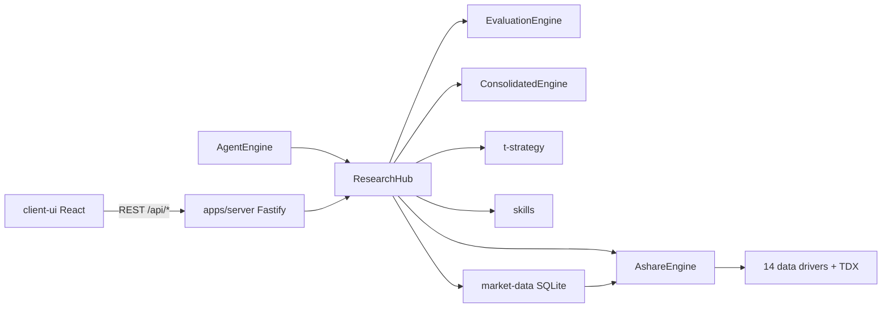

# 架构说明

## 设计原则

1. **单一调度入口**：所有投研能力经 `ResearchHub.dispatch(feature, params)` 路由，HTTP 层与 Agent tools 共用同一实现。
2. **纯 Node 运行时**：数据抓取、TDX 协议、因子计算、报告生成均在 TypeScript 中完成，无 Python 桥接。
3. **Web 与桌面并存**：`client-ui` 为 Vite SPA；生产环境由 `@opptrix/server` 托管 `client-ui/dist`。可选 **Electron 桌面壳**（`apps/desktop`）加载同一 UI，API 以本机 sidecar 运行。详见 [DESKTOP.md](./DESKTOP.md)。

## 请求流



## 包依赖（简图）

```
shared
  ↑
a-stock-layer
  ↑
stock-eval, institutions, t-strategy, skills, market-data
  ↑
research-hub
  ↑
agent, server
```

## 数据层

> 多市场演进设计见 **[DATA-LAYER.md](./DATA-LAYER.md)**（Provider 抽象、Instrument 模型、ETF/美股/币圈路线图）。

### 在线层 `@opptrix/a-stock-layer`（→ `MarketDataEngine`）

- **AshareEngine**：统一 facade，按 capability 自动在 14 个内置 **Provider**（现名 driver）间回退。
- **TDX**：纯 Node TCP 客户端，替代原 pytdx/mootdx。
- **efinance**：EastMoney HTTP 封装，用于部分行情与基本面。
- **PortfolioManager**：读写 `~/.opptrix/portfolio.json`。
- **规划**：Driver → `DataProvider` 接口；Registry 增加 `(market, assetClass, capability)` 三维索引；Provider 内按 `markets/<m>/` 分文件维护；**设置页数据源 Tab 自动发现 Provider 配置**（见 [DATA-LAYER.md §6–§7](./DATA-LAYER.md)）。

## 评估层 `@opptrix/stock-eval`

- **FactorRegistry**：40 个因子，分 category 注册。
- **Scorecard**：8 套权重模板（综合评估、成长、价值等）。
- **IndustryNeutralizer**：行业内分位数中性化。
- **Screener / BacktestEngine / SnapshotStore**：筛选、回测、本地快照。

## 策略层 `@opptrix/t-strategy`

- 9 种策略信号（均线、MACD、布林带等）。
- `verifyStrategy`：历史 K 线验证，输出胜率、盈亏比等指标。
- `meanVarianceWeights`：均值-方差权重（组合模块）。

## 机构层 `@opptrix/institutions`

- 28 个 evaluator，YAML config 驱动维度与权重。
- `ConsolidatedEngine.evaluate` → 共识评级与分组明细。

## Hub Features

`ResearchHub` 支持的 `feature` 字符串见 [API.md](./API.md#hub-features)。

新增能力时：在 `packages/research-hub/src/hub.ts` 增加 `case`，必要时在 `apps/server/src/index.ts` 暴露 REST，并在 `packages/agent/src/tools.ts` 注册 tool。

## 本地挖掘层 `@opptrix/market-data`

- **MarketDataStore**：SQLite 持久化 A 股因子、K 线、行业映射等（规划扩展 `instruments` / ETF 表，见 [DATA-LAYER.md §8](./DATA-LAYER.md#8-a-股-etf-专项设计phase-1-优先)）。
- **MarketDataSyncEngine**：从在线 Engine 拉取并入库；支持增量/全量计划（`sync/plan.ts`）。
- **查询面**：本地选股、行业列表、决策雷达、批量快照等，供 Hub 与 MCP 工具调用。

## 前端 `client-ui`

当前产品主入口为 **聊天工作区**（`src/chat/ChatApp.tsx`）：左侧会话栏、中间对话、右侧投研面板（关注/发现/行业/个股/组合）、设置页。

| 区域 | 目录 | 主要 API |
|------|------|----------|
| 聊天与 Composer | `src/chat/` | `/api/chat`, `/api/sessions/*` |
| 右侧面板 | `src/market/` | `/api/watchlist`, `/api/research`, 本地库相关 |
| 设置 | `src/pages/SettingsPage.tsx` | `/api/config`, 市场数据同步 |
| 桌面壳层 | `src/desktop/` | Electron 窗口与浮层侧栏 |

开发时 Vite（`:5173`）将 `/api` 代理到后台 API（`:8711`）；生产用 `npm run serve`。桌面开发：`npm run dev:desktop`。

协作者与 Agent 请参阅 [AGENT-GUIDE.md](./AGENT-GUIDE.md)。

## 本地持久化

| 路径 | 内容 |
|------|------|
| `apps/server/data/config.json` | 服务端 LLM 与应用默认值 |
| `~/.opptrix/portfolio.json` | 交易账本 |
| `~/.opptrix/writer-config.yaml` | Writer 微信与主题配置 |
| `~/.opptrix/snapshots/` | 因子评估快照（stock-eval） |

`.gitignore` 已排除密钥、构建产物与运行时数据目录。

## 市况模块 `@opptrix/shared` — `market-regime`

- **职责**：综合指数动量、广度、情绪、Marks 周期等，输出 `MarketRegimeSnapshot`（发现页策略提示，非交易信号）。
- **入口**：`ResearchHub.dispatch('market_regime')`；纯函数在 `packages/shared/src/market-regime.ts`。
- **后续扩展**：社融、M1-M2、iVIX 等外部宏观/期权指标待接入，扩展 `MarketRegimeInputs` 即可，UI 已消费 `indicators` 字段。详见 [RIGHT-PANEL-RESEARCH-PLAN.md § 待办事项](./RIGHT-PANEL-RESEARCH-PLAN.md#待办事项)。
