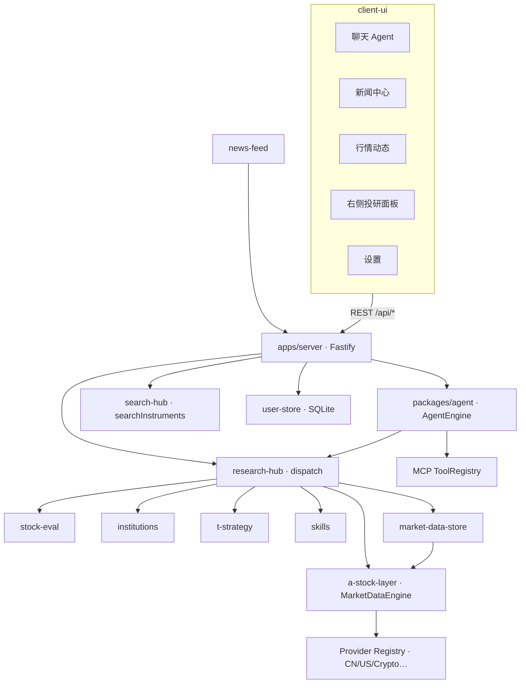

# 架构说明

> 协作者请先读 [AGENT-GUIDE.md](./AGENT-GUIDE.md)；数据层细节见 [DATA-LAYER.md](./DATA-LAYER.md)、[PROVIDER-STANDARD-API.md](./PROVIDER-STANDARD-API.md)、[MULTI-MARKET-ARCHITECTURE.md](./MULTI-MARKET-ARCHITECTURE.md)。

## 设计原则

1. **单一调度入口**：投研能力经 `ResearchHub.dispatch(feature, params)` 或标准 **`queryInstrumentData(ref, capability)`** 路由；HTTP 与 Agent tools 共用实现。
2. **InstrumentRef 主轴**：标的以 `{ market, assetClass, symbol }` 标识；应用层优先 `instrument_*` Hub feature（见 [MULTI-MARKET-ARCHITECTURE.md](./MULTI-MARKET-ARCHITECTURE.md)）。
3. **纯 Node 运行时**：抓取、TDX 协议、因子、报告均在 TypeScript 完成，无 Python 桥接。
4. **Web 与桌面并存**：`client-ui` 为 Vite SPA；生产由 `@opptrix/server` 托管 `client-ui/dist`。Electron（`apps/desktop`）加载同一 UI，API 以本机 **sidecar** 运行（见 [DESKTOP.md](./DESKTOP.md)）。
5. **用户数据本地化**：配置、会话、关注列表等写入 `~/.opptrix/opptrix.db`（`@opptrix/user-store`），桌面/Web 自托管场景数据留在用户环境。

## 请求流



## 包依赖（简图）

```
shared  (+ market-registry, instrument-ref, discover profiles)
  ↑
market-data-core · provider-sdk
  ↑
a-stock-layer · market-data-providers-{cn,us,crypto}
  ↑
market-data-store · stock-eval · institutions · t-strategy · skills · news-feed · article-enrichment
  ↑
research-hub · search-hub · local-inference
  ↑
agent · user-store
  ↑
server · (desktop 仅壳层 + 打包)
```

完整包列表见 [packages/README.md](../packages/README.md)。

## 数据层

### 在线层 `@opptrix/a-stock-layer`

- **MarketDataEngine**（原 AshareEngine）：`queryInstrumentData(InstrumentRef, capability, opts?)` 为 **唯一标准入口**（见 [PROVIDER-STANDARD-API.md](./PROVIDER-STANDARD-API.md)）。
- **Provider Registry**：`(market, assetClass, capability)` → 按优先级回退；各 Provider 以 `manifest.ts` + `bindingsFor` 注册。
- **TDX**：纯 Node TCP 客户端；部分路径为性能保留 fast-path。
- **多市场**：CN / US / HK / JP / KR / Crypto 等；区域 list/quote 已参数化，深度 scorecard 与 A 股组合 intentionally 以 CN 为主。

### 本地层 `@opptrix/market-data-store`

- SQLite：A 股因子、K 线、行业、instruments 表等。
- **SyncEngine**：从在线 Engine 拉取并入库；支持 pack / 增量计划。
- 供 Hub、MCP 工具（`screen_local_universe` 等）与决策雷达使用。

## 应用层 `@opptrix/agent`

- **AgentEngine**：OpenAI 兼容 Function Calling + 进程内 MCP Broker。
- **ToolRegistry**：40+ 工具（市场、选股、ETF、组合、本地库、发现策略等），见 `packages/agent/src/tools.ts`。
- **多会话**：会话与消息持久化经 server → user-store。

## Hub 与 Search

- **ResearchHub**：`feature` 字符串调度（`stock_diagnosis`、`instrument_chart`、`market_regime` …），见 [API.md](./API.md#hub-features)。
- **SearchHub**：工作区/聊天 `@` 引用 → `searchInstruments`（InstrumentRef-first）。
- 新增能力：在 `hub.ts` 增加 `case`，必要时暴露 REST，并在 `tools.ts` 注册 tool。

## 前端 `client-ui`

| 区域 | 目录 | 说明 |
|------|------|------|
| 聊天工作区 | `src/chat/` | 主入口 `ChatApp.tsx`：会话、Composer、Markdown |
| 新闻中心 | `src/pages/news/` | RSS 阅读、订阅筛选 |
| 行情动态 | `src/pages/market-dynamics/` | 大盘/板块/龙虎榜等 |
| 右侧面板 | `src/market/` | 关注、发现、行业、个股、组合 |
| 设置 | `src/pages/settings/` | LLM、数据源、市场数据、新闻、翻译 |
| 桌面壳 | `src/desktop/` | 标题栏、浮层侧栏、更新提示 |

开发：Vite `:5173` 代理 `/api` → `:8711`。桌面：`npm run dev:desktop`。

## 桌面 `apps/desktop`

```
Electron main
  ├─ BrowserWindow → client-ui (dev:5173 / prod: sidecar 同源)
  └─ spawn sidecar → @opptrix/server (ELECTRON_RUN_AS_NODE + runtime-stage)
```

- 生产 bundle：`runtime-stage` 含 server、packages、原生 `.node`（按架构编译）。
- **electron-updater**：启动后检查 GitHub Release；用户确认后 `quitAndInstall`。
- 详见 [DESKTOP.md](./DESKTOP.md)、[DESKTOP-RELEASE.md](./DESKTOP-RELEASE.md)。

## 本地持久化

| 路径 | 内容 |
|------|------|
| `~/.opptrix/opptrix.db` | 配置、会话、关注、Provider 设置等（主存储） |
| `~/.opptrix/portfolio.json` | A 股模拟组合账本 |
| `~/.opptrix/market-data/` | 本地因子库 SQLite 与 pack |
| `~/.opptrix/snapshots/` | 因子评估快照（stock-eval） |
| `OPPTRIX_DATA_DIR` | 覆盖上述用户数据根目录 |

`.gitignore` 已排除密钥、构建产物与运行时数据。

## 评估 / 策略 / 机构

| 包 | 职责 |
|----|------|
| `@opptrix/stock-eval` | 40 因子、8 评分卡、筛选、回测、快照 |
| `@opptrix/t-strategy` | 9 种策略信号、`verifyStrategy`、组合权重 |
| `@opptrix/institutions` | 28 evaluator，YAML 驱动机构共识评级 |
| `@opptrix/skills` | 收盘/早报、产业透视、Mermaid |
| `@opptrix/shared` · `market-regime` | 市况快照（发现页提示，非交易信号） |

## 扩展阅读

- 多市场矩阵与 CN-only 边界：[MULTI-MARKET-ARCHITECTURE.md](./MULTI-MARKET-ARCHITECTURE.md)
- Provider 实现与自定义方法：[PROVIDER-STANDARD-API.md](./PROVIDER-STANDARD-API.md)
- 右侧面板路线图：[RIGHT-PANEL-RESEARCH-PLAN.md](./RIGHT-PANEL-RESEARCH-PLAN.md)
- 文档总索引：[README.md](./README.md)
