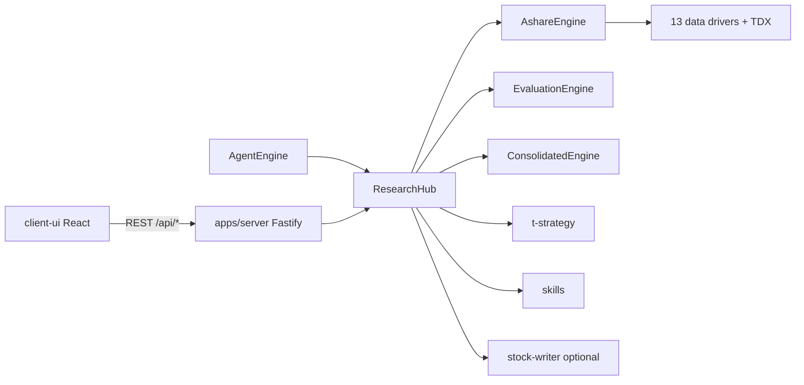

# 架构说明

## 设计原则

1. **单一调度入口**：所有投研能力经 `ResearchHub.dispatch(feature, params)` 路由，HTTP 层与 Agent tools 共用同一实现。
2. **纯 Node 运行时**：数据抓取、TDX 协议、因子计算、报告生成均在 TypeScript 中完成，无 Python 桥接。
3. **Web 优先**：`client-ui` 为 Vite SPA；生产环境由 `@inno-a-stock/server` 托管 `client-ui/dist`，无 Electron / 无 TUI。

## 请求流



## 包依赖（简图）

```
shared
  ↑
a-stock-layer
  ↑
stock-eval, institutions, t-strategy, skills, stock-writer
  ↑
research-hub
  ↑
agent, server
```

## 数据层 `@inno-a-stock/a-stock-layer`

- **AshareEngine**：统一 facade，按 capability 自动在 13 个 driver 间回退。
- **TDX**：纯 Node TCP 客户端，替代原 pytdx/mootdx。
- **efinance**：EastMoney HTTP 封装，用于部分行情与基本面。
- **PortfolioManager**：读写 `~/.a_stock_layer/portfolio.json`。

## 评估层 `@inno-a-stock/stock-eval`

- **FactorRegistry**：40 个因子，分 category 注册。
- **Scorecard**：8 套权重模板（综合评估、成长、价值等）。
- **IndustryNeutralizer**：行业内分位数中性化。
- **Screener / BacktestEngine / SnapshotStore**：筛选、回测、本地快照。

## 策略层 `@inno-a-stock/t-strategy`

- 9 种策略信号（均线、MACD、布林带等）。
- `verifyStrategy`：历史 K 线验证，输出胜率、盈亏比等指标。
- `meanVarianceWeights`：均值-方差权重（组合模块）。

## 机构层 `@inno-a-stock/institutions`

- 28 个 evaluator，YAML config 驱动维度与权重。
- `ConsolidatedEngine.evaluate` → 共识评级与分组明细。

## Hub Features

`ResearchHub` 支持的 `feature` 字符串见 [API.md](./API.md#hub-features)。

新增能力时：在 `packages/research-hub/src/hub.ts` 增加 `case`，必要时在 `apps/server/src/index.ts` 暴露 REST，并在 `packages/agent/src/tools.ts` 注册 tool。

## 前端 `client-ui`

| 路由 ID | 页面 | 主要 API |
|---------|------|----------|
| diagnosis | 个股诊断 | `/api/evaluate` |
| screening | 智能选股 | `/api/screen` |
| institution_rating | 机构群评 | `/api/research` |
| strategy_signals | 策略信号 | `/api/signal` |
| portfolio | 组合分析 | `/api/portfolio`, `/api/portfolio/trades` |
| market_report | 市场日报 | `/api/research` |
| industry_mining | 产业透视 | `/api/industry/mermaid` |
| backtest | 回测验证 | `/api/research` |
| stock_writer | 投研写作 | `/api/writer/*` |
| settings | 设置 | `/api/config` |

开发时 Vite（`:5173`）将 `/api` 代理到后台 API（`:8711`）；生产用 `npm run serve`（Vite preview + API）。

## 本地持久化

| 路径 | 内容 |
|------|------|
| `apps/server/data/config.json` | 服务端 LLM 与应用默认值 |
| `~/.a_stock_layer/portfolio.json` | 交易账本 |
| `~/.a_stock_layer/writer-config.yaml` | Writer 微信与主题配置 |
| `~/.a_stock_layer/snapshots/` | 因子评估快照（stock-eval） |

`.gitignore` 已排除密钥、构建产物与运行时数据目录。
