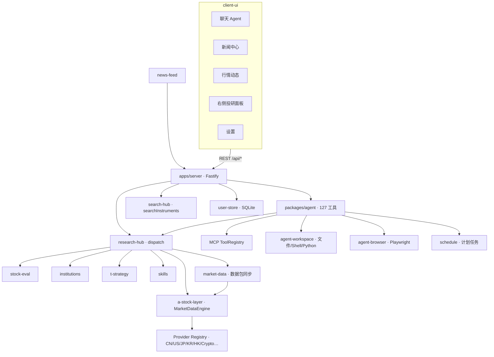

# 架构说明

> 协作者请先读 [AGENT-GUIDE.md](./AGENT-GUIDE.md)；数据层细节见 [DATA-LAYER.md](./DATA-LAYER.md)、[PROVIDER-STANDARD-API.md](./PROVIDER-STANDARD-API.md)、[MULTI-MARKET-ARCHITECTURE.md](./MULTI-MARKET-ARCHITECTURE.md)。

## 设计原则

1. **单一调度入口**：投研能力经 `ResearchHub.dispatch(feature, params)` 或标准 **`queryInstrumentData(ref, capability)`** 路由；HTTP 与 Agent tools 共用实现。
2. **InstrumentRef 主轴**：标的以 `{ market, assetClass, symbol }` 标识；应用层优先 `instrument_*` Hub feature（见 [MULTI-MARKET-ARCHITECTURE.md](./MULTI-MARKET-ARCHITECTURE.md)）。
3. **纯 Node 运行时**：抓取、TDX 协议、因子、报告均在 TypeScript 完成，无 Python 桥接。
4. **Web 与桌面并存**：`client-ui` 为 Vite SPA；生产由 `@opptrix/server` 托管 `client-ui/dist`。Electron（`apps/desktop`）加载同一 UI，API 以本机 **sidecar** 运行（见 [DESKTOP.md](./DESKTOP.md)）。
5. **用户数据本地化**：配置、会话、关注列表等写入 `~/.opptrix/opptrix.db`（`@opptrix/user-store`），桌面/Web 自托管场景数据留在用户环境。

## 请求流


```mermaid
flowchart TB
  subgraph UI["client-ui"]
    Chat[聊天 Agent]
    News[新闻中心]
    Market[行情动态]
    Panel[右侧投研面板]
    Settings[设置]
  end

  UI -->|REST /api/*| Server["apps/server · Fastify"]

  Server --> Agent["packages/agent · 127 工具"]
  Server --> Hub["research-hub · dispatch"]
  Server --> Search["search-hub · searchInstruments"]
  Server --> Store["user-store · SQLite"]

  Agent --> Hub
  Agent --> Tools[MCP ToolRegistry]
  Agent --> Workspace["agent-workspace · 文件/Shell/Python"]
  Agent --> Browser["agent-browser · Playwright"]
  Agent --> Schedule["schedule · 计划任务"]

  Hub --> Engine["a-stock-layer · MarketDataEngine"]
  Hub --> Eval["stock-eval"]
  Hub --> Inst["institutions"]
  Hub --> Strat["t-strategy"]
  Hub --> Skills["skills"]
  Hub --> MDStore["market-data · 数据包同步"]

  Engine --> Providers["Provider Registry · CN/US/JP/KR/HK/Crypto…"]
  MDStore --> Engine
  NewsPkg["news-feed"] --> Server
```

## 包依赖（简图）

```
shared  (+ market-registry, instrument-ref, discover profiles)
  ↑
market-data-core · provider-sdk
  ↑
a-stock-layer · market-data-providers-{cn,us,crypto,jp,kr,hk}
  ↑
market-data · stock-eval · institutions · t-strategy · skills · news-feed · article-enrichment
  ↑
research-hub · search-hub · local-inference · schedule
  ↑
agent · agent-workspace · agent-browser · user-store
  ↑
server · (desktop 仅壳层 + 打包)
```

完整包列表见 [packages/README.md](../packages/README.md)。

## 数据层

### 在线层 `@opptrix/a-stock-layer`

- **MarketDataEngine**（原 AshareEngine）：`queryInstrumentData(InstrumentRef, capability, opts?)` 为 **唯一标准入口**（见 [PROVIDER-STANDARD-API.md](./PROVIDER-STANDARD-API.md)）。
- **Provider Registry**：`(market, assetClass, capability)` → 按优先级回退；各 Provider 以 `manifest.ts` + `bindingsFor` 注册。
- **TDX**：纯 Node TCP 客户端；部分路径为性能保留 fast-path。
- **多市场**：CN / US / HK / JP / KR / Crypto 等；`queryInstrumentData` 按市场路由 Provider；**A 股** 在组合、深度评分卡与机构评级等在线能力上最完整（见 [MULTI-MARKET-ARCHITECTURE.md](./MULTI-MARKET-ARCHITECTURE.md)）。

### 本地层 `@opptrix/market-data`

- SQLite + DuckDB：历史行情缓存与在线查询加速；多市场本地基础数据包（`.opmd` 专用格式）同步：A 股全市场、美股列表、加密货币对、港股 / 日股 / 韩股列表。
- 在线研究请走 `queryInstrumentData` / Hub `instrument_*` / Agent MCP 工具；本地数据包为截面筛选与离线浏览提供标的基础。

## 应用层 `@opptrix/agent`

- **AgentEngine**：OpenAI 兼容 Function Calling + 进程内 MCP Broker。
- **会话上下文投影**：长对话压缩时 soft/micro/structured 写入可选 `SessionRecord.contextProjection` sidecar（不改写 canonical `messages`）；全文落 `session-state/`，SQLite 仅指针；`assembleModelView` 优先 splice 有效投影，无效或缺省回退 `sessionMemory` + 近端窗。详见 [AGENT-GUIDE.md §4.2](./AGENT-GUIDE.md#42-agent-与-mcp)。
- **ToolRegistry**：投研 MCP 工具（市场、ETF、组合、跨市场搜索与评估等），见 `packages/agent/src/tools.ts`；工作区 / `http_fetch` / `opptrix_run`（`@anthropic-ai/sandbox-runtime` OS 隔离 + 会话 grants / 联网安装 sticky；Windows 另支持 `windows_isolation_mode`：`elevated` 完整隔离 / `unelevated` 基础隔离 RestrictedToken，默认 `unelevated`，见 [DESKTOP.md · 命令隔离](./DESKTOP.md#命令隔离agent-shell)）见 [AGENT-GUIDE.md §4.2](./AGENT-GUIDE.md#42-agent-与-mcp) 与 [API.md · Workspace grants](./API.md#workspace-grants会话文件夹授权)。
- **多会话**：会话与消息持久化经 server → user-store。
- **会话前缀缓存**：稳定 system（角色/纪律/packs）与本轮动态尾注分离——【会话时钟】与「本轮工具选型卡」经 turn-tail 追加到发给模型的 messages 末尾，避免每轮改写 system 导致 DeepSeek 等前缀缓存失效；请求体可带稳定 `prompt_cache_key`，调试日志记录 warm/cold 仅作观测；输出额度 ladder 为普模 32k / 推理 32k / high 64k（用户可显式 64k / 128k / 384k）；工具轮将 `reasoning_content` 写入会话并在下一请求回传（空串也保留字段），终轮仅非空思考写入。

## Hub 与 Search

- **ResearchHub**：`feature` 字符串调度（`stock_diagnosis`、`instrument_chart`、`market_regime` …），见 [API.md](./API.md#hub-features)。
- **SearchHub**：工作区/聊天 `@` 引用 → `searchInstruments`（InstrumentRef-first）。
- 新增能力：在 `hub.ts` 增加 `case`，必要时暴露 REST，并在 `tools.ts` 注册 tool。

## 前端 `client-ui`

| 区域 | 目录 | 说明 |
|------|------|------|
| 聊天工作区 | `src/chat/` | 主入口 `ChatApp.tsx`：会话、Composer、Markdown |
| 新闻中心 | `src/pages/news/` | RSS 订阅 CRUD、RSSHub 路由三级漏斗、文章阅读、本地/远程翻译 |
| 行情动态 | `src/pages/market-dynamics/` | 大盘/板块/龙虎榜等 |
| 右侧面板 | `src/market/` | 关注、发现、行业、个股、组合 |
| 设置 | `src/pages/settings/` | LLM、数据源、市场数据、新闻、翻译、MCP 服务器 |
| 桌面壳 | `src/desktop/` | 标题栏、浮层侧栏、更新提示 |

开发：Vite `:5173` 代理 `/api` → `:8711`。桌面：`npm run dev:desktop`。

## 桌面 `apps/desktop`

```
Electron main
  ├─ BrowserWindow → client-ui (dev:5173 / prod: sidecar 同源)
  └─ spawn sidecar → @opptrix/server (ELECTRON_RUN_AS_NODE + runtime-stage)
```

- 生产 bundle：`runtime-stage` 含 server、packages、原生 `.node`（按架构编译）。
- **electron-updater**：启动后检查 **Cloudflare R2** 上的 `latest-*.yml`；用户确认后 `quitAndInstall`（GitHub Release 仍供手动下载）。
- 详见 [DESKTOP.md](./DESKTOP.md)、[DESKTOP-RELEASE.md](./DESKTOP-RELEASE.md)。

## 本地持久化

| 路径 | 内容 |
|------|------|
| `~/.opptrix/opptrix.db` | 配置、会话、关注、Provider 设置等（主存储） |
| `~/.opptrix/portfolio.json` | A 股模拟组合账本 |
| `~/.opptrix/market-data/` | 多市场本地基础数据包（`.opmd` 格式）：A 股全市场 + 美股/加密货币/港股/日股/韩股本地列表 |
| `~/.opptrix/snapshots/` | 因子评估快照（stock-eval） |
| `OPPTRIX_DATA_DIR` | 覆盖上述用户数据根目录 |

`.gitignore` 已排除密钥、构建产物与运行时数据。

## 评估 / 策略 / 机构

| 包 | 职责 |
|----|------|
| `@opptrix/stock-eval` | 40 因子、8 评分卡、筛选、回测、快照 |
| `@opptrix/t-strategy` | 9 种策略信号、`verifyStrategy`、组合权重 |
| `@opptrix/institutions` | 28 evaluator，YAML 驱动机构共识评级 |
| `@opptrix/agent-skills` | 工作流技能（内置早报/收盘/产业链等 + 用户自定义 SKILL.md） |
| `@opptrix/shared` · `market-regime` | 市况快照（发现页提示，非交易信号） |

## 扩展阅读

- 多市场矩阵与 CN-only 边界：[MULTI-MARKET-ARCHITECTURE.md](./MULTI-MARKET-ARCHITECTURE.md)
- Provider 实现与自定义方法：[PROVIDER-STANDARD-API.md](./PROVIDER-STANDARD-API.md)
- 右侧面板路线图：[RIGHT-PANEL-RESEARCH-PLAN.md](./RIGHT-PANEL-RESEARCH-PLAN.md)
- 文档总索引：[README.md](./README.md)
