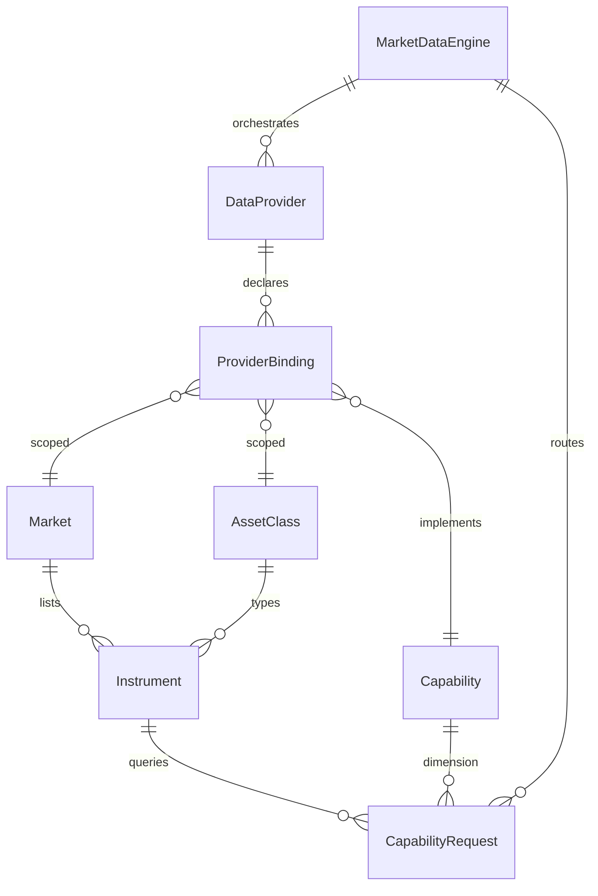
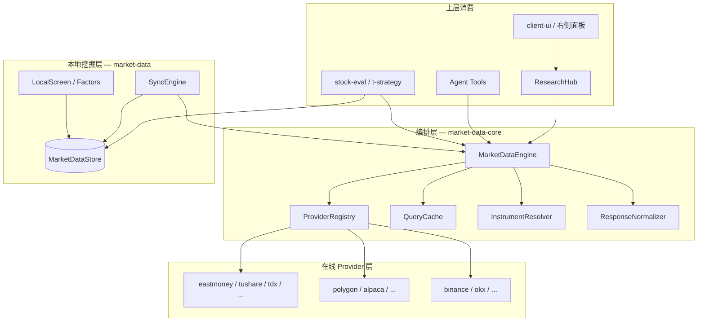
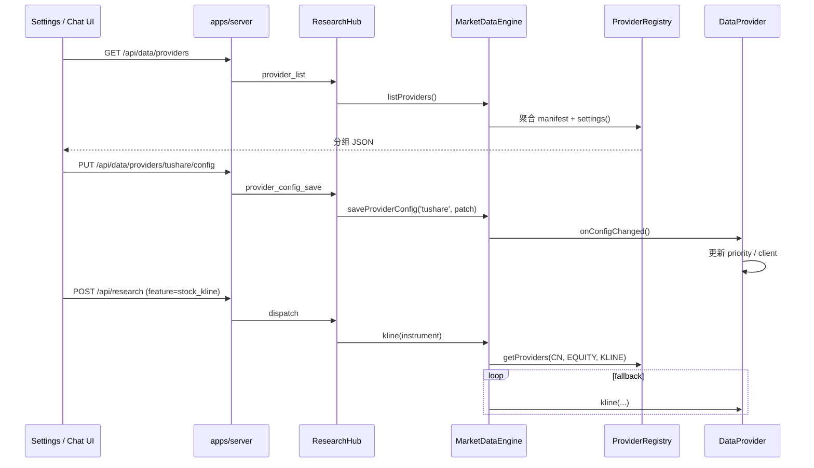
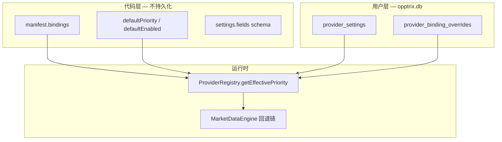
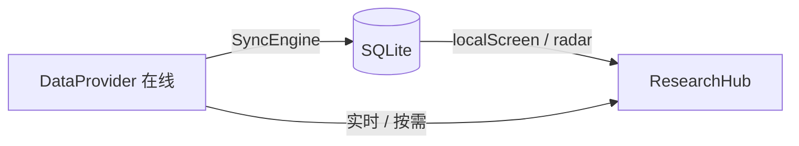

# 数据层架构（Data Layer）

> **状态**：设计文档（v2）— 描述当前实现与多市场演进目标。  
> **v2 更新**：Provider 模块内部结构、上层统一 API、Provider 配置与设置页自动发现。  
> **v2.1**：`provider_settings` 持久化（启用/优先级/密钥分层存储）。  
> **关联**：[ARCHITECTURE.md](./ARCHITECTURE.md)、[AGENT-GUIDE.md](./AGENT-GUIDE.md) §4.3、[DEVELOPMENT.md](./DEVELOPMENT.md)

---

## 1. 结论摘要

**是的，需要升级数据层**——但不是推倒重来，而是在现有 **Capability + 优先级回退** 模型上，引入 **市场维度（Market）**、**标的类型（AssetClass）** 与 **DataProvider 抽象**，使同一套调度逻辑能覆盖 A 股、A 股 ETF、美股、虚拟货币等资产。

你的设想与当前代码方向一致，且可渐进落地：

| 你的设想 | 与现状的关系 |
|----------|--------------|
| Driver → `DataProvider` 接口 | 现有 `BaseDriver` 已是雏形；需补 **market / assetClass 声明** 与 **统一 Instrument 入参** |
| 每个提供商一个 module | 与 `drivers/eastmoney.ts`、`drivers/tushare.ts` 一致；东财/TDX 已跨股票/指数/ETF 多接口 |
| DataLayer 看全量 Provider × Capability 列表（带优先级） | 现有 `DriverRegistry.capIndex` 已实现；需升级为 **三维索引** `(market, assetClass, capability)` |
| 上层 API 统一 | Hub / Agent / UI 只调 Engine | 现有已接近；需收敛 Tushare 等散落 endpoint |
| Provider 内按 market 分文件 | 单 Provider module，内部 boot 市场子模块 | 东财已有 `eastmoney-f10.ts` 等 mixin 模式，需标准化 |
| 设置页自动发现 | 数据源 Tab 分组展示 Provider 配置 | 现状仅硬编码 Tushare（`MarketDataSettingsSection` + `/api/tushare/*`） |

**A 股 ETF** 应作为 **Phase 1** 优先补齐：接口与股票高度重叠，但本地库、Instrument 解析、筛选因子需单独建模，不能仅依赖现有的 `etfData()` 列表接口。

---

## 2. 现状诊断

### 2.1 包与职责

```
┌─────────────────────────────────────────────────────────────┐
│  ResearchHub / Agent / MarketDataService                    │
└───────────────────────────┬─────────────────────────────────┘
                            │
         ┌──────────────────┴──────────────────┐
         ▼                                      ▼
┌─────────────────────┐              ┌─────────────────────┐
│ @opptrix/a-stock-layer │              │ @opptrix/market-data   │
│ AshareEngine (在线)    │◄── sync ────│ SQLite (本地挖掘)      │
│ 14× BaseDriver        │              │ 因子 / K线 / 筛选      │
└─────────────────────┘              └─────────────────────┘
```

| 组件 | 路径 | 职责 |
|------|------|------|
| `AshareEngine` | `packages/a-stock-layer/src/engine.ts` | 统一 facade；按 Capability 在 driver 间回退；内置 cache |
| `BaseDriver` | `packages/a-stock-layer/src/providers/common/base.ts` | 数据源抽象；可选方法 + `capabilities()` |
| `DriverRegistry` | `packages/a-stock-layer/src/core/registry.ts` | Capability → 按 priority 排序的 driver 列表 |
| `Capability` | `packages/a-stock-layer/src/core/capabilities.ts` | 56 个数据维度枚举 |
| `MarketDataStore` | `packages/market-data/src/schema.ts` | A 股专用 SQLite schema（`stocks` 表等） |
| TDX 客户端 | `packages/a-stock-layer/src/tdx/` | 绕过 Registry 的硬编码 fast-path（K 线、批量行情、分时） |

### 2.2 现有优势（应保留）

1. **Capability 作为稳定契约**：上层（Hub、stock-eval、Agent tools）只关心「要什么数据」，不关心具体源站。
2. **优先级回退链**：`DriverRegistry.getDriversForCapability()` + Engine 循环尝试，生产环境已验证。
3. **Provider 粒度合理**：东财、Tushare、TDX 等各占一个 module，职责清晰。
4. **QueryResult 统一响应**：`success / data / source / cached / error` 便于上层与 Agent 消费。

### 2.3 主要瓶颈（多市场前必须解决）

| 问题 | 表现 | 影响 |
|------|------|------|
| **市场维度缺失** | Registry 仅索引 `Capability`，无 `Market` / `AssetClass` | 接入美股/币圈时无法隔离回退链 |
| **Instrument 未统一** | A 股用 6 位代码 + 隐式 SH/SZ/BJ；无 `symbol` 标准 | 跨市场搜索、关注列表、组合账本难以扩展 |
| **Engine 硬编码 A 股路径** | `fetchBatchRealtime`、`fetchDailyKline` 内嵌 Tushare/TDX 特殊逻辑 | 新市场无法复用编排层，Engine 会持续膨胀 |
| **ETF 能力不完整** | 仅有 `ETF_DATA` 列表（东财 RPT_ETF_LIST）；无 ETF 实时/K 线/持仓/溢价的 first-class 支持 | 无法做 ETF 筛选与投研 |
| **本地库绑定 A 股** | `stocks` 表、`stock_factors` 等无 `asset_class` | 本地挖掘无法覆盖 ETF / 美股 /  crypto |
| **配置散落** | Tushare 独立 `tushare/config.ts` + Hub `tushare_config*` + 专用 REST | 每增 Provider 都要改 Settings UI / server 路由 |

---

## 3. 设计目标

1. **单一调度入口**：上层仍只调用 `MarketDataEngine`（或过渡期 `AshareEngine` alias），不感知具体 Provider。
2. **Provider 可插拔**：新增数据源 = 新增一个 Provider module + 注册，不改 Engine 核心循环。
3. **多市场同构**：同一 Capability（如 `STOCK_KLINE`）在不同 Market 下有不同 Provider 链，互不干扰。
4. **回退可观测**：每次查询返回 `source`（已有），扩展 `attempts[]` 便于调试与 Agent 解释。
5. **本地挖掘分层**：在线层拉数 → 归一化 → 按 Market 写入本地 Store；筛选/因子在 Store 层完成。
6. **渐进迁移**：Phase 0 重构不破坏现有 API；A 股行为保持不变。
7. **配置可发现**：Provider 自描述设置项；设置页「数据源」自动分组渲染，无需为每个源改 UI。
8. **上层 API 唯一**：Hub / REST / Agent 只经 Engine 与 Provider 注册表，不散落 `tushare_*` 类 feature。

---

## 4. 核心概念

### 4.1 概念模型



| 概念 | 说明 | 示例 |
|------|------|------|
| **Market** | 交易市场 / 监管域 | `CN`（沪深北）、`US`（美股）、`HK`、`CRYPTO` |
| **AssetClass** | 标的类型 | `EQUITY`、`ETF`、`INDEX`、`FUND`、`CRYPTO_SPOT`、`CRYPTO_PERP` |
| **Instrument** | 统一标的引用 | `{ market: 'CN', assetClass: 'ETF', symbol: '510300', exchange: 'SH' }` |
| **Capability** | 数据维度（已有枚举，按需扩展） | `STOCK_REALTIME`、`STOCK_KLINE`、`ETF_HOLDINGS` |
| **DataProvider** | 数据提供商 module | `eastmoney`、`tushare`、`tdx`、`polygon`、`binance` |
| **ProviderBinding** | Provider 在 (market, assetClass, capability) 上的能力与优先级 | `{ provider: 'eastmoney', market: 'CN', assetClass: 'ETF', capability: 'STOCK_KLINE', priority: 100 }` |

### 4.2 Instrument 标识规范

统一使用 **InstrumentRef**，替代裸 `code: string`：

```typescript
/** @opptrix/shared — 目标类型（Phase 0 起逐步引入） */
interface InstrumentRef {
  /** ISO-like 市场码 */
  market: 'CN' | 'US' | 'HK' | 'CRYPTO'
  assetClass: 'EQUITY' | 'ETF' | 'INDEX' | 'FUND' | 'CRYPTO_SPOT' | 'CRYPTO_PERP'
  /** 市场内主代码：A 股 6 位、美股 ticker、crypto base（如 BTC） */
  symbol: string
  /** 交易所 / 子市场（可选） */
  exchange?: string
  /** 报价货币（crypto / 跨境场景） */
  quote?: string
}

/** 兼容层：A 股 6 位 code → InstrumentRef */
function resolveInstrument(input: string | InstrumentRef): InstrumentRef
```

**符号对照（Phase 1 需实现）**：

| 市场 | symbol | exchange | 说明 |
|------|--------|----------|------|
| A 股股票 | `600519` | `SH` | 现有逻辑 |
| A 股 ETF | `510300` | `SH` | 与股票共用行情 API，assetClass 区分 |
| A 股指数 | `000001` | `SH` | assetClass = INDEX |
| 美股 | `AAPL` | `NASDAQ` | 无固定长度 |
| Crypto | `BTC` | `BINANCE` | quote = `USDT` |

### 4.3 Capability 分层

保留现有 `Capability` 枚举作为 **全局数据维度**，按三类管理：

| 类别 | 能力 | 跨市场复用度 |
|------|------|--------------|
| **行情类** | `STOCK_REALTIME`, `STOCK_KLINE`, `INDEX_*`, `INTRADAY_TICK` | 高 — 各市场 Provider 实现同一方法签名 |
| **基本面类** | `FINANCIAL_SUMMARY`, `STOCK_PROFILE`, `DIVIDEND`, … | 中 — schema 差异大，需 market-specific normalizer |
| **市场特色类** | `LIMIT_UPDOWN`, `DRAGON_TIGER`, `CHIP_DISTRIBUTION`（A 股） | 低 — 仅 CN Provider 声明支持 |

**ETF 扩展 Capability（Phase 1 新增）**：

```typescript
enum Capability {
  // ... 现有 ...
  ETF_LIST = 'etf_list',           // 全量 ETF 列表（替代泛化 etfData）
  ETF_PROFILE = 'etf_profile',     // 基金概况、管理人、规模
  ETF_HOLDINGS = 'etf_holdings',   // 成分股 / 持仓
  ETF_NAV = 'etf_nav',             // 净值、溢价率
  ETF_FLOW = 'etf_flow',           // 份额变动、申赎
}
```

ETF 的 `STOCK_REALTIME` / `STOCK_KLINE` **复用**现有 Capability，通过 `assetClass: 'ETF'` 区分；专用维度走新 Capability。

---

## 5. 目标架构

### 5.1 分层图



### 5.2 包结构演进（推荐）

**Phase 0–2**：在 monorepo 内用目录隔离，避免过早拆包：

```
packages/
  market-data-core/          # 新：Engine、Registry、Instrument、Cache（自 a-stock-layer 抽离）
  a-stock-layer/             # 过渡：CN Provider 实现 + TDX；re-export core
  market-data/               # 本地 SQLite + Sync + 筛选（扩展 multi-asset schema）
  shared/                    # InstrumentRef、QueryResult、跨市场 schema
```

**Phase 3+**（可选）：按市场拆 Provider 包：

```
packages/market-data-providers-cn/
packages/market-data-providers-us/
packages/market-data-providers-crypto/
```

---

## 6. DataProvider 接口

### 6.1 接口定义

将 `BaseDriver` 升级为 **`DataProvider`**（命名对齐你的设想；过渡期保留 `BaseDriver extends DataProvider` alias）。

```typescript
/** Provider 自声明：我在哪些 (market, assetClass) 下支持哪些 capability */
interface ProviderBinding {
  market: Market
  assetClass: AssetClass
  capability: Capability
  priority: number
}

interface DataProvider {
  readonly id: string          // 'eastmoney' | 'tushare' | 'tdx' | ...
  readonly displayName?: string

  /** 静态声明支持矩阵；Registry 据此建索引 */
  bindings(): ProviderBinding[]

  /** 可选：Provider 级健康检查 / 限流状态 */
  healthCheck?(): Promise<ProviderHealth>

  // ── 行情（InstrumentRef 一参化） ──
  realtime?(instrument: InstrumentRef): Promise<unknown[] | null>
  batchRealtime?(instruments: InstrumentRef[]): Promise<unknown[] | null>
  kline?(instrument: InstrumentRef, period?: string, start?: string, end?: string, count?: number): Promise<unknown[] | null>

  // ── ETF 专用（Phase 1） ──
  etfList?(market: Market, filter?: EtfListFilter): Promise<unknown[] | null>
  etfHoldings?(instrument: InstrumentRef): Promise<unknown[] | null>
  etfNav?(instrument: InstrumentRef): Promise<unknown[] | null>

  // ── 其余 Capability 方法保持 optional，与现有 BaseDriver 一致 ──
  profile?(instrument: InstrumentRef): Promise<unknown[] | null>
  financials?(instrument: InstrumentRef, reportDate?: string, reportType?: string): Promise<unknown[] | null>
  // ...
}
```

**设计要点**：

1. **一个 Provider module 可绑定多 Market**：例如 `eastmoney` 主要服务 `CN`；未来 `eastmoney-global` 或 `sina` 可声明 `GLOBAL_INDEX` 等跨市场能力。
2. **bindings() 替代 capabilities()**：从「我支持哪些 capability」升级为「我在哪些市场、哪些资产类型下支持哪些 capability、优先级多少」。
3. **方法签名统一收 InstrumentRef**：Provider 内部自行调用 `resolveSecId(instrument)` 等 adapter，Engine 不再硬编码 A 股 code 规则。

### 6.2 ProviderRegistry

升级 `DriverRegistry` → **`ProviderRegistry`**：

```typescript
type BindingKey = `${Market}:${AssetClass}:${Capability}`

class ProviderRegistry {
  register(provider: DataProvider): void
  unregister(id: string): void

  /** 核心查询：给定 market + assetClass + capability，返回按 priority 降序的 Provider 列表 */
  getProviders(market: Market, assetClass: AssetClass, cap: Capability): DataProvider[]

  /** 管理/调试：列出完整绑定矩阵 */
  listBindings(): Array<ProviderBinding & { providerId: string }>
}
```

**与现状对比**：

```typescript
// 现状
registry.getDriversForCapability(Capability.STOCK_KLINE)

// 目标
registry.getProviders('CN', 'ETF', Capability.STOCK_KLINE)
// → [eastmoney(100), tushare(110), tdx(90), ...]
```

### 6.3 MarketDataEngine 查询循环

将 `AshareEngine.query()` 泛化为：

```typescript
async query<T>(
  instrument: InstrumentRef | InstrumentRef[],
  cap: Capability,
  method: string,
  options: { useCache?: boolean; mergePartial?: boolean },
  args: unknown[],
): Promise<QueryResult<T[]>>
```

**回退策略**（继承并扩展现有逻辑）：

| 策略 | 说明 | 现有案例 |
|------|------|----------|
| **Sequential fallback** | 按 priority 依次尝试，首个非空成功即返回 | 默认 `query()` |
| **Partial merge** | 批量请求时合并多 Provider 结果 | `fetchBatchRealtime` |
| **Fast-path override** | 特定 (market, cap) 的编排策略可配置 | TDX 优先 K 线 → 应改为 `TdxProvider` 的 binding priority + `mergeStrategy` |
| **Cache-first** | 命中 QueryCache 则跳过 Provider | 已有 `CACHE_TYPE` |

**建议**：将 TDX/Tushare 特殊路径从 Engine 抽到 **`QueryPlan`** 配置：

```typescript
interface QueryPlan {
  market: Market
  assetClass: AssetClass
  capability: Capability
  strategy: 'sequential' | 'merge' | 'race'
  /** 可选：覆盖 Registry 默认顺序的 Provider 子序列 */
  overrideChain?: string[]
}
```

### 6.4 Provider 模块内部结构

**原则**：对外一个 Provider module；对内按 **市场（market）** 与 **API 家族** 拆文件，由入口 `index.ts` 统一 boot 并注册 bindings。

#### 6.4.1 推荐目录（以 `eastmoney` 为例）

```
packages/a-stock-layer/src/providers/eastmoney/
  index.ts              # class EastMoneyProvider implements ConfigurableProvider
  manifest.ts           # id、displayName、bindings()、markets 声明
  config.ts             # 本 Provider 专属配置 load/save（走 ProviderConfigStore）
  settings.ts           # settings() 自描述 → 设置页自动发现
  context.ts            # 注入 ProviderContext（config + appSettings + http）
  markets/
    cn/
      index.ts          # bootCnHandlers() — 聚合 cn 下各 assetClass
      equity.ts         # 股票 realtime / kline / moneyFlow
      etf.ts            # ETF 列表 / 净值 / 持仓（Phase 1）
      index-bars.ts     # 指数行情
    global/
      index-quotes.ts   # GLOBAL_INDEX（已有能力）
  api/
    push2.ts            # push2 / push2his HTTP
    datacenter.ts       # RPT_* 报表
    f10.ts              # F10 基本面（自 eastmoney-f10.ts 迁入）
  normalize/
    quote.ts
    kline.ts
    profile.ts
```

**多市场 Provider**（如未来 `polygon`）：

```
providers/polygon/
  index.ts
  manifest.ts
  settings.ts
  markets/
    us/
      equity.ts
      etf.ts
    global/
      fx.ts
```

**无配置 Provider**（如 `sina`、`tdx` 免密钥）：可不实现 `settings()`，设置页仅展示「已启用 / 优先级 / 健康状态」，无表单字段。

#### 6.4.2 Boot 与组合模式

Provider 入口负责 **装配**，不把市场逻辑堆在单文件：

```typescript
/** providers/eastmoney/index.ts */
export class EastMoneyProvider implements ConfigurableProvider {
  readonly id = 'eastmoney'
  private readonly cn: CnMarketHandlers

  constructor(private readonly ctx: ProviderContext) {
    this.cn = bootCnHandlers(ctx)   // markets/cn/index.ts
  }

  bindings(): ProviderBinding[] {
    return manifestBindings()       // manifest.ts — 静态矩阵
  }

  settings(): ProviderSettingsDefinition {
    return eastmoneySettings        // settings.ts
  }

  // 委托到 market handler（按 assetClass 分发）
  async realtime(instrument: InstrumentRef) {
    return this.cn.realtime(instrument)
  }

  async kline(instrument: InstrumentRef, period?: string, ...rest: unknown[]) {
    return this.cn.kline(instrument, period, ...rest)
  }

  async etfNav(instrument: InstrumentRef) {
    return this.cn.etf.nav(instrument)
  }
}
```

`markets/cn/index.ts` 内再按 assetClass 路由：

```typescript
export function bootCnHandlers(ctx: ProviderContext): CnMarketHandlers {
  const equity = createCnEquityHandlers(ctx)
  const etf = createCnEtfHandlers(ctx)
  const index = createCnIndexHandlers(ctx)

  return {
    realtime(inst) {
      if (inst.assetClass === 'INDEX') return index.realtime(inst)
      if (inst.assetClass === 'ETF') return etf.realtime(inst)
      return equity.realtime(inst)
    },
    kline(inst, ...args) { /* 同理 */ },
    etf,
  }
}
```

**与现状迁移**：现有 `eastmoney.ts` + `eastmoney-f10.ts` + `eastmoney-research.ts` mixin → 拆入上述目录；`mixEastMoneyResearch(EastMoneyDriver)` 改为显式 `etf` handler 模块。

#### 6.4.3 共享 vs 市场专属

| 层级 | 放什么 | 示例 |
|------|--------|------|
| `providers/<id>/api/` | HTTP/TCP 客户端、签名、限流 | `push2.ts`、`TdxClient` 封装 |
| `providers/<id>/normalize/` | 原始 JSON → `@opptrix/shared` schema | `mapEastMoneyKline` |
| `providers/<id>/markets/<m>/` | 市场规则、secid 解析、Capability 实现 | A 股涨跌停、美股 split |
| `packages/a-stock-layer/src/tdx/` | 过渡期保留；由 `providers/tdx/` 引用 | 纯协议层 |

---

### 6.5 上层统一 API（Engine Facade）

**硬规则**：`ResearchHub`、`MarketDataService`、`Agent tools`、`client-ui` **不得**直接 import 某 Provider 或调用 `/api/tushare/*` 类专用路由；一律经 **MarketDataEngine** 或 **Provider 配置 API**。

#### 6.5.1 数据查询面（已有，收敛命名）

Engine 对外保持 **语义化方法**（与 Capability 一一对应），签名逐步升级为 `InstrumentRef`：

```typescript
class MarketDataEngine {
  // 行情
  realtime(instrument: InstrumentRef | string): Promise<QueryResult<StockRealtime[]>>
  batchRealtime(instruments: InstrumentRef[] | string[]): Promise<QueryResult<StockRealtime[]>>
  kline(instrument: InstrumentRef | string, ...): Promise<QueryResult<StockKline[]>>
  // ETF（Phase 1）
  etfList(market?: Market, filter?: EtfListFilter): Promise<QueryResult<EtfListItem[]>>
  etfNav(instrument: InstrumentRef): Promise<QueryResult<EtfNav[]>>
  // ... 其余与现 AshareEngine 相同

  /** 通用 escape hatch — Agent / 实验性 capability */
  fetch(cap: Capability, instrument: InstrumentRef, params?: Record<string, unknown>): Promise<QueryResult<unknown[]>>

  // 注册表 / 运维
  listProviders(): ProviderManifest[]
  listBindings(): ProviderBindingView[]
}
```

**字符串 overload**：`realtime('600519')` 经 `InstrumentResolver` 默认解析为 `{ market: 'CN', assetClass: 'EQUITY', symbol: '600519' }`，保证 A 股现有调用零改动。

#### 6.5.2 Provider 配置面（新增，替代散落 endpoint）

统一 REST（Hub 薄封装）：

| 方法 | 路径 | 说明 |
|------|------|------|
| GET | `/api/data/providers` | 全部 Provider 清单 + settings schema + 公共配置 + 健康摘要 |
| GET | `/api/data/providers/:id/config` | 单个 Provider 公共配置（密钥打码） |
| PUT | `/api/data/providers/:id/config` | 保存配置 patch |
| POST | `/api/data/providers/:id/test` | 测试连接（可选 body 覆盖未保存字段） |

Hub feature 对应（供 Agent 使用）：

```typescript
'provider_list'        // → listProviders()
'provider_config'      // { provider_id }
'provider_config_save' // { provider_id, patch }
'provider_test'        // { provider_id, ... }
```

**迁移**：现有 `/api/tushare/*` 与 `tushare_config*` 在 Phase 0 标记 deprecated，内部转调 `provider_config_save({ provider_id: 'tushare', ... })`。

#### 6.5.3 调用链（统一）



---

## 7. Provider 配置与设置页

### 7.1 设计目标

1. **Provider 自描述设置项**：字段类型、标签、校验、测试连接 — 在 Provider module 内维护（`settings.ts`），不写死在 React。
2. **设置页自动发现**：Engine 启动时收集所有 `ConfigurableProvider.settings()`，暴露给 UI。
3. **Provider 可读项目设置**：通过 `ProviderContext.appSettings` 读取评分卡默认值、同步策略等（只读），避免 Provider 直接读文件。
4. **分组展示**：设置 → **数据源**，按 **市场分组**（A 股 / 美股 / 加密货币 / 全球），组内按 Provider 卡片排列。

### 7.2 类型定义

```typescript
/** 设置字段 — UI agnostic schema */
type ProviderSettingsFieldType = 'boolean' | 'string' | 'secret' | 'number' | 'select'

interface ProviderSettingsField {
  key: string
  type: ProviderSettingsFieldType
  label: string
  description?: string
  placeholder?: string
  required?: boolean
  default?: unknown
  options?: Array<{ value: string; label: string }>
  /** 仅当 type=secret 时：是否在 UI 显示「已配置」而非明文 */
  masked?: boolean
}

/** Provider 在设置页的完整描述 */
interface ProviderSettingsDefinition {
  providerId: string
  title: string
  subtitle?: string
  /** 设置页分组：决定出现在哪个 market 区块 */
  marketGroup: Market | 'GLOBAL'
  /** 搜索关键词（注入 settingsSearchIndex） */
  keywords?: string[]
  fields: ProviderSettingsField[]
  /** 是否有「测试连接」按钮 */
  supportsTest?: boolean
  /** 启用开关是否影响 Registry priority（如 Tushare：disabled → priority 0） */
  enableAffectsPriority?: boolean
}

/** 返回给 UI 的公共配置（不含明文 secret） */
interface PublicProviderConfig {
  providerId: string
  enabled: boolean
  values: Record<string, unknown>
  secretsConfigured: Record<string, boolean>  // { token: true }
  updatedAt?: string
}

/** 可配置 Provider 扩展接口 */
interface ConfigurableProvider extends DataProvider {
  settings(): ProviderSettingsDefinition
  loadConfig(): Record<string, unknown>
  saveConfig(patch: Record<string, unknown>): Record<string, unknown>
  toPublicConfig(): PublicProviderConfig
  testConnection?(overrides?: Record<string, unknown>): Promise<{ ok: boolean; message: string }>
  onConfigChanged?(config: Record<string, unknown>): void
}
```

### 7.3 ProviderContext — Provider 读配置与项目设置

Engine 构造 Provider 时注入 **只读/读写分明** 的上下文：

```typescript
interface ProviderContext {
  /** 读写：本 Provider 持久化配置 */
  config: ProviderConfigAccessor
  /** 只读：应用级设置（LLM、默认评分卡、同步偏好等） */
  app: AppSettingsReader
  http: HttpClient
  log: ProviderLogger
}

interface ProviderConfigAccessor {
  get<T = Record<string, unknown>>(): T
  save(patch: Partial<T>): T
  isEnabled(): boolean
}

/** 只读 — Provider 不得写入 app 命名空间 */
interface AppSettingsReader {
  getString(key: AppSettingKey): string | undefined
  getBoolean(key: AppSettingKey): boolean | undefined
  getJson<T>(namespace: AppSettingNamespace): T | undefined
}

/** 示例 key — 在 shared 枚举，文档列出 */
type AppSettingKey =
  | 'default_scorecard'
  | 'default_top_n'
  | 'market_data.sync.auto_on_boot'
  | 'llm.provider'           // 若 Provider 需知当前 LLM（极少）
```

**Tushare 迁移示例**：

```typescript
// providers/tushare/settings.ts
export const tushareSettings: ProviderSettingsDefinition = {
  providerId: 'tushare',
  title: 'Tushare Pro',
  marketGroup: 'CN',
  keywords: ['tushare', 'token', '行情源'],
  enableAffectsPriority: true,
  supportsTest: true,
  fields: [
    { key: 'enabled', type: 'boolean', label: '启用', default: false },
    { key: 'token', type: 'secret', label: 'API Token', required: true, masked: true },
  ],
}

// providers/tushare/index.ts
get priority() {
  return this.ctx.config.isEnabled() ? 110 : 0
}
```

配置持久化统一走 **`ProviderConfigStore`**（底层复用 `@opptrix/user-store`）：

```typescript
// namespace: provider_config / docId: <providerId>
// 替代现有 tushare_config 独立 namespace
ProviderConfigStore.save('tushare', { enabled: true, token: '...' })
```

### 7.4 设置页 UI — 自动发现与分组

#### 7.4.1 数据流

1. `MarketDataSettingsSection` Tab「数据源」mount 时调用 `GET /api/data/providers`。
2. 响应结构：

```typescript
interface ProviderCatalogResponse {
  groups: Array<{
    marketGroup: Market | 'GLOBAL'
    label: string              // 'A 股' | '美股' | '加密货币' | '全球'
    providers: Array<{
      manifest: ProviderManifest
      settings: ProviderSettingsDefinition
      config: PublicProviderConfig
      health?: { ok: boolean; message?: string }
    }>
  }>
}
```

3. 通用渲染器 `ProviderSettingsCard` 根据 `settings.fields` 动态生成表单（Fluent `Switch` / `OpptrixField` / `SettingsCredentialRow`）。
4. 保存 → `PUT /api/data/providers/:id/config`；测试 → `POST .../test`。
5. **搜索索引自动合并**：server 将各 Provider 的 `title` + `keywords` 注入 `settingsSearchIndex`（或前端 merge），无需手写「Tushare Pro」条目。

#### 7.4.2 UI 分组规则

| marketGroup | Tab 内区块标题 | 典型 Provider |
|-------------|----------------|---------------|
| `CN` | A 股 | eastmoney（无表单）、tushare、tdx |
| `US` | 美股 | polygon、fmp（Phase 2） |
| `CRYPTO` | 加密货币 | binance、okx（Phase 3） |
| `GLOBAL` | 全球 / 宏观 | stats-gov、eastmoney-global-index |

无 `settings.fields` 的 Provider 仍出现在列表，卡片仅显示说明 + 健康状态（如「东财 Push2 · 免费 · 默认启用」）。

#### 7.4.3 与现有 UI 的关系

| 现状 | 目标 |
|------|------|
| `MarketDataSettingsSection` 硬编码 Tushare 表单 | Tab「数据源」改为 `<ProviderSettingsCatalog />` 自动渲染 |
| `getTushareConfig` / `saveTushareConfig` | 通用 `getProviderCatalog` / `saveProviderConfig(id, patch)` |
| `settingsSearchIndex` 手写 Tushare 条目 | 由 catalog API 动态生成或 build 时脚本导出 |

库状态 / 同步 / 导入导出 Tab **不变**。

### 7.5 ProviderCatalogService（Engine 侧）

```typescript
class ProviderCatalogService {
  constructor(
    private registry: ProviderRegistry,
    private configStore: ProviderConfigStore,
  ) {}

  listCatalog(): ProviderCatalogResponse {
    const configurable = this.registry.listConfigurable()
    // 按 marketGroup 分组、排序（CN 优先）
    return { groups: ... }
  }

  getPublicConfig(providerId: string): PublicProviderConfig { ... }

  saveConfig(providerId: string, patch: Record<string, unknown>): PublicProviderConfig {
    const p = this.registry.get(providerId) as ConfigurableProvider
    const next = p.saveConfig(patch)
    p.onConfigChanged?.(next)
    this.registry.refreshPriority(providerId)  // 重算 capIndex
    return p.toPublicConfig()
  }

  async test(providerId: string, overrides?: Record<string, unknown>) {
    return (this.registry.get(providerId) as ConfigurableProvider).testConnection!(overrides)
  }
}
```

### 7.6 安全与权限

- **secret 字段**：API 响应永不返回明文；`PublicProviderConfig.secretsConfigured` 仅布尔。
- **save patch**：若 `token` 为空字符串且已配置过，则保留旧值（与现 Tushare 行为一致）。
- **env 回退**：Provider `config.ts` 可读取 `process.env.TUSHARE_TOKEN` 作为默认值，但不写入 UI 展示路径。
- **桌面 / Web 一致**：配置存 `user-store`（`~/.opptrix/opptrix.db`），与现 Tushare 相同。

### 7.7 持久化：存哪里、怎么存

#### 7.7.1 结论（先答「要不要 provider 表」）

| 存储位置 | 是否合适 | 说明 |
|----------|----------|------|
| **`@opptrix/user-store`（`~/.opptrix/opptrix.db`）** | ✅ **推荐** | 用户偏好、密钥、启用/优先级 — 跟设备走，不进行情包 |
| **`provider_settings` 结构化表** | ✅ **推荐** | 启用、优先级、排序 — 一行一 Provider，Registry 启动时一次加载 |
| **`provider_binding_overrides` 表（可选）** | ✅ Phase 2+ | 按 market × assetClass × capability 细调优先级 |
| **`documents` JSON blob（现 Tushare 方式）** | ⚠️ 过渡 | Phase 0 可兼容；迁移后 secrets 仍可在同行 `extra_json` |
| **`@opptrix/market-data` SQLite** | ❌ **不要** | 行情/因子库；导入 `.opmd` 会覆盖，且与「用户路由偏好」域不符 |

**一句话**：在 **`opptrix.db` 新建 `provider_settings` 表**（+ 可选 binding 子表），**不要**放进 market-data 的 `stocks` 库，也**不要**把 enable/priority 写进 Provider 代码或 manifest。

#### 7.7.2 配置分层（代码 vs 用户）



| 层级 | 内容 | 谁维护 |
|------|------|--------|
| **Manifest（代码）** | 支持哪些 market/capability、**默认**优先级、是否允许用户改优先级 | Provider `manifest.ts` |
| **Runtime（用户库）** | **启用/关闭**、**自定义优先级**、API Token 等 | 设置页 → `ProviderConfigStore` |
| **Effective（计算）** | 回退链实际使用的 priority | Registry 每次 `getProviders()` 时算出 |

**有效优先级公式**：

```typescript
function effectivePriority(providerId: string, binding: ProviderBinding): number {
  const runtime = providerSettings.get(providerId)
  const secretsOk = providerSecretsSatisfied(providerId, runtime.extra)

  // 1. 总开关关闭 → 不参与回退
  if (runtime.enabled === false) return 0

  // 2. 必填密钥缺失 → 等同关闭（如 Tushare 无 token）
  if (!secretsOk) return 0

  // 3. binding 级 override（Phase 2+）
  const bo = bindingOverrides.get(providerId, binding)
  if (bo?.enabled === false) return 0
  if (bo?.priority != null) return bo.priority

  // 4. Provider 级自定义优先级
  if (runtime.priorityMode === 'custom' && runtime.priority != null) {
    return runtime.priority
  }

  // 5. 回落 manifest 默认
  return binding.defaultPriority
}
```

> 与现状对齐：现 `DriverRegistry` 已用 `priority > 0` 过滤；`TushareDriver.priority` 在 enabled+token 时为 110，否则 0 — 即上述公式的特例。

#### 7.7.3 Schema（`user-store` migration v2）

在 `packages/user-store` 的 `opptrix.db` 增加（**不是** market-data schema）：

```sql
-- 每 Provider 一行：运维字段 + 扩展配置 JSON
CREATE TABLE IF NOT EXISTS provider_settings (
  provider_id     TEXT PRIMARY KEY,          -- 'tushare' | 'eastmoney' | 'tdx' | ...
  enabled         INTEGER NOT NULL DEFAULT 1,
  priority_mode   TEXT NOT NULL DEFAULT 'manifest',  -- 'manifest' | 'custom'
  priority        INTEGER,                   -- custom 时生效；NULL = 用 manifest
  sort_order      INTEGER,                   -- 设置页同组内展示顺序（可选）
  extra_json      TEXT NOT NULL DEFAULT '{}', -- token、base_url 等 settings.fields
  updated_at      TEXT NOT NULL
);

CREATE INDEX IF NOT EXISTS idx_provider_settings_enabled
  ON provider_settings(enabled);

-- Phase 2+：细粒度 override（高级用户 / 后台）
CREATE TABLE IF NOT EXISTS provider_binding_overrides (
  provider_id     TEXT NOT NULL,
  market          TEXT NOT NULL,             -- 'CN' | 'US' | ...
  asset_class     TEXT NOT NULL,             -- 'EQUITY' | 'ETF' | ...
  capability      TEXT NOT NULL,             -- Capability 枚举字符串
  enabled         INTEGER,                   -- NULL = 继承 provider_settings
  priority        INTEGER,                   -- NULL = 继承上级
  updated_at      TEXT NOT NULL,
  PRIMARY KEY (provider_id, market, asset_class, capability),
  FOREIGN KEY (provider_id) REFERENCES provider_settings(provider_id) ON DELETE CASCADE
);
```

**`extra_json` 示例**（Provider 专属字段，schema 仍由 `settings.ts` 描述）：

```json
{
  "token": "sk-…",
  "base_url": "https://api.tushare.pro",
  "timeout_ms": 15000
}
```

**为何不用纯 `documents` 表一行 JSON？**

- 启用/优先级是 **Registry 热路径**，结构化列便于 `SELECT provider_id, enabled, priority FROM provider_settings` 一次加载。
- 设置页列表、Agent `provider_list` 需要聚合查询，不必解析 N 份 JSON。
- secrets 仍放 `extra_json`，读写时由 `ProviderConfigStore` 做 mask / merge，与现 Tushare 行为一致。

**迁移**：启动时若存在 `documents` namespace `tushare_config/default`，导入到 `provider_settings` 行 `provider_id='tushare'`，然后保留旧 document 作备份标记。

#### 7.7.4 TypeScript 模型

```typescript
/** 持久化行 — 对应 provider_settings 表 */
interface ProviderSettingsRow {
  providerId: string
  enabled: boolean
  priorityMode: 'manifest' | 'custom'
  priority: number | null
  sortOrder: number | null
  extra: Record<string, unknown>   // token 等
  updatedAt: string
}

/** UI / API 公共视图 */
interface PublicProviderRuntime {
  providerId: string
  enabled: boolean
  priorityMode: 'manifest' | 'custom'
  priority: number | null
  effectivePriority: number        // 当前 manifest 代表 binding 的计算值（展示用）
  manifestDefaultPriority: number
  secretsConfigured: Record<string, boolean>
  canEnable: boolean               // secrets 是否满足 enabled 条件
  values: Record<string, unknown>  // extra 脱敏副本
  updatedAt?: string
}

/** 保存 patch — 设置页 / 后台 API */
interface ProviderSettingsPatch {
  enabled?: boolean
  priorityMode?: 'manifest' | 'custom'
  priority?: number | null
  sortOrder?: number
  extra?: Record<string, unknown>  // 仅提交的 fields；secret 空串表示「保留原值」
}
```

扩展 §7.2 的 `PublicProviderConfig` → 合并为 `PublicProviderRuntime`（含 priority 字段）。

#### 7.7.5 ProviderConfigStore（唯一读写入口）

```typescript
class ProviderConfigStore {
  /** 启动时加载进内存；save 后 invalidate + 通知 Registry */
  getRuntime(providerId: string): ProviderSettingsRow
  listAll(): ProviderSettingsRow[]

  save(providerId: string, patch: ProviderSettingsPatch): ProviderSettingsRow
  toPublic(providerId: string, manifest: ProviderManifest): PublicProviderRuntime

  // binding 级 — Phase 2+
  getBindingOverride(providerId: string, key: BindingKey): BindingOverride | null
  saveBindingOverride(...): void
}
```

Provider 内部 **禁止** 直接 SQL；只通过 `ProviderContext.config` 访问。

#### 7.7.6 设置页与「后台」可调项

数据源 Tab 每张 Provider 卡片统一包含 **运维控件**（由 catalog 渲染，非各 Provider 自实现）：

| 控件 | 写入字段 | 行为 |
|------|----------|------|
| 启用开关 | `enabled` | `false` → effectivePriority = 0，Registry 立即重排 |
| 优先级 | `priority_mode` + `priority` | 「跟随默认」/「自定义」；custom 时 slider 或数字输入（如 0–200） |
| 测试连接 | — | 只读调用 `testConnection`，不写库 |
| 扩展字段 | `extra_json.*` | 来自 `settings.fields`（Token 等） |

**REST**（与 §6.5 一致，补充 priority 字段）：

```http
PUT /api/data/providers/tushare/config
{
  "enabled": true,
  "priority_mode": "custom",
  "priority": 105,
  "extra": { "token": "..." }
}
```

Hub / Agent 管理工具（`provider_config_save`）同样接受上述 patch — 即你说的 **provider 后台** 与设置页共用 Store，无第二套数据源。

#### 7.7.7 默认优先级谁定？

| Provider | manifest 默认 | 用户可调 | 说明 |
|----------|---------------|----------|------|
| tonghuashun | 120 | ✅ | 需 Key 层置顶；无 Key → 0 |
| tushare | 110 | ✅ | 需 Token；bulk/基本面 |
| tickflow | 100 | ✅ | 需 Key；多市场行情 |
| zzshare / baostock 等免费 | 105–110 | ✅ | 免费层（effective 低于需 Key 层） |
| tencent / sina | ~50–56 | ✅ | 回退源 |

默认值在 **`manifest.ts` 的 `bindings()`** 里声明；用户未改时 `priority_mode = 'manifest'`，**不在 DB 重复存一份默认表**。

#### 7.7.8 与 market-data 包导入导出边界

| 数据 | 随 `.opmd` 行情包？ | 存储 |
|------|---------------------|------|
| 股票池、K 线、因子 | ✅ | market-data.db |
| Provider 启用/优先级 | ❌ | opptrix.db |
| Tushare Token | ❌ | opptrix.db `extra_json` |

避免换机导入行情包后 **覆盖用户精心调的回退顺序**；换机若需同步 Provider 配置，走独立「应用设置备份」（未来可选，非 Phase 0）。

#### 7.7.9 Phase 0 落地顺序

1. `user-store` migration：`provider_settings` 表 + `ProviderConfigStore`
2. 从 `tushare_config` document 迁移一行
3. `ProviderRegistry.refreshPriorities()` 读表计算 effective priority
4. Catalog API 返回 `PublicProviderRuntime`（含 priority 控件状态）
5. 设置页卡片增加启用 + 优先级 UI（通用组件）

---

## 8. 各市场 Provider 矩阵（规划）

### 8.1 A 股（CN）— 现状 + ETF 补齐

| Provider | EQUITY | ETF | INDEX | 说明 |
|----------|--------|-----|-------|------|
| eastmoney | ○ 资金流/两融/宏观已接入 | ○ | ○ 大盘资金流 | `STOCK/SECTOR/MARKET_MONEY_FLOW` + `MARGIN_TRADE` + `MACRO_INDICATOR`；cjsj 中国/国外/行业；行情主路径仍靠其他源 |
| tushare | ● 需 token | ○ Phase 1 | ● | 批量/sync 优先 |
| tdx | ● 行情/K线 | ● 行情/K线 | ● | 低延迟；TCP |
| tencent / sina | ● 行情备选 | ○ | ○ | 回退；个股资金流/两融备选 |
| csindex | ○ | ○ | ● 指数 | 中证指数 |
| cninfo | ○ 公告 | ○ | ○ | 披露 |

● = 已支持或 Phase 1；○ = 计划/可选

### 8.2 美股（US）— Phase 2

| Provider | 典型 Capability | 备注 |
|----------|-----------------|------|
| polygon / tiingo / fmp | REALTIME, KLINE, PROFILE, FINANCIALS | 需 API Key；注意盘前盘后 |
| alpaca | REALTIME, KLINE | 交易接口可选 |
| yahoo（非官方） | 回退 | 稳定性差，仅 fallback |

**Normalizer 重点**：财报科目映射、split/dividend 调整、时区（America/New_York）、Ticker → InstrumentRef。

### 8.3 虚拟货币（CRYPTO）— Phase 3

| Provider | AssetClass | Capability |
|----------|------------|------------|
| binance / okx / coinbase | SPOT, PERP | REALTIME, KLINE, ORDERBOOK（可选） |
| coingecko | SPOT | PROFILE, MARKET_CAP（宏观） |

**特殊性**：7×24 交易、无涨跌停、交易对 notation（`BTC/USDT`）、多 exchange 同 symbol。

---

## 9. A 股 ETF 专项设计（Phase 1 优先）

### 9.1 为什么先做 ETF

1. **API 复用度高**：东财 `secid` 对 ETF 与股票相同，TDX 同样支持 ETF 代码。
2. **产品需求明确**：宽基/行业/红利 ETF 是 A 股投资者核心标的，右侧面板与筛选需支持。
3. **风险低于美股/币圈**：同一 `Market: CN`，不改 Registry 主流程，只扩展 `AssetClass: ETF`。

### 9.2 在线层

| 能力 | Provider 实现 | 说明 |
|------|---------------|------|
| 列表 | eastmoney `RPT_ETF_LIST`（已有 `etfData`） | 升级为 `ETF_LIST` capability |
| 实时/ K 线 | eastmoney / tdx / tushare | `assetClass: ETF`，复用 `STOCK_REALTIME` / `STOCK_KLINE` |
| 成分股 | eastmoney 基金持仓 API | 新 `ETF_HOLDINGS` |
| 净值/溢价 | eastmoney 基金净值 | 新 `ETF_NAV` |
| 份额变动 | eastmoney ETF 份额 | 新 `ETF_FLOW` |

### 9.3 本地库扩展

在 `market-data` schema 中新增（Migration v5 草案）：

```sql
CREATE TABLE IF NOT EXISTS instruments (
  id TEXT PRIMARY KEY,              -- 'CN:ETF:510300:SH'
  market TEXT NOT NULL,
  asset_class TEXT NOT NULL,
  symbol TEXT NOT NULL,
  exchange TEXT,
  name TEXT NOT NULL,
  status TEXT NOT NULL DEFAULT 'active',
  updated_at TEXT NOT NULL
);

CREATE TABLE IF NOT EXISTS etf_profiles (
  instrument_id TEXT PRIMARY KEY,
  fund_type TEXT,                   -- 宽基/行业/债券/货币/跨境
  manager TEXT,
  tracking_index TEXT,
  expense_ratio REAL,
  total_shares REAL,
  nav REAL,
  premium_rate REAL,
  synced_at TEXT NOT NULL,
  FOREIGN KEY (instrument_id) REFERENCES instruments(id)
);

CREATE TABLE IF NOT EXISTS etf_holdings (
  id INTEGER PRIMARY KEY AUTOINCREMENT,
  instrument_id TEXT NOT NULL,
  report_date TEXT NOT NULL,
  holding_symbol TEXT NOT NULL,
  holding_name TEXT,
  weight REAL,
  synced_at TEXT NOT NULL
);
```

**迁移策略**：现有 `stocks` 表保留；新 `instruments` 表与 `stocks` 双写过渡，最终 `stocks` 视图指向 `asset_class = 'EQUITY'`。

### 9.4 本地挖掘

| 场景 | 实现 |
|------|------|
| ETF 筛选 | 扩展 `localScreen` 支持 `asset_class = ETF` + ETF 因子（溢价率、规模、跟踪误差） |
| 关注列表 | `WatchlistItem` 增加 `instrument: InstrumentRef` |
| 决策雷达 | ETF 专用 scorecard（可选，Phase 1 可仅展示行情） |

---

## 10. 本地挖掘层（market-data）定位

DataLayer **不等于** SQLite；完整数据层 = **在线编排 + 本地持久化**：



**原则**：

1. **全市场批量数据** → Sync 入库（因子、日 K、ETF 列表）。
2. **单标的实时/分时** → 直查 Online Engine，可选短 TTL cache。
3. **筛选/发现/雷达** → 优先 Local Store，降低源站压力（现有设计正确）。
4. **多市场 Store**：Phase 2 起可按 `market` 分库或单库分表；首阶段 ETF 与 EQUITY 共库。

---

## 11. 与上层集成

| 上层 | 当前 | 目标 |
|------|------|------|
| `ResearchHub` | `new AshareEngine()` | 注入 `MarketDataEngine`；dispatch 参数增加 `market` / `instrument` |
| `MarketDataService` | `de: AshareEngine` | `engine: MarketDataEngine`；Sync jobs 按 market 分组 |
| `EvaluationEngine` | A 股因子 | 按 `assetClass` 注册 factor set；ETF 独立 factor registry（Phase 1 可延后） |
| Agent tools | 裸 `code` 参数 | 接受 `symbol` + 可选 `market`；默认 `CN` + `EQUITY` 保兼容 |
| client-ui | `@` 股票引用 | 扩展 `@` 搜索为多 market instrument picker（Phase 2+） |
| **设置页 · 数据源** | 硬编码 Tushare 表单 + `/api/tushare/*` | `GET /api/data/providers` 自动发现；`ProviderSettingsCatalog` 按 market 分组渲染（§7） |
| **Provider 读配置** | Tushare 直接 `loadTushareConfig()` | 统一 `ProviderContext.config` + `ProviderContext.app`（只读项目设置） |

**Hub feature 命名建议**：数据查询保持现有 `stock_*`；配置统一 `provider_*`（§6.5）；新增 `etf_*`、`us_*`、`crypto_*` 前缀。

---

交叉引用：[DATA-LAYER-PROGRESS.md](./DATA-LAYER-PROGRESS.md)（各 Phase 未完成项与接续索引）

### Phase 0 — 内核 refactor（无行为变化）

- [x] 在 `shared` 定义 `InstrumentRef`、`Market`、`AssetClass`
- [x] `BaseDriver` 增加 `bindings()`；`capabilities()` 由 bindings 推导（兼容）
- [x] `ProviderRegistry` 支持三维索引；旧 `getDriversForCapability` 等价于 `getProviders('CN', 'EQUITY', cap)`
- [x] 提取 `QueryPlan` 配置，TDX fast-path 移出 Engine 硬编码
- [x] 文档与类型 alias：`AshareEngine = MarketDataEngine`（或 class extends）
- [x] **`user-store`：`provider_settings` 表** + `ProviderConfigStore`（§7.7）
- [x] **`ProviderConfigStore` + `ProviderCatalogService`**
- [x] 从 `documents.tushare_config` 迁移至 `provider_settings`
- [x] **`ProviderRegistry.refreshPriorities()`** 读 runtime 计算 effective priority
- [x] **统一 REST** `/api/data/providers*`；Tushare 旧路由转调
- [x] **`providers/tushare/`** 按 §6.4 目录拆分；`settings.ts` 自描述
- [x] **全部 20 个数据源** 迁入 `providers/<id>/` §6.4 结构；**无 shim**（`drivers/`、`src/tushare/` 已删除）
- [x] **设置页** Tab「数据源」→ `ProviderSettingsCatalog`（启用/优先级/扩展字段自动渲染；先 Tushare）

### Phase 1 — A 股 ETF

- [x] 新增 ETF Capability 与 eastmoney 实现
- [x] `InstrumentResolver` 识别 ETF 代码段（15/51/56/58 等）
- [x] SQLite migration v5：`instruments` + `etf_profiles` + `etf_nav_daily` + `etf_holdings`
- [x] Sync jobs：`etf_list`、`etf_nav`、`etf_holdings`、`etf_kline_bootstrap`
- [x] Hub features：`etf_list`、`etf_snapshot`、`etf_nav`、`etf_holdings`、`local_etf_*`、`etf_scorecard`、`search_etfs`
- [x] REST：`GET /api/etf/list|search`、`GET /api/etf/:code/snapshot|nav|holdings|scorecard`
- [x] Agent tools：`get_etf_list`、`get_etf_snapshot`、`get_etf_nav`、`get_etf_holdings`、`get_etf_scorecard`、`search_etfs`
- [x] **client-ui**：右侧面板 ETF 代码自动切换 `EtfDetailTab`（概览 / 决策 / 走势 / 净值 / 持仓）
- [x] ETF 本地筛选 / 决策雷达 scorecard
- [ ] `WatchlistItem.instrument: InstrumentRef` 显式字段（当前靠代码段推断）

### Phase 2 — 美股（**底层先行，前端暂缓**）

> **策略**：Phase 2 先完成 Data Layer / Provider / Sync / Hub / Agent；**不实现** client-ui。进度详见 [DATA-LAYER-PROGRESS.md](./DATA-LAYER-PROGRESS.md)。

- [x] 接入主 Provider `polygon` + 回退 `yahoo_us`
- [x] US normalizer + ET 交易日辅助（`utils/us-market.ts`）
- [x] `instruments` 表写入 US EQUITY（`us_list` sync）
- [x] Hub `us_*` + REST `/api/us/*` + Agent tools
- [ ] 完整 NYSE 假日历、盘前盘后字段（见 PROGRESS P2-13）
- [x] 美股财报 `FINANCIAL_SUMMARY`（Polygon + `usFinancials`）
- [x] NYSE 假日历（`isUsTradingDay` / `us-holidays.ts`）
- [ ] **（延后）** client-ui：多 market picker、美股详情 Tab

### Phase 3 — 虚拟货币（**底层先行，前端暂缓**）

> **策略**：同 Phase 2；7×24 TTL、交易对 notation 在 Engine/Store 层完成，**前端图表/详情 Tab 后续迭代**。

- [x] CEX Provider（binance/okx）SPOT K 线 + 实时
- [x] `InstrumentRef` 支持 `quote`、exchange（类型已有，Provider 接入）
- [x] 7×24 cache TTL 策略
- [x] Hub `crypto_*` features + Agent tools（无 UI）
- [x] `crypto_list` sync → `instruments`
- [ ] **（延后）** client-ui：Crypto 详情 / 7×24 图表交互

### Phase 4 — 包整理（可选）

- [x] 抽 `@opptrix/market-data-core`（facade，物理迁移待续）
- [x] `@opptrix/market-data-providers-cn` shim
- [x] `@opptrix/market-data-providers-us` / `-crypto` shim
- [x] `@opptrix/market-data` rename 为 `@opptrix/market-data-store`
- [x] `MarketDataEngine` type alias

### 12.1 美股 / Crypto 前端暂缓说明

| 层级 | Phase 2 美股 | Phase 3 Crypto | 备注 |
|------|-------------|----------------|------|
| `@opptrix/shared` 类型 | ✅ 已有 `Market`/`InstrumentRef` | ✅ 已有 `CRYPTO_SPOT`/`quote` | 继续扩展 normalizer |
| Provider + Registry | 待实现 | 待实现 | manifest 可预置占位，默认 disabled |
| SQLite / Sync | `instruments` 写 US | 7×24 K 线 TTL | 与 A 股共库 |
| Hub + REST + Agent | `us_*` / `crypto_*` | 同上 | **Agent 可先用，UI 不做** |
| client-ui | **不做** | **不做** | 后续单独 PR：picker、详情 Tab、设置页分组 |

**前端后续迭代清单**（数据源 API 接入前已完成骨架部分）：

1. [x] `@` 引用支持 `market:symbol`（如 `US:AAPL`、`CRYPTO:BTC/USDT`）— 聊天 @ + 本地 instruments 搜索
2. [x] 右侧面板按 `assetClass` / market 路由（EQUITY / ETF / US / CRYPTO 详情组件占位）
3. [x] 设置页「数据源」已按 `marketGroup` 分组，新 Provider manifest 注册即出现，无需改 Tab 结构
4. [ ] 图表组件：Crypto 7×24 轴、美股盘前盘后标注（TradingView 或自研）— **待数据源接入**
5. [ ] 美股/Crypto 详情 Tab 完整行情与图表 — **待在线 Provider 稳定后替换占位页**

---

## 13. 新增 Provider 检查清单

协作者新增数据源时，按此清单实现：

1. **创建 module**：`providers/<vendor>/`，按 §6.4 目录结构
2. **manifest.ts**：声明 `bindings()` 与 `marketGroup`
3. **settings.ts**（若需密钥/开关）：实现 `ConfigurableProvider` + `settings()` 自描述
4. **config.ts**：读写走 `ProviderConfigStore`，勿自建 JSON 路径
5. **markets/**：按市场拆 handler 文件，入口 `index.ts` boot
6. **Normalizer**：`normalize/` 转为 `@opptrix/shared` schema
7. **注册**：`registerAllProviders(registry)`；Engine 注入 `ProviderContext`
8. **测试**：capability 回退 + `testConnection`（若有）+ 配置 save/load
9. **文档**：更新本文件 §8 矩阵；设置搜索词由 schema 自动注入

---

## 14. FAQ

**Q：每个市场要单独一个 Engine 吗？**  
A：不要。一个 `MarketDataEngine` + Registry 按 market 分流即可。

**Q：Driver 和 Provider 还并存吗？**  
A：过渡期 `type BaseDriver = DataProvider`；代码中统一称 Provider，6 个月后移除 Driver 别名。

**Q：TDX 还算 Provider 吗？**  
A：是。`TdxProvider` 声明 CN/EQUITY/ETF/INDEX 的 REALTIME、KLINE 等 binding；不应再在 Engine 里直接 `tdxClient.xxx()`。

**Q：ETF 用 STOCK_KLINE 还是单独 ETF_KLINE？**  
A：复用 `STOCK_KLINE`（OHLCV 结构相同），用 `assetClass: ETF` 区分；仅 ETF 特有数据（持仓、净值）用新 Capability。

**Q：本地库是否必须支持所有市场？**  
A：否。在线层可先接入；本地 Sync 按产品优先级逐步覆盖（A 股 EQUITY 已完整 → ETF → US → CRYPTO）。

**Q：Provider 如何读取默认评分卡等应用设置？**  
A：通过 `ProviderContext.app`（`AppSettingsReader`）只读获取；禁止 Provider 写应用配置。

**Q：无配置的 Provider（东财）要在设置页显示吗？**  
A：要。catalog 返回 health + 说明文案，便于用户理解回退链；无表单字段即可。

**Q：启用和优先级存 market-data 的 provider 表行吗？**  
A：不行。那是行情库，会被同步/导入覆盖；启用与优先级是 **用户运行时偏好**，存 `~/.opptrix/opptrix.db` 的 **`provider_settings` 表**。

**Q：优先级存 manifest 还是数据库？**  
A：**默认**在代码 manifest；用户改过才在 DB 记 `priority_mode='custom'` + `priority`。未改则 DB 不重复存默认值。

**Q：每个 capability 能单独调优先级吗？**  
A：Phase 0 仅 Provider 级；Phase 2 用 `provider_binding_overrides` 表细调 (market, assetClass, capability)。

**Q：新增 polygon 时要改 Settings  React 吗？**  
A：不要。实现 `settings.ts` + 注册后，数据源 Tab 自动出现新卡片。

---

## 15. 参考：现有代码锚点

| 主题 | 文件 |
|------|------|
| Engine 回退循环 | `packages/a-stock-layer/src/engine.ts` — `query()` |
| Driver 基类 | `packages/a-stock-layer/src/drivers/base.ts` |
| Registry | `packages/a-stock-layer/src/core/registry.ts` |
| Capability 枚举 | `packages/a-stock-layer/src/core/capabilities.ts` |
| 注册入口 | `packages/a-stock-layer/src/providers/register.ts` |
| 东财 research/chain | `packages/a-stock-layer/src/providers/eastmoney/markets/cn/` |
| Tushare 配置 | `packages/a-stock-layer/src/providers/tushare/config.ts` |
| 设置页数据源 Tab | `client-ui/src/pages/settings/MarketDataSettingsSection.tsx` |
| Tushare REST（待统一） | `apps/server/src/index.ts` — `/api/tushare/*` |
| 用户配置存储 | `@opptrix/user-store` — `documents` + **规划 `provider_settings` 表**（§7.7） |

---

*文档版本：2026-07-03 v2.1 — 含 Provider 运行时配置持久化（`provider_settings` 表）。*
