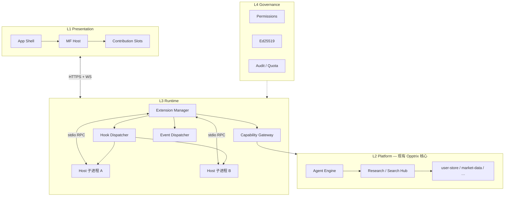
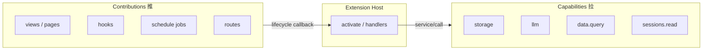
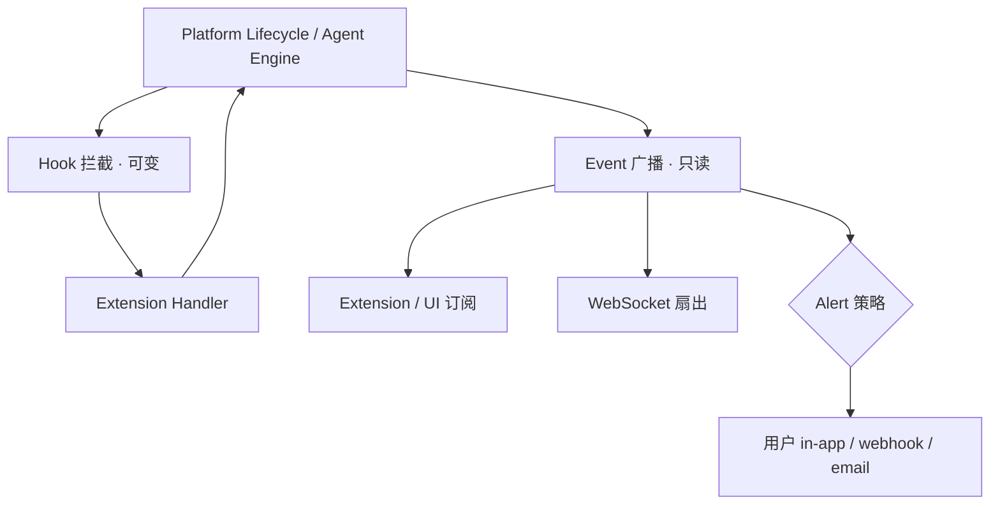
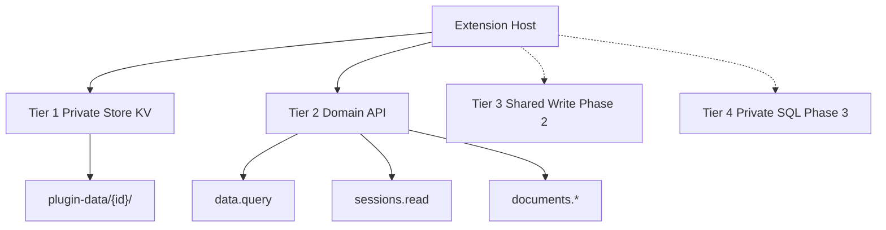
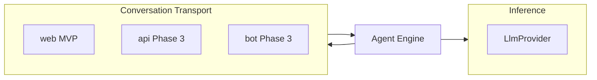
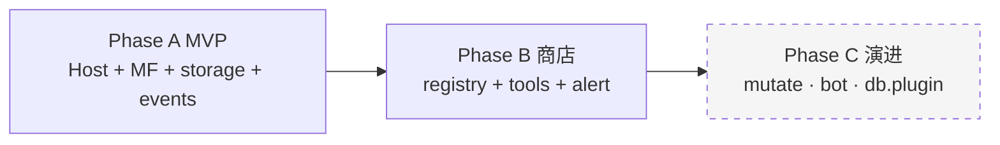
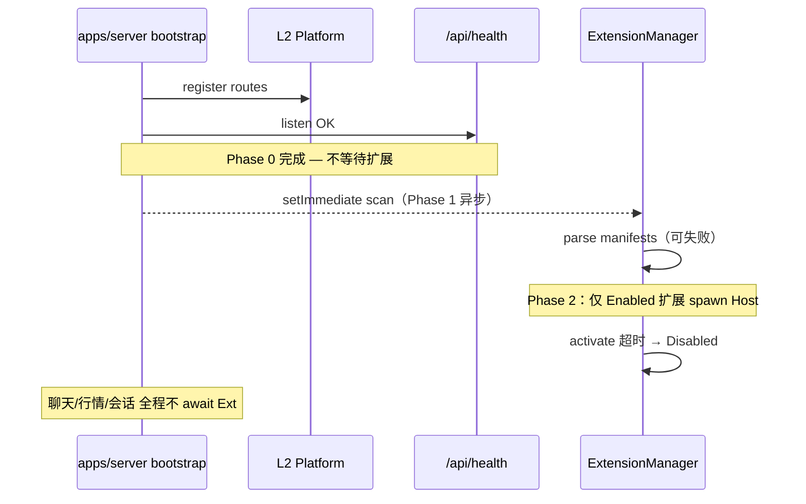
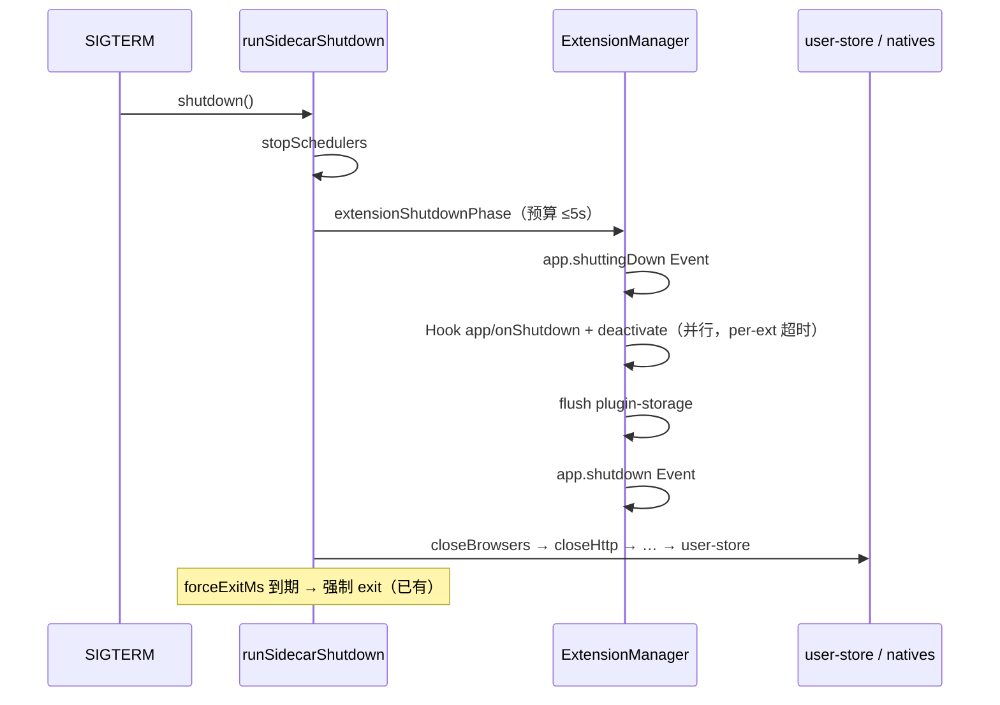
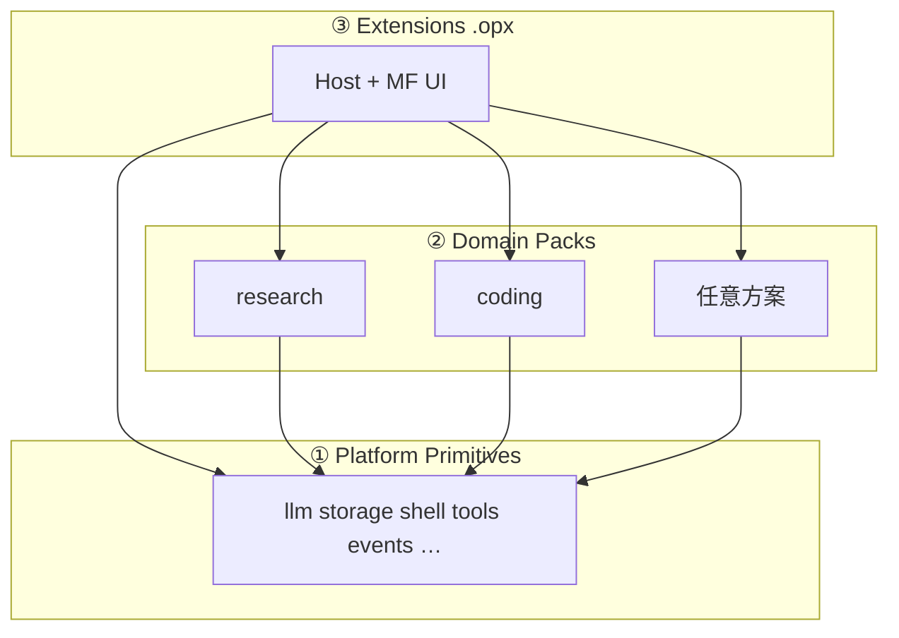

# Opptrix 扩展平台 — 架构图（v2.0 抽象）

> 抽象架构正文：[EXTENSION-PLATFORM-ARCHITECTURE.md](./EXTENSION-PLATFORM-ARCHITECTURE.md)  
> 实现细节：[EXTENSION-PLATFORM.md](./EXTENSION-PLATFORM.md)

---

## 1. 四层平面（总览）

---

## 2. 双轴模型：Capabilities × Contributions

---

## 3. 交互三元组

---

## 4. 存储分层

---

## 5. 推理 × 对话（正交）

---

## 6. 三阶段交付

---

## 7. R0 启动时序（强制）

---

## 8. R1 关闭时序（有界 best-effort）

---

## 9. 通用原语 vs 领域包（产品三层）

---

*图表版本：2.4.1 · 2026-09-04 — 产品三层*
