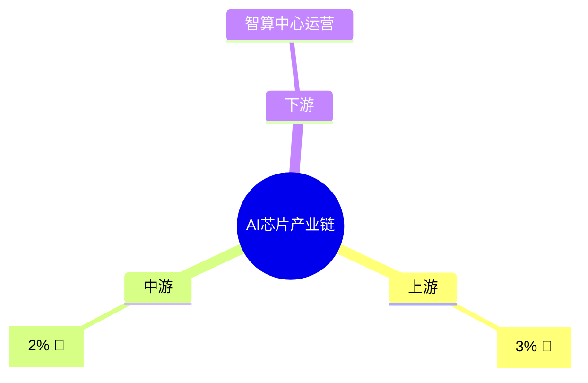
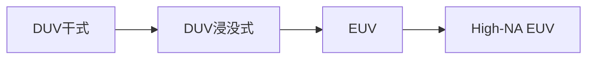

# 产业投资挖掘 (Industry Mining)

输入行业名称，输出覆盖 7 大维度的深度投研报告。支持 **20个预置产业链知识库** + 任意行业自动发现。

## 快速使用

```python
from a_stock_layer import AshareEngine
import sys, os
sys.path.insert(0, os.path.dirname(__file__))
from skills.industry_mining.report_mining import IndustryMiningReport

engine = AshareEngine()
reporter = IndustryMiningReport(engine)
report = reporter.generate("半导体")
print(report)

# 也可直接使用产业链知识库工具函数
from skills.industry_mining.chain_knowledge import (
    resolve_industry, get_bottleneck_summary,
    get_tech_generation_map, get_all_industry_names
)
chains = get_all_industry_names()        # 20个行业列表
bottlenecks = get_bottleneck_summary("AI芯片")  # 瓶颈详情
tech_map = get_tech_generation_map("工业母机")  # 技术代际路线
```

## 支持行业（20 个预置产业链知识库）

| # | 行业 | 节点数 | 瓶颈数 | 覆盖概念关键词 |
|---|------|--------|--------|-------------|
| 1 | **半导体** | 23 | 16 | 芯片、集成电路、光刻机、晶圆、封测、硅片 |
| 2 | **AI芯片/算力** | 14 | 8 | AI芯片、GPU、HBM、CoWoS、算力、光模块 |
| 3 | **具身智能/人形机器人** | 19 | 12 | 机器人、减速器、伺服电机、灵巧手、PEEK |
| 4 | **新能源汽车** | 23 | 8 | 锂电池、电动车、SiC、碳酸锂、充电桩 |
| 5 | **光伏** | 9 | 2 | 太阳能、钙钛矿、TOPCon、HJT、硅料 |
| 6 | **消费电子** | 10 | 4 | 手机、面板、PCB、折叠屏、可穿戴 |
| 7 | **医疗器械** | 8 | 3 | IVD、CT、MRI、内窥镜、高值耗材 |
| 8 | **人工智能** | 8 | 2 | 大模型、LLM、AIGC、AI Agent |
| 9 | **创新药** | 8 | 2 | CRO、ADC、CAR-T、细胞治疗 |
| 10 | **军工/国防** | 8 | 4 | 航空发动机、导弹、雷达、电子对抗 |
| 11 | **白酒** | 4 | 1 | 酱香、浓香、酿酒 |
| 12 | **低空经济** | 7 | 2 | eVTOL、飞行汽车、无人机 |
| 13 | **氢能源** | 5 | 3 | 燃料电池、电解槽、绿氢 |
| 14 | **新材料** | 7 | 4 | 碳纤维、高温合金、PEEK、稀土 |
| 15 | **云计算** | 6 | 1 | SaaS、IDC、云原生 |
| 16 | **存储芯片** | 7 | 3 | NAND、DRAM、HBM、SSD |
| 17 | **航空航天** | 8 | 3 | 发动机、卫星、火箭、大飞机 |
| 18 | **船舶制造** | 7 | 3 | LNG船、海工、造船、航运 |
| 19 | **工业母机/数控机床** | 8 | 5 | 五轴、CNC、精密加工、刀具 |
| 20 | **通信设备/5G-6G** | 8 | 2 | 基站、光通信、6G、光模块 |

**未列出的行业**也会自动发现公司并生成初步探索报告。

## 🆕 新增核心功能

### 瓶颈环节深度分析
每个瓶颈节点标注了瓶颈类型、国产化率、技术代际：

```python
bottlenecks = get_bottleneck_summary("半导体")
for b in bottlenecks:
    print(f"{b['position']}: {b['type']} | 国产化率: {b['domestic_rate']}")
# 输出示例：
# 上游 — 光刻设备（光刻机）: 光学系统+精密运动 | 国产化率: 2%
# 上游 — 光刻胶: 树脂合成+配方 | 国产化率: 5%
```

### 原材料追溯
节点拆解到金属/化工/稀有元素层级：

```python
from chain_knowledge import get_raw_material_nodes
materials = get_raw_material_nodes("新能源汽车")
for m in materials:
    print(f"{m['position']}: {m['desc'][:50]}")
```

### 技术代际路线图
追踪核心节点的技术演进路径：

```python
tech_map = get_tech_generation_map("半导体")
# 光刻设备: DUV干式→DUV浸没式→EUV→High-NA EUV
# 存储芯片: 2D→32层→64层→128层→200+层→300+层
# 先进封装: 引线键合→FC→Fan-out/WLP→CoWoS→3D Hybrid Bonding
```

## 输出报告架构（7 大模块）

### 1. 🗺️ 产业链全景图
- 从上游原材料到下游的完整节点展示
- 每个节点标注**瓶颈标志**、**国产化率**、**技术代际**
- 每个节点发现并列出代表公司
- **新增** 原材料追溯 → 追溯到金属/化工/稀有元素层级

**数据来源:** `chain_knowledge.py` + `profile()` + `main_business()`

### 2. 💰 价值链分配
- 按毛利率排序的节点价值分布表
- 平均毛利率、ROE、营收增速
- 环节总市值
- 识别"价值高地"（利润率最高的环节）+ 各环节瓶颈分析

**数据来源:** `financials()` + `realtime()` + `main_business()`

### 3. 🏆 竞争格局
- 每个节点的格局类型判定：
  - 极高（绝对龙头/寡头）
  - 高（双寡头/一超多强）
  - 中（分散竞争）
  - 低（充分竞争）
- 龙头市值占比、与第二名差距
- 全部参与者列表（含PE和增速）

**数据来源:** `realtime()` + `financials()` + `peer_companies()`

### 4. 🎯 核心标的深度评估
- **投资策略总览**
- **核心标的 Top8 评分表**
- **技术面位置表**：MA20/MA60/MACD/RSI/60日涨幅

**数据来源:** `realtime()` + `financials()` + `tech_indicator()` + `money_flow()`

### 5. 🔬 瓶颈环节分析（新增）
- 列出全产业链的"卡脖子"环节
- 瓶颈类型、国产化率、技术代际
- 投资机会提示：国产替代空间最大的环节

**数据来源:** `get_bottleneck_summary()` 新函数

### 6. 🔮 行业前景与投资展望
- 行业资金流向
- 宏观背景数据（GDP/CPI/PMI/全球指数）
- 综合投资观点：高毛利环节、高成长环节、寡头格局

### 7. ⚠️ 风险评估
- 估值风险（PE > 80）
- 负债率风险
- 业绩预警
- 价格位置风险（年内高位）

## 瓶颈环节标注体系

每个瓶颈节点(`bottleneck: True`)包含以下元数据：

| 字段 | 说明 | 示例 |
|------|------|------|
| `bottleneck_type` | 瓶颈的具体技术/工艺/资源类型 | `"光学系统+精密运动"` |
| `domestic_rate` | 国产化率 | `"2%"`（光刻机）或 `"5%"`（光刻胶） |
| `tech_generation` | 技术代际演进（可选） | `"DUV→EUV→High-NA EUV"` |

### 关键瓶颈环节（投资关注重点）

| 环节 | 瓶颈程度 | 国产化率 | 投资逻辑 |
|------|---------|---------|---------|
| EUV光刻机 | 🔴 极高 | 2% | 国产替代零突破 |
| ABF载板 | 🔴 极高 | 3% | AI芯片产能瓶颈 |
| HBM内存 | 🔴 极高 | 0% | AI存力核心 |
| 先进制程(7nm以下) | 🔴 极高 | 3% | 被设备出口管制 |
| 光刻胶(ArF/EUV) | 🔴 极高 | 5% | 日本垄断 |
| CNC数控系统 | 🔴 高 | 10% | 发那科/西门子垄断 |
| 航空发动机 | 🔴 高 | 15% | 单晶叶片+整机认证 |
| SiC衬底 | 🔴 高 | 10% | 新能源汽车逆变器 |

## 数据采集策略

所有数据采集通过 `concurrent.futures.ThreadPoolExecutor` 并行拉取。

```
行业名称输入
    │
    ▼
chain_knowledge.py ──→ 产业链结构解析（含瓶颈标注+原材料追溯+技术代际）
    │
    ▼
公司发现层 ──→ stock_list → profile → main_business
    │
    ▼
节点分类层 ──→ 主营构成分析 + 关键词匹配
    │
    ▼
深度分析层 ──→ 并行采集每个公司的12+维度数据
    ├── realtime (行情)
    ├── financials (财务)
    ├── main_business (主营)
    ├── tech_indicator (技术)
    ├── money_flow (资金)
    ├── kline (K线)
    ├── institutional_visits (调研)
    ├── rd_investment (研发)
    ├── perf_forecast (业绩)
    ├── shareholder (股东)
    ├── peer_company (可比公司)
    └── top_customer_supplier (客户供应商)
    │
    ▼
多维度分析层 ──→ 瓶颈分析 → 价值链 → 竞争格局 → 技术代际
    │
    ▼
报告生成层 ──→ 7大模块深度投研报告
```

## 什么时候触发

- 用户问："帮我看看半导体产业链" "分析新能源汽车" "光伏怎么样"
- "产业链挖掘" "产业投资" "xxx行业深度"
- "找到xxx产业链的核心机会/瓶颈环节/卡脖子环节"
- "xxx的技术路线是什么" "国产化率怎么样"
- 行业 + "龙头/前景/爆发/主升浪/持有/原材料/瓶颈"

## 示例输出片段

```
> 帮我分析半导体产业链

# 🔬 半导体产业深度挖掘报告 | 2026-06-24
# 🗺️ 一、产业链全景图（23个节点，16个瓶颈环节）
# 💰 二、价值链分配（毛利率排序）
# 🏆 三、竞争格局分析
# 🎯 四、核心标的深度评估
# 🔬 五、瓶颈环节分析（卡脖子清单）
# 🔮 六、行业前景与投资展望
# ⚠️ 风险提示

关键瓶颈：
1. 光刻设备 【国产化率: 2%】 光学系统+精密运动
2. 光刻胶   【国产化率: 5%】 树脂合成+配方
3. 检测设备 【国产化率: 5%】 光学/电子束系统
4. EDA工具  【国产化率: 5%】 软件算法+工艺库绑定
```

---

## 🆕 可视化报告能力（新增）

报告现在支持生成**嵌入式图表**，无需离开对话即可查看：

### 1. Mermaid 产业链全景图（零依赖）
自动生成的思维导图，瓶颈环节标注 🚨 和国产化率：
```

```

### 2. 瓶颈四象限气泡图（Matplotlib）
以 **国产化率** 为 X 轴、**技术壁垒** 为 Y 轴，直观展示产业链的"卡脖子"环节：
- 🔴 红色：卡脖子区（国产化率<15%，壁垒高）
- 🟡 黄色：改善区（国产化率15-30%）
- 🟢 绿色：优质区（国产化率>30%）

### 3. 价值链分配柱状图
每个环节的毛利率对比，橙色条为营收增速。

### 4. 核心标的雷达图
Top 6 公司的多维度评分（毛利率/增速/ROE等）。

### 5. 技术代际路线图（Mermaid）
```

```

### 使用方法
报告会自动生成所有图表，直接展示在回复中。图表路径均为 `/tmp/astock_charts/` 下的临时 PNG 文件。
